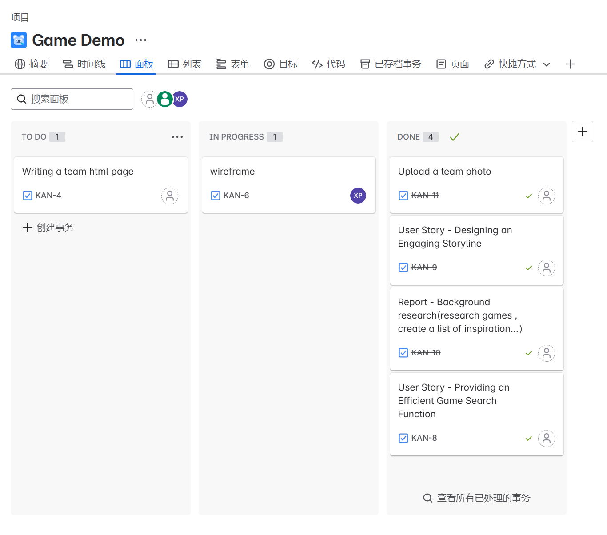

# 2025-group-27

2025 COMSM0166 group 27

## Game: Glitchwood

### Quick Start

- 🔗 **[Play the Game Now!](https://uob-comsm0166.github.io/2025-group-27/)**  
- 📁 Game source code lives in the [`/docs`](./docs) folder  
- 📽️ Demo Video: *Coming soon!*

### Before You Play: Meet the Characters & Bosses

#### Playable Characters

| Image | Name | Description |
|:---:|:---:|:---|
|  | **Mousegirl** | Charge-based ranged attacker. Fully charged, deals highest damage. Upgrades focus on bow mechanics. |
|  | **Computerboy** | Easy-to-use character with strong bullet-based attacks. Upgrades boost attributes and firepower. |
|  | **Keyboardman** | Melee fighter with high AoE damage. Needs to stay close. Upgrades emphasize survivability and special traits. |

#### Bosses You'll Encounter

| Image | Name | Description |
|:---:|:---:|:---|
|  | **Slimeboss** | Classic RPG enemy reimagined as a boss. Four colored forms with different attack patterns. |
|  | **Birdboss** | Shrine-dwelling boss with dash and restriction skills. Stay outside its range to stay safe. |
|  | **Bugboss** | Disrupts vision and summons ghost flames. Sudden high-damage attacks — stay alert! |

## Meet the Team

| 🎭 Name | 📧 Email | 📌 Role | 🐙 GitHub |
|--------|-----------|--------|-----------|
| Chengjun Yi   | [lw24658@bristol.ac.uk](mailto:lw24658@bristol.ac.uk) | TBD | [realYDIAN](https://github.com/realYDIAN) |
| Qiutong Zhao  | [fa24741@bristol.ac.uk](mailto:fa24741@bristol.ac.uk) | TBD | [AQIU20](https://github.com/AQIU20) |
| Heng Zhang    | [gg24694@bristol.ac.uk](mailto:gg24694@bristol.ac.uk) | TBD | [chrisheng456](https://github.com/chrisheng456) |
| Tong Yu       | [mp24824@bristol.ac.uk](mailto:mp24824@bristol.ac.uk) | TBD | [CelesteYt](https://github.com/CelesteYt) |
| Feihang Yan   | [vj24070@bristol.ac.uk](mailto:vj24070@bristol.ac.uk) | TBD | [Feihang027](https://github.com/Feihang027) |
| Xianhang Peng | [ge24600@bristol.ac.uk](mailto:ge24600@bristol.ac.uk) | TBD | [capybara131](https://github.com/capybara131) |

## 📌 Task Management

Track our progress here 👉 [Kanban Board (Jira)](https://1971026049.atlassian.net/jira/software/projects/KAN/boards/1)

## Project Report

### 📑 Table of Contents

- [1. 🎮 Introduction](#1-🎮-introduction)  
  - [1.1 Game Overview](#11-game-overview)  
  - [1.2 Inspiration](#12-inspiration)  
  - [1.3 Innovation](#13-innovation)  
  - [1.4 Project Objectives & Vision](#14-project-objectives--vision)  

- [2. 💡 Idea](#2-💡-game-ideation--concept-exploration)  
  - [2.1 Game Idea 1: Glitch-themed Survival Roguelike](#21-game-idea-1-glitch-themed-survival-roguelike)  
  - [2.2 Game Idea 2: Horror Puzzle RPG](#22-game-idea-2-horror-puzzle-rpg)  
  - [2.3 Why We Chose Game Idea 1](#23-why-we-chose-game-idea-1)  

- [3. 📋 Requirements](#3-📋-requirements)  
  - [3.1 Stakeholder Analysis](#31-stakeholder-analysis)  
  - [3.2 Epics & User Stories](#32-epics--user-stories)  
  - [3.3 Acceptance Criteria](#33-acceptance-criteria)  
  - [3.4 Application in Our Game](#34-application-in-our-game-development)  
  - [3.5 Summary & Takeaways](#35-summary--takeaways)  

- [4. 🧠 Design](#4-🧠-design)  
  - [4.1 Class Diagram](#41-class-diagram)  
  - [4.2 Sequence Diagram](#42-sequence-diagram)  

- [5. 🛠️ Implementation](#5-🛠️-implementation)  
  - [5.1 Core Systems](#51-core-systems)  
  - [5.2 Major Challenges](#52-major-challenges)  
  - [5.3 Future Technical Improvements](#53-future-technical-improvements)  

- [6. 🔍 Evaluation](#6-🔍-evaluation)  
  - [6.1 Qualitative Evaluation](#61-qualitative-evaluation)  
  - [6.2 Quantitative Evaluation](#62-quantitative-evaluation)  
  - [6.3 Code Testing](#63-code-testing)  

- [7. 🤝 Team Process](#7-🤝-team-process)  
  - [7.1 Communication & Meetings](#71-communication--meetings)  
  - [7.2 Tools & Collaboration Platforms](#72-tools--collaboration-platforms)  
  - [7.3 Team Roles](#73-team-roles)  
  - [7.4 Reflection & Continuous Improvement](#74-reflection--continuous-improvement)  

- [8. 🌱 Sustainability, Ethics & Accessibility](#8-🌱-sustainability-ethics--accessibility)

- [9. 🧭 Conclusion](#9-🧭-conclusion)

- [10. 📊 Contribution Statement](#10-📊-contribution-statement)

---

### 1. Introduction

#### 1.1 Game Overview

**Glitchwood** is a **2D roguelike action RPG** developed using P5.js. Players choose from **three uniquely designed characters**—each with distinct combat styles and upgrade preferences—to battle through procedurally generated stages filled with enemies, traps, and unpredictable challenges.

The game emphasizes **randomness and replayability**, introducing features like dynamic **weather effects**, **support pets**, **enemy variants**, and **environmental obstacles**. As players progress through increasingly difficult waves, they earn upgrades and eventually unlock an **Endless Mode** to test their endurance.

Designed for both **newcomers and roguelike veterans**, Glitchwood includes a built-in tutorial, intuitive controls, and two difficulty levels. Its gameplay is tied to a deeper theme—**a developer lost inside their own creation**, fighting to escape.

#### 1.2 Inspiration

Glitchwood draws inspiration from roguelike games like **Vampire Survivors** and **20 Minutes Till Dawn**, known for their escalating difficulty and minimalist gameplay. We appreciated how these games combined randomness with short-session intensity.

However, as computer science students, we wanted to push further—infusing personal and metaphorical meaning. In Glitchwood, the player is trapped inside their own game, battling symbolic “bugs,” navigating unstable “runtime environments,” and relying on tools (weapons, pets) to debug and survive.

Working within the limits of **P5.js**, we focused on modular systems like wave-based enemy spawning, straightforward combat, and randomized upgrades—balancing feasibility with creative depth.

Ultimately, Glitchwood merges familiar roguelike gameplay with **personal meaning and developer culture**.

#### 1.3 Innovation

Glitchwood brings several innovations to the roguelike format, blending symbolic design with engaging mechanics.

**Mechanically**, the game offers three characters with distinct **combat roles and upgrade styles**, not a shared progression path. We also introduced a **pet system**: after defeating a boss, players choose a pet (attack, shield, or heal) that influences combat strategy. A **dynamic weather system** further alters gameplay: **snow slows movement**, **lightning causes damage**, and **sunlight drains health**—affecting both players and enemies.

**Narratively**, the game metaphorically reflects a programmer's journey through burnout, bugs, and problem-solving. These ideas are not explained through text, but embedded in every mechanic.

**Visually**, Glitchwood uses pixel art to reflect different programmer archetypes, with UI elements nodding to coding culture. Combined with minimalist sound effects and dynamic visuals, it creates a distinctive atmosphere.

With two difficulty modes, three bosses, and endless replayability, Glitchwood offers not just challenge, but also introspection.

#### 1.4 Project Objectives & Vision

Glitchwood was created with dual objectives: to deliver a polished and replayable roguelike experience, and to explore how technical and creative systems can reflect real-world development processes.

From a gameplay perspective, our goal was to build modular systems—such as the weather engine, pet integration, and enemy generation—that could be scaled or repurposed. We focused on clean architecture and maintainable code to support future content expansions, difficulty tuning, and possibly co-op play.

Technically, we aimed to push the boundaries of what P5.js can handle in a real-time action game. The project provided valuable experience in managing collisions, animation states, and responsive input under performance constraints.

Looking ahead, Glitchwood could evolve in many directions: deeper roguelike branching, community-designed upgrades, or even as a learning platform to demonstrate code-as-world metaphors. Our vision is to keep expanding Glitchwood not just as a game, but as a **sandbox for experimentation in gameplay, storytelling, and system design**.

---

### 2. Idea

Before selecting and developing Glitchwood, our team explored two original game concepts. Each was supported by early design prototypes and system planning. This allowed us to evaluate their creative potential, feasibility within our toolset (P5.js), and suitability for an agile development workflow.

#### 2.1 Game Idea 1: Glitch-themed Survival Roguelike

**[GAME1 OVERVIEW](./docs/game_idea/Survival_Shooting_Game(Roguelike_Elements).pdf)**

.png)

🎬 [🎮 Demo Video](https://github.com/UoB-COMSM0166/2025-group-27/blob/main/docs/prototype/video/Prototype_Game_Idea_1.mp4)

🎯 **Core Concept**  
A wave-based roguelike where players control one of several programmer-themed characters navigating glitchy environments filled with enemies, hazards, and random upgrades. Players adapt to ever-changing weather, pet abilities, and environmental effects while progressing toward high scores or survival.

🔥 **Key Mechanics**
- **Distinct characters** with different combat styles and upgrade preferences
- **Dynamic weather system** (e.g., lightning, snow, sunlight) affecting all characters and enemies
- **Wave-based enemy spawning**, with bosses and random rewards scaling over time
- **Pets with combat effects** (attack, heal, shield), acquired after boss battles
- **Endless mode** and increasing difficulty to encourage replayability

🧠 **Design Strengths**
- Straightforward system to prototype with paper diagrams and early demos
- Modular enough to design separate upgrade logic, pet effects, and environmental systems
- Compatible with course tools: P5.js, class/use case diagrams, agile iterations

#### 2.2 Game Idea 2: Horror Puzzle RPG

**[GAME2 OVERVIEW](./docs/game_idea/Horror_Puzzle_RPG.pdf)**

🎬 [🎮 Demo Video](https://github.com/UoB-COMSM0166/2025-group-27/blob/main/docs/prototype/video/Prototype_Game_Idea_2.mp4)

🎯 **Core Concept**  
A time-loop puzzle RPG set in a frozen university lab. Players explore, solve programming-themed puzzles, and uncover hidden experiments to escape a mysterious temporal trap.

🧩 **Key Mechanics**
- Environmental puzzles (logic, object-based, memory)
- Repeated time loops revealing more story and areas
- Supernatural horror events and evolving world state
- Multiple endings based on player decisions

🧠 **Design Limitations**
- Requires extensive narrative scripting and state control
- Harder to modularize for team collaboration
- Fewer opportunities for randomness or iterative balance tuning
- Less suited for fast prototyping and testing in P5.js

#### 2.3 Why We Chose Game Idea 1

After structured comparison, we selected **Game Idea 1** as the foundation for Glitchwood. This decision was based on the following:

- 🧩 **Better modularity and scalability**: Wave-based combat, pet effects, weather changes, and upgrade logic could be developed in parallel by different team members.
- 🛠️ **Stronger compatibility with course tools**: We could apply use case diagrams, class diagrams, and early paper prototypes effectively.
- 🔁 **Supports agile iteration**: Core mechanics (spawning, combat, upgrades) could be tested and refined incrementally in sprints.
- 🎯 **Higher alignment with learning goals**: The idea allowed us to explore randomness, system balance, and symbolic design while reinforcing CS themes (e.g., bugs, debugging, resilience).
- 🤝 **Better fit for team collaboration**: Each subsystem (combat, environment, pet system) could be assigned clearly, allowing us to coordinate through GitHub and version control.

---

### Requirements

Throughout the game development process, we adopted structured planning tools—epics, user stories, and acceptance criteria. These tools helped improve clarity, enhanced team collaboration, and streamlined our workflow. By integrating them into our project, we gained valuable insights into understanding player needs, defining design goals, and working more efficiently.

#### The Onion Model of Stakeholders

We recognized that our game involved multiple stakeholders, including players, developers, publishers, and the marketing team. The stakeholder onion model allowed us to visualize how our decisions impacted different groups. This helped us prioritize development tasks more effectively and ensure a balanced approach that considered both gameplay experience and broader business needs.

The diagram below represents the onion model of stakeholder requirements for our project.

#### Understanding Epics & User Stories

Epics serve as a high-level breakdown of major game features. They provide a broad vision of what we aim to achieve, ensuring that our work aligns with the game’s core mechanics and user experience goals.

User Stories translate these broad ideas into concrete, actionable tasks. The structured format—"As a [user], I want [goal], so that [reason]"—forced us to think from a player’s perspective rather than a purely technical viewpoint.

#### Importance of Acceptance Criteria

Acceptance Criteria helped us define when a feature is truly complete. Using the "Given-When-Then" format, we set clear success conditions for our game mechanics.

For instance, when designing the enemy spawning system, we initially had a vague goal:

"Enemies should appear randomly."

By applying Acceptance Criteria, we refined it:

Given the player is in a combat zone,
When enemies spawn,
Then they should appear from different locations at randomized intervals.

This structured approach eliminated ambiguity, ensuring that both designers and developers had a clear, testable goal.

The diagram below illustrates the Epics, User Stories, and Acceptance Criteria for our project.

#### Application in Our Game Development

Our game, Survival Shooting Game, benefited significantly from these structured methodologies. Instead of jumping into coding immediately, we first defined stakeholder needs, as seen in the Stakeholder Requirements Analysis.

Each group—players, developers, publishers, and marketing teams—had distinct priorities:

Players wanted immersive combat and intuitive UI.
Developers focused on smooth mechanics and maintainability.
Publishers required monetization and replayable mechanics.
Marketing Teams needed attractive visuals and promotional appeal.
By integrating Epics, User Stories, and Acceptance Criteria, we ensured that our development process balanced all these needs while staying aligned with the core game vision.

#### Conclusion

This structured approach fundamentally transformed how we approached game development. Initially, we were inclined to jump straight into implementation without fully considering the broader design implications. However, through this process, we learned the importance of:

Breaking down complex ideas into manageable tasks.
Ensuring clear communication between designers, developers, and testers.
Focusing on user experience rather than just technical implementation.
By using Epics, User Stories, and Acceptance Criteria, we now have a well-structured, efficient workflow that aligns with both technical feasibility and player expectations. This experience has made us more mindful of structured planning in game development, improving both our teamwork and final product quality.

---

### Design

**This part is based on our early design**

#### **Class Diagram Description**
The class diagram represents a game system with multiple interacting components, focusing on **players, enemies, weapons, weather effects, and rewards**.

##### 1. **Field and Figures**  
- The **Field** class represents the game area with a size attribute.  
- The **Figures** class is a general entity affecting the game.

##### 2. **Player and Enemy**  
- The **Player** class includes attributes such as speed, HP, level, defense, attackSpeed, and type. It has methods for movement (move()), upgrades (upgrade()), and display (display()).  
- The **Enemy** class has HP and attackPower, along with methods to appear(), disappear(), and attack().  
- A subclass of **Enemy** is **Boss**, which has an additional method to displayHealthBar().

##### 3. **Weapons**  
- **Sword** (power, attackRange, swordAttack())  
- **Gun** (attackDistance, bulletAttack())  
- **Bow** (fireCoolDown, attackDistance, arrowAttack())  
- **Bullet** (perDamage, numberOfOneShoot, touchEnemy(), disappear())

##### 4. **Weather Effects**  
- The **Weather** class affects gameplay and includes types such as:  
  - **Snow** (slowDownRate)  
  - **Thunder** (range, damage)  
  - **Sun** (duration, powerUpRate)  

##### 5. Rewards  
- Potion (effect, color)  
- Pet, which has name, type, follow(), attack(), and move().  
  - Bird (attackRange, fly())  
  - Cat (speed, touchEnemy())  
  - Elf (effect, makeEffect())

---

#### Sequence Diagram Description (Second Image)  
The sequence diagram illustrates interactions between game components in various gameplay scenarios.

##### 1. Character Selection & Attack System  
- The Player selects a role (Sword, Gun, or Bow).  
- Depending on the weapon, the player either attacks directly (sword) or uses a ranged attack (gun or bow).  
- The attack process triggers different methods (shootBullet(), shootArrow(), attack()).
- Depending on the character roles, each character upgrades different skills.

##### 2. Potion System  
- The Player interacts with the PotionSystem to retrieve health potions (getPotion()).  
- The system checks the player's HP and applies the necessary effects.

##### 3. Pet System  
- The player chooses a Pet (choosePet()), which can provide some extra gains to the player. 
- Pets provide additional support in combat.

##### 4. Enemy and Boss Battle  
- The CommonEnemy and Boss entities engage in battle with the Player.  
- The Boss has additional attack patterns (heavyAttack()).

##### 5. Weather System Effects  
- The WeatherSystem influences gameplay through different weather conditions (affect()).  
- Weather may hinder movement or provide power-ups.

---

### Evaluation

#### 1. Qualitative Evaluation

##### 1.1 Artistic style and interaction design

— Players recognized the simplicity of the interface layout (e.g., the flat design of the character selection panel), and the tutorial's graphic guide enabled novices to get started quickly, making it a very successful design.

— Most players said that the programmer style, code symbols and digital elements used in the game make the overall picture full of unique “black science and technology” sense, which is very different from the traditional theme, adding personality and interest to the game. In addition, special effects such as dynamic weather, light and shadow gradient and particle effects add a sense of hierarchy and dynamism to the screen, making each game present a very different visual experience.

##### 1.2 Difficulty balance
  
— L1 Easy Mode: 
All new players were able to pass the level, and found the upgrade props and pacing to be relatively linear, and the bosses' attack intervals to be reasonable.

— L2 Difficulty Mode: 
In this mode, the number of enemies, speed and strength of attacks are increased, the attack pattern of bosses is more aggressive, and random events are more frequent (e.g., dynamic weather), which puts more pressure on the player to maneuver and react to the situation, resulting in a higher level of frustration, and a sense of accomplishment for the player who seeks a challenge after defeating it.

##### 1.3 Plot and Immersion

Players expressed interest in the game's setting of intertwining technology and survival, saying that this theme reflects the life of a programmer and also incorporates the exciting experience of adventure and survival. Some players mentioned that they resonated with the design of the game's individual characters, and felt a sense of accomplishment and immersion as they grew through their characters and fought against tough environments during the experience.

##### 1.4 Focus group Q&A transcripts

The questions and sample responses above reflect the focus group's views on the game's interface, operation, mode experience, hint messages, and plot characters. Based on this feedback, we have made improvements in the following directions:

| Issue Category           | User Feedback                                                                                           | Improvement Points                                                                                                       |
| ------------------------ | ------------------------------------------------------------------------------------------------------- | ------------------------------------------------------------------------------------------------------------------------- |
| Reminder mechanism       | Add Boss skill animation/sound effects.                                                                 | Add text files and sound cues                                                                                            |
| performance optimization | The screen gets stuck when there are too many special effects                                           | Reduce effects loading pressure with object pooling                                                                      |
| Excessive plotting       | Some transitions can be abrupt.                                                                         | Optimize scene transitions and effects pacing                                                                            |
| Helpful Hints            | The textual explanations and illustrations in the Beginner's Guide are slightly fragmented and not intuitive enough. | Integrate help pages to enhance the readability of the explanatory text and the overall visual presentation.             |

#### 2. Quantitative Evaluation

In order to evaluate the usability and player load of the game in different difficulty modes (L1 easy mode and L2 hard mode), we used the System Usability Scale (SUS) and NASA-TLX (Task Load Index) to collect and analyze the data respectively.

**2.1 NASA TLX Scores**.

At the L1 (easy) difficulty, users generally reported a lower workload, particularly in the dimensions of mental demand and effort. The average Mental Demand score for L1 was 60, while at L2 (hard), it significantly increased to 80. Other dimensions such as Physical Demand and Frustration showed similar trends, indicating that as the difficulty increased, players experienced higher physical exertion and emotional stress. At L2, users’ Frustration scores were generally higher, indicating an increase in frustration at the higher difficulty.

**2.2 System Usability Scale (SUS)**.

We used the Wilcoxon Signed Rank Test to compare the evaluation data between the two difficulty levels, calculating the significance differences in the NASA TLX and SUS scores for L1 and L2. The analysis revealed that while there was a significant difference in workload between L1 and L2, the usability ratings showed only a small difference, indicating that the game maintained a relatively consistent user experience across both difficulty levels.

From the SUS data in the table, it can be seen that in the L1 Easy Mode, players' evaluation of the game's ease of use, intuitiveness, and integration of functions is relatively high. In addition, the data in NASA shows that players' scores for Psychical Demand and Effort are generally low in Easy Mode, which indicates that players' attention span and complexity of operation are low in this mode. Time demands and physical demands are also relatively mild, and overall frustration is low (in the 20-30 range). This is consistent with the goal of the L1 mode, which is to quickly familiarize novices with the basic gameplay and reduce psychological stress.

In contrast, the scores of some questions in L2 mode (such as Q2, Q4, Q10 and other negative questions) increased, indicating that players felt more obvious about the complexity of the system operation and the burden of learning.NASA's scores of all dimensions in the difficult mode increased to a certain extent, especially the mental demand, effort and frustration (in the range of 60-70), which reflected that players need to invest more energy and reaction ability when coping with the faster, more difficult or more complicated enemies/levels, and are also more prone to the stress of failure. or more complex enemies/levels require more effort and reflexes, and are more prone to the stress of failure. At the same time, time demands also increase, indicating that players need to make more frequent and quick decisions and actions in a shorter period of time.

#### 3.Code Test

The test environment deployed an online version of the game via GitHub Pages, ensuring accessibility in both desktop and mobile browsers. We invited three typical user groups (classmates, game enthusiasts, and developers) to participate in semi-structured interviews after the trial. During the interviews, we not only collected qualitative user experience feedback (interface intuitiveness, smoothness of operation, hints, etc.), but also discussed specific scenarios in the game in detail, which helped the team clarify the direction of improvement.

---

### Process

With efficiency, collaboration and communication at the core of this team assignment, our team adopted a series of standardized workflows to ensure the smooth development of Glitchwood. Throughout the entire process, from the building of the Minimum Viable Product (MVP) to the subsequent feature iterations, teamwork and communication were always present to continuously improve the quality of the project and the user experience.

#### 1.Meetings and communication mechanisms

We hold regular offline meetings in MVB lab, and organize at least one full team meeting every week, which mainly includes: project progress report, discussion of existing problems, and decomposition of tasks for the next phase. In the meeting, team members explain in detail the current progress of the features they are responsible for, the technical problems they encountered and their next steps, and make suggestions on how to improve the connection between game states and optimize the user experience. In addition, we also have occasional discussions, when someone has a problem that cannot be solved, we will start a meeting to discuss how to solve it together. Outside of these meetings, the team has also set up a Wechat group to keep in touch with each other via instant messaging. Especially during the holiday season, even though we can't meet in person, we still work together efficiently on Wechat to make sure everyone knows what they need to accomplish while on vacation.

#### 2.Tools and collaborative platforms

In order to guarantee the version control and efficient collaboration of the project, we chose GitHub as the code hosting platform and implemented a strict code review mechanism on this basis. Each member of the team uses their own functional branches during development, such as the main menu, map status, battle status, store status, etc., to ensure that the main branch always maintains a working basic version. All code submissions are subject to Pull Request approval, ensuring that all changes are reviewed by the team before being merged into the master branch, a measure that effectively reduces the risk of potential errors and conflicts. At the same time, we utilize the JIRA(as shown in the figure2 ) system to handle task flow and manage project tasks, splitting the overall workload into smaller sub-tasks, with clear deadlines and responsible persons for each task, and real-time tracking of progress updates and issue feedback. Ensure that each code update does not break existing functionality. Bugs are also fixed and responded to quickly by the technical team.

#### 3. Team roles and division of tasks

| Name          | Role                                             | Contribution                                                                                                                                                                                                                    | Weight |
|---------------|--------------------------------------------------|--------------------------------------------------------------------------------------------------------------------------------------------------------------------------------------------------------------------------------|--------|
| **Chengjun Yi**   | Lead Developer and Debug Team Leader           | Responsible for the overall code architecture design and integration, system performance tuning, to ensure that all functional modules run stably and synergistically.                                                                                                 | 1      |
| **Qiutong Zhao**  | Video Director, Editor and Coordination Engineer | Responsible for the shooting and editing of the presentation video, controlling the team's progress, task allocation. Also involved in some of the auxiliary logic code (e.g., demo script, bug tracking and fixing process), coordinating the progress of the team's tasks. | 1      |
| **Heng Zhang**    | Core Development Engineer and Debug Team Member  | Responsible for the implementation of the game's core logic, enemy generation, boss skills, collision detection, special effects, and dynamic weather system writing and debugging. Also debugging bugs encountered during testing.                                  | 1      |
| **Tong Yu**       | Art Design and Front-end UI Development Engineer | Responsible for art design and visual resources production outside, participate in the development of the front-end interface, buttons, menus and animation effects code, to ensure the seamless integration of art and interaction logic.                         | 1      |
| **Feihang Yan**   | Pet Systems Engineer and Debug Team Member       | Comprehensively responsible for pet system code development, including pet behavior modeling, interaction logic, state management and performance optimization, etc., to ensure that the pet system is tightly integrated with the overall game logic.             | 1      |
| **Xianhang Peng** | Front-end Development Engineer                   | Responsible for the development of the game front-end components of the code (such as the main menu, operation prompts, score display, etc.), optimize the interaction logic.                                                                                        | 1      |

#### 4. Team reflection and continuous improvement

Looking back at the whole project, we encountered a lot of unexpected challenges during the development of the Minimum Viable Prototype (MVP): due to the parallel development of the modules, there were frequent problems with the connection between the game states, which resulted in the overall experience failing to meet the expectations. At this stage, in order to solve the problem, we organized a “Game Jam” meeting, through face-to-face discussion and improvisation, we brainstormed on how to smooth the transitions between game states and came up with concrete and effective solutions. This not only alleviated the interface problems between modules, but also stimulated team members' creativity and enthusiasm for collaboration.
At the same time, our team continued to optimize the workflow in daily communication. Real-time communication through WeChat, detailed task management through Kanban, and strict implementation of the code review system ensured the orderly progress of our work. Although online tools have greatly facilitated remote communication, we realize that face-to-face discussions are still irreplaceable in solving technical problems and in-depth collaboration.
We realized that active and efficient communication is the key to successful teamwork, and that only through continuous open communication can we maximize the talents of each member. In addition, a clear division of roles, timely team reflection and lessons learned, also provide a solid guarantee for the smooth progress of the project. Through this project experience, we not only optimized the development process, but also accumulated valuable experience for future cross-module collaboration.

---

### Sustainability Analysis

#### Social Dimension
We raise awareness of developer well-being by embedding themes of overwork and creative burnout into gameplay.
Community-driven features like level design submissions encourage collaboration and shared creative expression.

#### Environmental Dimension
Our dynamic weather reflects shifting digital environments and resource unpredictability, prompting adaptive strategies.
We use nature-inspired map design and optimize code for minimal energy use, promoting ecological consciousness in both content and performance.

#### Economic Dimension
The game is free-to-play with optional donations, all of which go to organizations advocating for tech worker rights.
Through ongoing content updates, we prioritize long-term engagement over extractive monetization.

#### Technical Dimension
We apply modular and efficient coding practices to reduce maintenance overhead and technical waste.
Visual effects and animations are optimized to lower power consumption and improve runtime efficiency.

#### Individual Dimension
By gamifying debugging as self-discovery, we invite players to reflect on productivity, stress, and balance.
The variety of tools and paths encourages experimentation, creativity, and personal agency in problem-solving.

---

### Implementation

#### Basic Implement

The implement of Glitchwood revolve around battling enemies, leveling up, and progressing through stages while striving for higher kill counts in endless mode. Players can easily control one of three selectable characters using a combination of keyboard and mouse: the keyboard handles movement, while the mouse controls attacks and attack direction. **The implementation relies primarily on event-related methods such as keyPressed and mouseClicked.**

Characters can engage in both melee and ranged combat, with damage types classified as either single-target or AoE.

The game features four distinct maps, each owned procedurally generated obstacles of different styles. These obstacles block both movement and attacks(For both players and enemies). However, certain bosses possess the ability to phase through obstacles. **When a new map is generated, existing obstacles are cleared, and new obstacles are created based on the current wave.**

As for the game logic, enemies spawn outside obstacle zones and at a certain distance from the player’s location. As waves increase, the number of spawning enemies increases. Bosses appear at waves 5, 10, and 15, each bringing unique challenges. **To ensure enemies pursue the player effectively, we calculate the direct line between them and determine the optimal angle for movement along the shortest path.**

Regarding the pet and weather systems, after defeating the first boss, players can choose one of three pets, each granting a unique blessing—such as generating a shield, restoring health, or automatically attacking enemies. Additionally, the game introduces a dynamic weather system that changes every 30 seconds. **This is implemented using time-related functions provided by p5.js, along with random number generation to determine the type of weather effect.**

#### Challenges

In the development of our game, we faced several key challenges that required creative problem-solving and technical expertise. These challenges mainly fall into two categories(In fact, in this part we list more than three challenges): **integrating story and Game’s Elements with gameplay and implementing complex game mechanics and code compatibility.**

##### 1. Integrating Story and Game’s Elements with Gameplay

One of our core challenges was tightly blending the main storyline with gameplay mechanics. The game’s narrative needed to be immersive while ensuring that the gameplay remained engaging and not overshadowed by excessive text or cutscenes. Key aspects of this challenge included:

-	**Background Art & Atmosphere**: The background needed to reflect the story setting while maintaining clarity for gameplay. Striking a balance between visual storytelling and functional level design was crucial.

-	**Monster and Character Design**: Each character and monster had to be visually distinct, fitting the game’s theme while ensuring their silhouettes were recognizable in fast-paced combat. Achieving dynamic animations for multiple characters further increased development complexity. **For example, we need to load different movement animations based on the enemy's movement direction.**

-	**Attack Mechanisms**: The player character required two distinct attack methods: melee and ranged combat. These two attack types needed to feel different in mechanics, balance, and animations, making their implementation more complex. For example, the **Mousegirl** character requires a charging bar to be drawn, while **Keyboardman** needs different animations bound to attacks in four directions.

-	**Pet System**: The game included three types of pets, each offering unique benefits such as attack, shield, and healing. These pets needed to follow the main character and interact with the environment without disrupting the gameplay balance. Designing pet mechanics that complemented the main character’s abilities added to the challenge.

-	**Level Design**: Each stage needed to introduce new gameplay elements while maintaining difficulty progression. The placement of enemies, obstacles, and power-ups had to be carefully designed to prevent either excessive frustration or a lack of challenge. **For this, we need to create a variety of different characters, which also increases the complexity of the code.**

-	**Weather System**: Dynamic weather effects were considered to enhance immersion, but integrating them in a way that impacted gameplay (e.g., reducing visibility in fog or affecting movement in the rain) required careful design and testing. **For example, when generating lightning, we should provide players with enough time to react.**

##### 2. Implementing Complex Game Mechanics and Code Compatibility

Beyond storytelling and visual design, the technical implementation of various game mechanics posed another set of challenges. These included:

-	**Collision Detection & Air Walls**: The game world needed invisible boundaries ("air walls") to prevent players from exiting the intended play area. However, defining their volume accurately without interfering with gameplay movement was tricky. For this, we need to carefully crop the images to minimize empty borders as much as possible.

-	**Obstacle Variations**: Each level introduced unique obstacles, requiring a flexible system that could spawn new types dynamically while removing old ones efficiently. For this challenge, we try to use **stack** to solve it.

-	**Attack & Hit Detection**: Both player and enemy attacks needed precise hitbox detection to ensure fair and responsive combat. Different attack types (melee, ranged, pet abilities) made this more challenging. **For melee characters' attacks, we have introduced two parameters: attack range and attack angle**.

-	**Pet Abilities**: The three pets followed the main character while providing distinct benefits. Coding behavior for pets that attack enemies, provide shields, or heal the player in real-time added layers of complexity. Ensuring pets didn't obstruct movement or interfere with combat balance was another challenge.

-	**Weather System Implementation**: If the game featured a weather system, its effects on physics (e.g., slowing movement in snow) and visibility (e.g., fog reducing sight) had to be carefully implemented without breaking the game’s mechanics.

-	**Frame Rate Differences Between Characters**: Different characters had unique animations, but their frame rates varied. Unifying animation timing across all characters without making them feel sluggish or desynchronized was a difficult technical task.

##### 3. Conclusion

Developing a game involves overcoming multiple challenges, from balancing storytelling and gameplay mechanics to solving complex coding problems. Through iteration, testing, and optimization, we tackled these challenges to create a more immersive and enjoyable gaming experience. Future improvements will focus on refining game balance, enhancing AI behavior, and optimizing performance across different devices.

---
### Sustainability, Ethics, and Accessibility
In addition to pursuing gameplay, challenge and innovation, we also strive to have a positive impact on the environment, society and economy. We have demonstrated the impact mechanism in three key dimensions during the development process: environment, society and economy.

#### Environmental Impact
In terms of the environment, the core design concept of Glitchwood is to establish a close connection with natural and environmental elements. We carefully constructed a dynamic weather system and a map design "inspired by nature" to reflect the unpredictability of the climate and the challenges of ecological protection in reality. The game uses a dynamic weather system that changes every 30 seconds, simulating various weather conditions such as rain and lightning. Players must develop different strategies according to environmental changes in battle, which not only greatly improves immersion, but also subtly improves their understanding of resource unpredictability and the balance of natural ecosystem management.
In addition, we pay special attention to reducing energy consumption at runtime in the design and optimization of visual effects and animations. Our code is specially optimized with the goal of achieving minimum energy consumption and easy maintenance, which is particularly important in the context of increasing global attention to digital carbon footprints. Through this technical approach, we not only provide an efficient operation experience, but also convey the concept of respecting nature and cherishing resources, which helps to build a green and sustainable digital ecosystem. The integration of environmental elements has a dual purpose: on the one hand, it enhances the player's immersive experience through a constantly changing dynamic system, and on the other hand, it provides a creative platform for discussing broader ecological issues. Like real-world environmental management challenges, Glitchwood encourages players to develop adaptive strategies, educate themselves on the environment, and increase ecological awareness while having fun.

#### Social Impact
Glitchwood incorporates sustainability and ideology into the game's narrative and design, focusing not only on the player experience, but also on the physical health of the development team and community collaboration. The game embeds themes about overwork, work-life balance, and creative fatigue, directly exploring common stress issues in the technology and game industries, guiding players to reflect on game development. At the same time, we encourage players to propose creative ideas and design solutions, thereby promoting collaboration and knowledge sharing. This open and interactive model not only stimulates collective wisdom, but also continuously enriches the game content and forms a stronger and more combative player community.

In addition, to address accessibility issues, we extensively incorporate feedback from qualitative interviews and quantitative evaluations into the design to ensure that the game is suitable for players of different abilities and experience levels. By providing multiple entry settings, such as L1 mode designed for novices and L2 mode designed for advanced players, and adding additional prompts and guidance in high-difficulty modes, we strive to ensure that all players can get a full game experience. This player-centered design approach not only reflects the importance of social responsibility, but also promotes the spread of the concept of healthy work-life balance, making games an important concept for promoting positive social causes.

#### Economic Impact
Glitchwood adopts a free model supplemented by optional donations, aiming to break traditional payment barriers, attract a wider player base, and ensure that the business model is ethical and socially responsible. Our strategy is not only to maximize player accessibility, but also to create a non-exploitative revenue structure that encourages long-term player participation through continuous content updates and open community communication mechanisms, rather than relying on one-time in-app purchases or aggressive in-game advertising. The free strategy lowers the barrier to entry, making the game accessible to players from different economic backgrounds, and lays the foundation for building a fair, transparent and inclusive digital ecosystem.

All optional donations are processed transparently, and a portion of the revenue is pledged to be donated to non-profit organizations that advocate for the rights and ethical practices of technical workers. This measure not only reflects our concern for improving the labor environment within the industry, but also conveys our belief in an economic model that prioritizes short-term profits over long-term participation and user well-being. Through this combination of public welfare and business, Glitchwood creates a healthy and positive economic cycle that allows both participants and developers to benefit sustainably from continued success. At the same time, this model cleverly guides players to pay attention to industry ethics and labor environment issues, greatly enhancing the importance of occupational health of technical workers.

---

### Conclusion
The development of Glitchwood is a multifaceted process that not only challenges our technical skills, but also our ability to balance storytelling, game mechanics, and sustainable design.

During the project process, our agile development approach allows the team to iterate quickly and adapt to changes based on continuous feedback. We often refine user stories and acceptance criteria to ensure that all features meet game standards and stakeholder expectations. Heuristic evaluation plays a crucial role in every sprint cycle; It not only helps identify usability issues early in the development cycle, but also ensures that the game is accessible and enjoyable for both novice and experienced players.

A major challenge is to integrate the story of the game with its mechanics. Balancing narrative immersion and gameplay requires us to re-examine our design multiple times. For example, synchronizing background art and atmosphere with fast-paced battles allows us to prioritize clarity in visual storytelling. This challenge extends to the design of characters and monsters that must be visually distinct but function well in dynamic environments. We have tried various animation techniques, such as loading different motion animations based on the direction of enemies, which sometimes leads to inconsistent frame rates. By combining design with performance metrics, this technical barrier can be alleviated.

Another important area is implementing complex game mechanics and ensuring code compatibility. Integrating elements such as collision detection, dynamic obstacle detection, precise attack and hit detection, and constantly changing weather systems requires meticulous methods. We address these issues by adopting modular coding practices. The pet system further complicates game balance, requiring us to design behaviors that enhance player abilities without causing interference. These technological challenges strengthen our commitment to the spirit of extreme programming, in which constant refactoring and collaboration are key to overcoming obstacles.

Sustainability is another pillar of our project philosophy. In addition to optimizing games through efficient code to reduce energy consumption, we also incorporate privacy into our design principles. We ensure careful handling of user data and respect for player privacy. This comprehensive approach not only enhances people's trust in our products, but is also consistent with the long-term goal of cultivating a safe and sustainable gaming environment.

Looking ahead, future work will focus on several areas that need improvement. One approach is to enhance narrative integration by experimenting with adaptive narrative elements, which further integrate gameplay with the fundamental themes of the game. We also plan to improve the enemy's artificial intelligence and weather dynamics to create more immersive and reactive games. In addition, more robust testing will be conducted on the expanded user base to further adjust usability aspects and ensure that the game is available to a wider audience. Finally, continuing to optimize the performance and sustainability of the game will remain a key focus.
In short, in this project, agile planning, heuristic insights, and sustainable design are integrated to create an attractive and ethically responsible product. The lessons learned here will undoubtedly provide great help for our future career development.

---

## Project Report

### Introduction

- 5% ~250 words 
- Describe your game, what is based on, what makes it novel? 

### Requirements 

- 15% ~750 words
- Use case diagrams, user stories. Early stages design. Ideation process. How did you decide as a team what to develop? 

### Design

- 15% ~750 words 
- System architecture. Class diagrams, behavioural diagrams. 

### Implementation

- 15% ~750 words

- Describe implementation of your game, in particular highlighting the three areas of challenge in developing your game. 

### Evaluation

- 15% ~750 words

- One qualitative evaluation (your choice) 

- One quantitative evaluation (of your choice) 

- Description of how code was tested. 

### Process 

- 15% ~750 words

- Teamwork. How did you work together, what tools did you use. Did you have team roles? Reflection on how you worked together. 

### Conclusion

- 10% ~500 words

- Reflect on project as a whole. Lessons learned. Reflect on challenges. Future work. 

### Contribution Statement

- Provide a table of everyone's contribution, which may be used to weight individual grades. We expect that the contribution will be split evenly across team-members in most cases. Let us know as soon as possible if there are any issues with teamwork as soon as they are apparent. 

### Additional Marks

You can delete this section in your own repo, it's just here for information. in addition to the marks above, we will be marking you on the following two points:

- **Quality** of report writing, presentation, use of figures and visual material (5%) 
  - Please write in a clear concise manner suitable for an interested layperson. Write as if this repo was publicly available.

- **Documentation** of code (5%)

  - Is your repo clearly organised? 
  - Is code well commented throughout?
