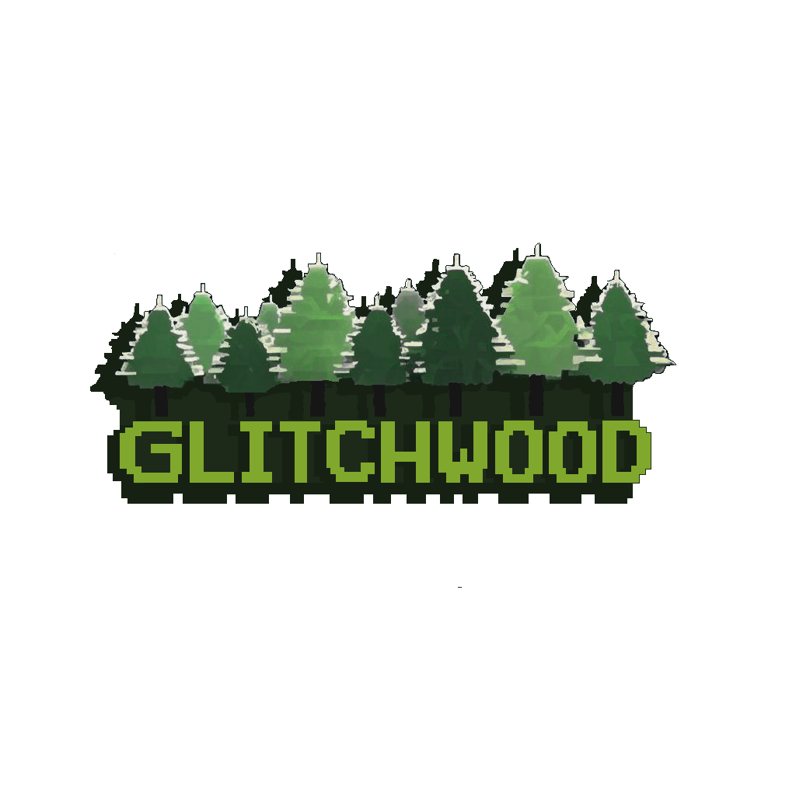
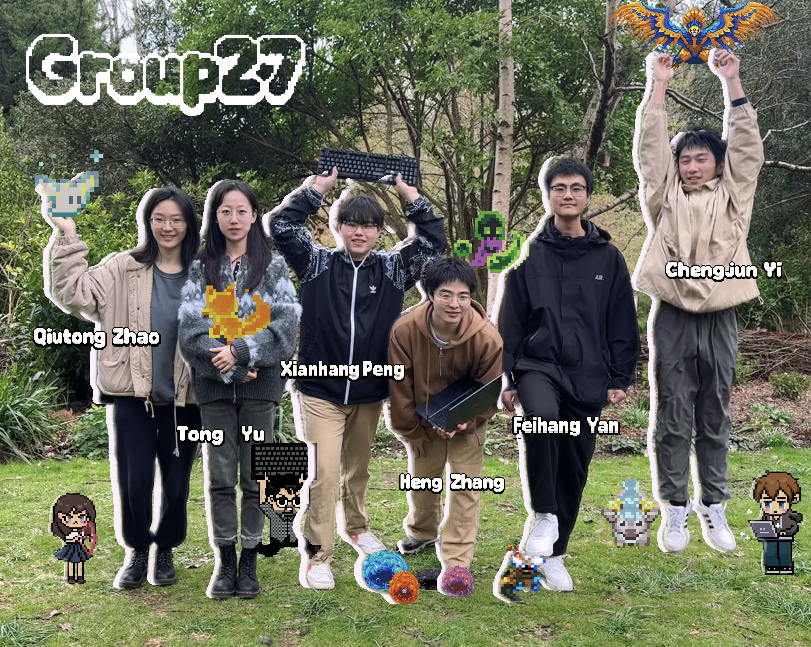
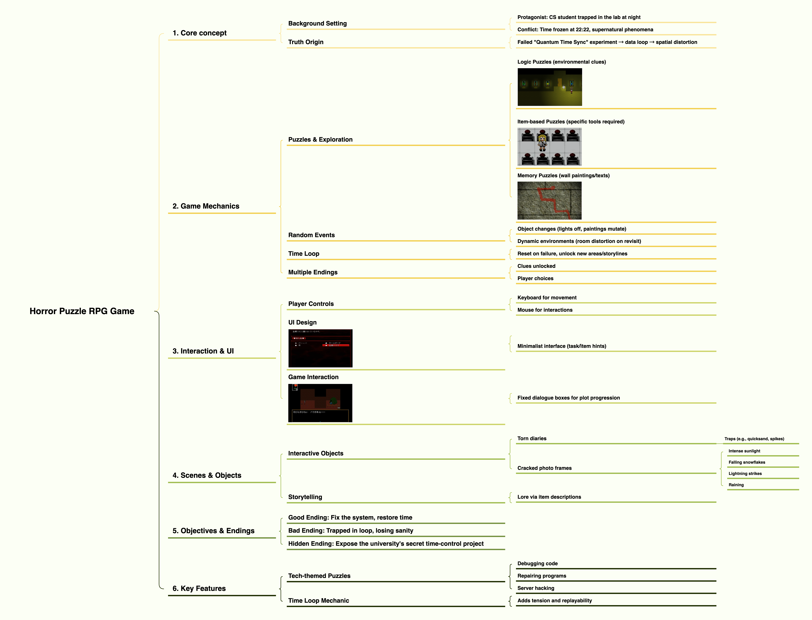
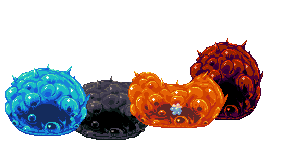
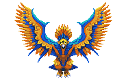
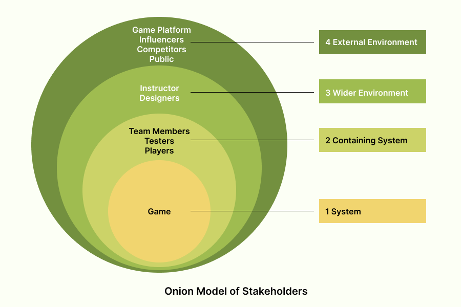
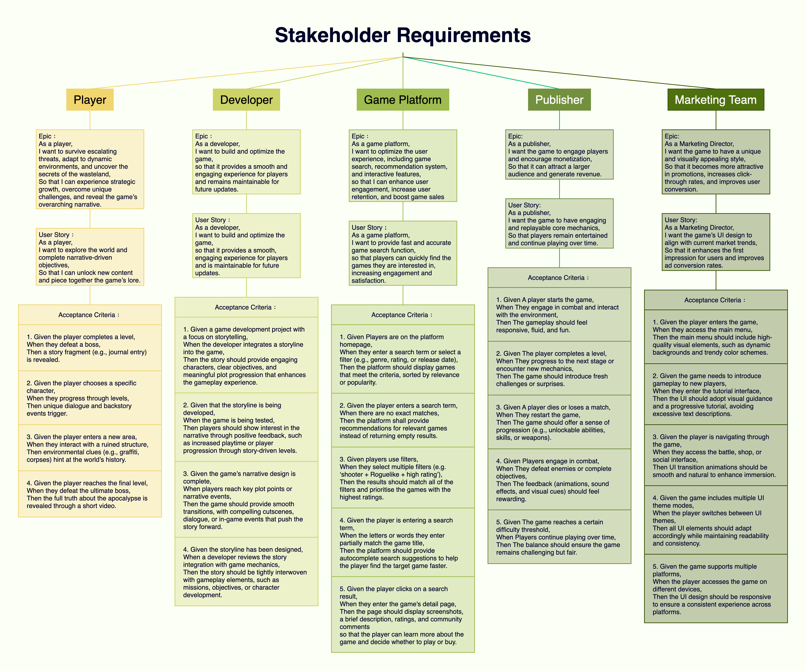
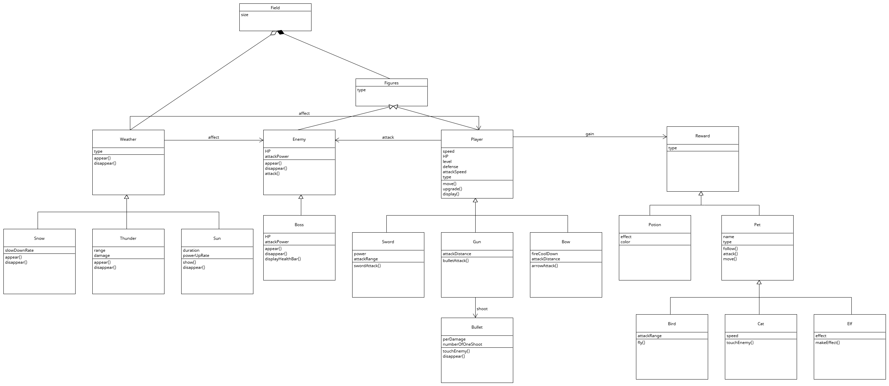
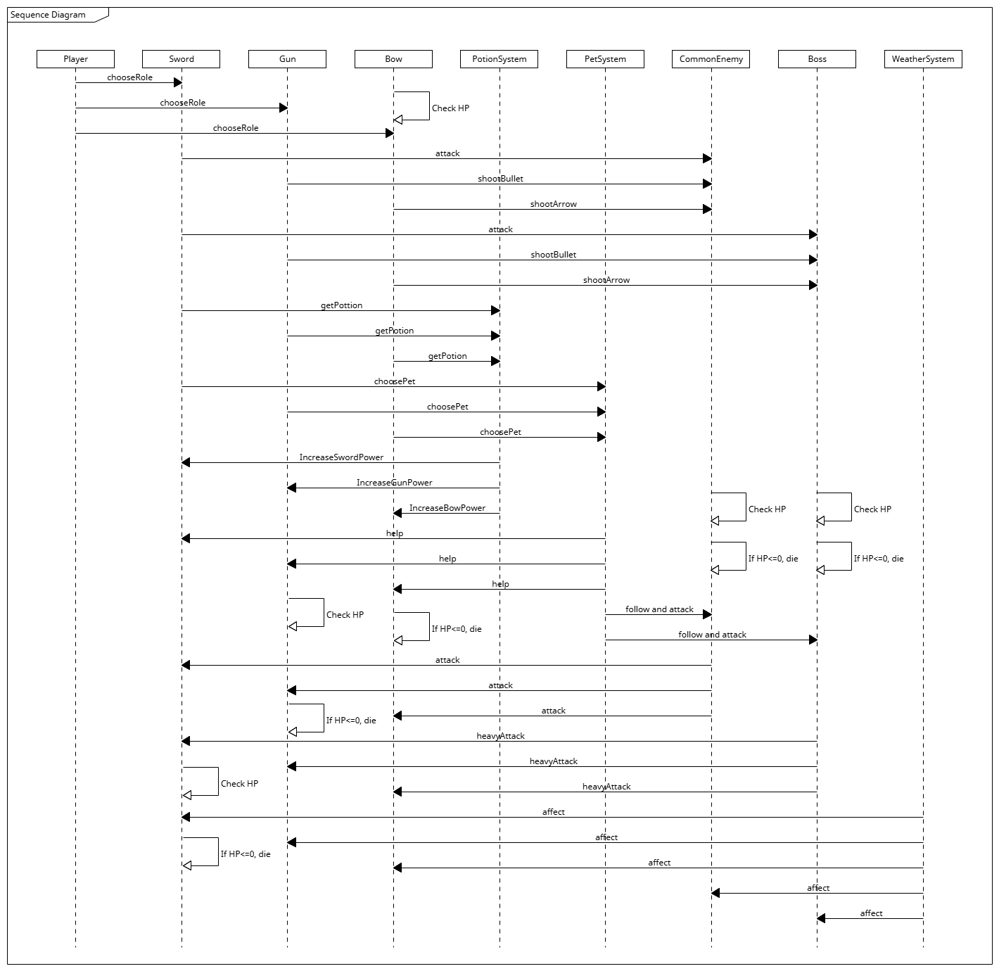
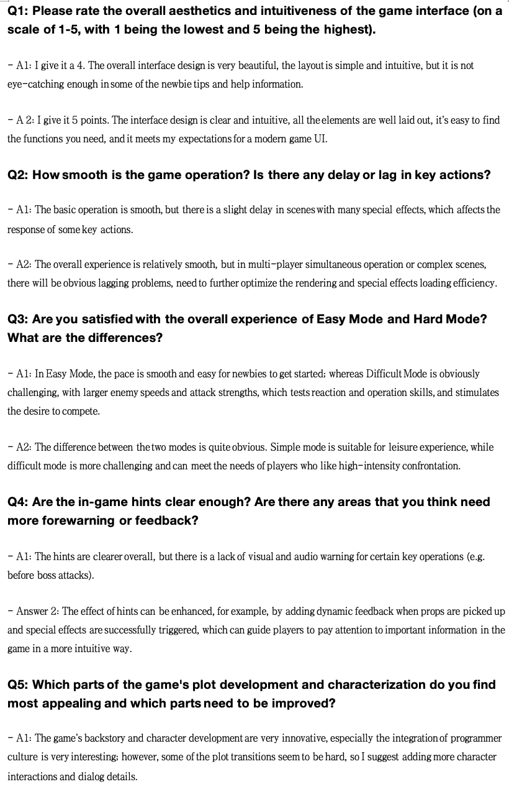

# 2025-group-27
2025 COMSM0166 group 27

## Glitchwood

Link to your game [PLAY HERE](https://uob-comsm0166.github.io/2025-group-27/)

Your game lives in the [/docs](/docs) folder, and is published using Github pages to the link above.

Include a demo video of your game here (you don't have to wait until the end, you can insert a work in progress video)

## Your Group

|   🎭 Name      |       📧 E-mail        | 📌 Role |                  🐙 Username                     |
|---------------|-----------------------|------|-------------------------------------------------|
| Chengjun Yi   | lw24658@bristol.ac.uk | TBD  | [realYDIAN](https://github.com/realYDIAN)       |
| Qiutong Zhao  | fa24741@bristol.ac.uk | TBD  | [AQIU20](https://github.com/AQIU20)             |
| Heng Zhang    | gg24694@bristol.ac.uk | TBD  | [chrisheng456](https://github.com/chrisheng456) |
| Tong Yu       | mp24824@bristol.ac.uk | TBD  | [CelesteYt](https://github.com/CelesteYt)       |
| Feihang Yan   | vj24070@bristol.ac.uk | TBD  | [Feihang027](https://github.com/Feihang027)     |
| Xianhang Peng | ge24600@bristol.ac.uk | TBD  | [capybara131](https://github.com/capybara131)   |

## Kanban

This is our [Kanban link(Jira)](https://1971026049.atlassian.net/jira/software/projects/KAN/boards/1)

## Project Report

### Background Research

#### Game Ideas

##### 1.Survival Shooting Game (Roguelike Elements)

 🎯 Introduction  
This **Survival Shooting Game** combines **Roguelike elements** with a **post-apocalyptic wasteland** setting. Players must survive against relentless enemies while facing dynamic environmental changes and **random events**. Every **3 minutes** brings a **surprise**, while every **5 minutes** introduces **despair**, ensuring an intense and unpredictable gameplay experience.  

**[GAME1 OVERVIEW](./docs/game_idea/Survival_Shooting_Game(Roguelike_Elements).pdf)**

.png)

###### 🔥 Game Mechanics  

###### 👥 Characters & Growth  
- Choose from **3 initial characters**, each with unique skills.  
- Gain **random rewards** (items, pets) to enhance abilities.  
- **Synergy system** creates unique experiences in each playthrough.  

###### 👾 Monster System  
- **Enemies spawn randomly** at screen edges and move toward the player.  
- **Two enemy types**:  
  - **Mobs**: Numerous but weak.  
  - **Bosses**: Special abilities & independent HP bars.  

###### 🎯 Shooting & Combat  
- **Mouse-controlled aiming** for precise shooting.  
- **Progressive upgrades**: Gain XP, new items, and ability boosts.  
- **Pet drops**: Obtain companions with unique effects.  

###### 🌍 Dynamic Challenges  
- **Random events**: Weather changes (Intense sunlight,Falling snowflakes,Lightning strikes，Raining ) and terrain traps (quicksand, spikes).  
- **Unpredictable battles**: Environmental changes force strategic adaptation.  

###### 🔀 Story & Progression  
- **Post-apocalyptic world** with a deep storyline.  
- Character progression tied to uncovering **the secrets of the wasteland**.  
- Unlockable content reveals hidden lore.  

###### ⚙️ Development & Technology  
- **Agile development** with tools like **use case diagrams, class diagrams, and communication diagrams**.  
- **Core mechanics**: Monster spawning, shooting physics, and rewards.  
- **GitHub version control** for efficient collaboration.  
- **Continuous testing & optimization** to ensure combat balance and fluidity.  

💀 **Survive, adapt, and uncover the secrets of the wasteland!**  

###### 🎬 Paper Prototype

🎮 **Game Idea 1 - Demo Video** 📹: [Click here to watch!](https://github.com/UoB-COMSM0166/2025-group-27/blob/main/docs/prototype/video/Prototype_Game_Idea_1.mp4)

---

##### 2.Horror Puzzle RPG

###### 🎯 Introduction  
In this **Horror Puzzle RPG**, players take on the role of a **computer science undergraduate** trapped in the university's experimental building. The building is mysteriously frozen in time at **22:22**, with supernatural events occurring. The protagonist must explore, solve puzzles, and uncover the truth to break the time curse.  

**[GAME2 OVERVIEW](./docs/game_idea/Horror_Puzzle_RPG.pdf)**

###### 🔥 Game Mechanics  

###### 🔍 Exploration & Puzzle Solving  
- Unlock new areas by **finding items** and **deciphering codes**.  
- Various **puzzle types**:  
  - **Logic puzzles** based on environmental clues.  
  - **Item-based puzzles** requiring specific objects.  
  - **Memory puzzles** (e.g., recognizing paintings or texts).  

###### ⏳ Time Loop Mechanic  
- **Failure resets time**, forcing players to retry.  
- Repeated loops **unlock new areas and story elements**.  

###### 🏚️ Dynamic Horror Environment  
- **Random supernatural events** (lights flicker, paintings shift).  
- Rooms become **more distorted** with each visit.  

###### 🔀 Multiple Endings  
- **Good Ending**: The protagonist **fixes the time system** and escapes.  
- **Bad Ending**: The protagonist is **trapped in the time loop forever**.  
- **Hidden Ending**: The protagonist uncovers the **university’s secret experiment** on time control.  

###### 💻 Tech-Based Puzzle Design  
- Includes **debugging code, repairing programs, and hacking servers**.  
- Aligns with the **computer science theme**.  

###### 🎭 Story Background  
A failed **quantum time synchronization experiment** caused the time freeze. The protagonist must repair the system to **restore normal time** and escape.  
 
🚀 **Can you break the cycle and uncover the truth?**  

###### 🎬 Paper Prototype

🎮 **Game Idea 2 - Demo Video** 📹: [Click here to watch!](https://github.com/UoB-COMSM0166/2025-group-27/blob/main/docs/prototype/video/Prototype_Game_Idea_2.mp4)

---

## Introduction

### About Glitchwood

**Glitchwood** is a **2D roguelike RPG game**. Players can choose from **three different characters**, each with unique attack ability and different upgrades. The game features highly **randomized elements (such as weather, pets, enemies, bosses, obstacles, and upgrades, etc.)**, allowing players to enjoy the thrill of boosting through clearing stages. By clearing stages, players can unlock an **endless mode**, continuously improving their characters and striving for higher kill counts.
The development of this game was inspired by **Vampire Survivors** and the popular Steam roguelike game **20 Minutes Till Dawn**. Glitchwood features a unique art style, an original and engaging background story, and creative background music with sound effects that complement the game’s atmosphere. It is not only easy to play, the game also includes a tutorial to help new players get started. We also introduce the endless mode which can further extend playtime.

### What makes our game distinction ?

In terms of game innovation, we have design **different upgrade paths** for three different characters, whereas traditional roguelike games usually offer only a single upgrade path. We also introduce a **pet system**, while traditional roguelike games typically only have standard upgrade options. Additionally, to enhance the game's randomness, we have implemented various **weather conditions** that affect both players and enemies under specific circumstances.
Regarding the storyline, we have broken away from the conventional RPG narrative style by **integrating the game's plot with the life of coding**, conveying the message: **"While writing code, we should also pay attention to life and those things around you."**
For art design, the game reflects our own experiences, featuring three uniquely designed characters with a **"programmer"** background, making them stand out.
For challenging gameplay, we have designed three different bosses, introduced an endless mode, and provided two difficulty levels for players to choose from.
In summary, this game is an exciting game and provide some accessible experience where players continuously improve themselves while facing increasingly powerful enemies.

### Before you play, there are some info that you need to know!!

| Image  | Character Name | Description  |
|--------|--------------|--------------|
|  | Mousegirl | This character has a unique charge attack mode. When fully charged, she reaches the maximum attack power among the characters. Her upgrades are related to the attack mechanics of the bow and arrows. |
|  | Computerboy | This character is easy to play—simple yet powerful. His upgrades focus on various attributes and bullet enhancements. |
|  | Keyboardman | This character specializes in melee combat, having high AOE damage. However, he needs to be close to enemies for launching attack. His upgrades mainly enhance survivability (e.g., lifesteal, resurrection) and some unique abilities. |

| Image  | Boss Name  | Description  |
|--------|-----------|--------------|
|  | Slimeboss | They are usually enemies found around beginner villages in RPG games, but in our game, they appear as bosses—be careful! They have four different forms, each with unique attack patterns and characteristics. Challenge them multiple times to familiarize yourself with the attack styles of different-colored slimes! |
|  | Birdboss | This boss appears around altars and specializes in dash attacks and movement-restricting strikes. Don’t be deceived by its flashy appearance! Here’s a little secret: its dash range is limited, so if you stay outside its attack range... |
|  | Bugboss | A boss that obscures vision, summons ghost flames, and performs dash attacks. Watch out for its ghost flames—they deal massive damage! |

---

## Requirements

Throughout the game development process, we explored how structured planning tools—Epics, User Stories, and Acceptance Criteria—enhance clarity, improve teamwork, and ensure an efficient workflow. By integrating these concepts into our project, we gained valuable insights into game design, stakeholder needs, and structured development.

### The Onion Model of Stakeholders

One key realization was that different stakeholders (players, developers, marketing teams, etc.) have different expectations and needs. The Onion Model of Stakeholders helped us visualize how our decisions impact not just players but also publishers, game platforms, and designers. This model allowed us to refine our development priorities.

The diagram below represents the onion model of stakeholder requirements for our project.

### Understanding Epics & User Stories

Epics serve as a high-level breakdown of major game features. They provide a broad vision of what we aim to achieve, ensuring that our work aligns with the game’s core mechanics and user experience goals.

User Stories translate these broad ideas into concrete, actionable tasks. The structured format—"As a [user], I want [goal], so that [reason]"—forced us to think from a player’s perspective rather than a purely technical viewpoint.

### Importance of Acceptance Criteria

Acceptance Criteria helped us define when a feature is truly complete. Using the "Given-When-Then" format, we set clear success conditions for our game mechanics.

For instance, when designing the enemy spawning system, we initially had a vague goal:

"Enemies should appear randomly."

By applying Acceptance Criteria, we refined it:

Given the player is in a combat zone,
When enemies spawn,
Then they should appear from different locations at randomized intervals.

This structured approach eliminated ambiguity, ensuring that both designers and developers had a clear, testable goal.

The diagram below illustrates the Epics, User Stories, and Acceptance Criteria for our project.

### Application in Our Game Development

Our game, Survival Shooting Game, benefited significantly from these structured methodologies. Instead of jumping into coding immediately, we first defined stakeholder needs, as seen in the Stakeholder Requirements Analysis.

Each group—players, developers, publishers, and marketing teams—had distinct priorities:

Players wanted immersive combat and intuitive UI.
Developers focused on smooth mechanics and maintainability.
Publishers required monetization and replayable mechanics.
Marketing Teams needed attractive visuals and promotional appeal.
By integrating Epics, User Stories, and Acceptance Criteria, we ensured that our development process balanced all these needs while staying aligned with the core game vision.

### Conclusion

This structured approach transformed how we approached game development. Initially, we tended to jump straight into implementation without considering broader design implications. However, through this process, we learned the importance of:

Breaking down complex ideas into manageable tasks.
Ensuring clear communication between designers, developers, and testers.
Focusing on user experience rather than just technical implementation.
By using Epics, User Stories, and Acceptance Criteria, we now have a well-structured, efficient workflow that aligns with both technical feasibility and player expectations. This experience has made us more mindful of structured planning in game development, improving both our teamwork and final product quality.

---

## Design

**This part is based on our early design**

### **Class Diagram Description**
The class diagram represents a game system with multiple interacting components, focusing on **players, enemies, weapons, weather effects, and rewards**.

#### 1. **Field and Figures**  
- The **Field** class represents the game area with a size attribute.  
- The **Figures** class is a general entity affecting the game.

#### 2. **Player and Enemy**  
- The **Player** class includes attributes such as speed, HP, level, defense, attackSpeed, and type. It has methods for movement (move()), upgrades (upgrade()), and display (display()).  
- The **Enemy** class has HP and attackPower, along with methods to appear(), disappear(), and attack().  
- A subclass of **Enemy** is **Boss**, which has an additional method to displayHealthBar().

#### 3. **Weapons**  
- **Sword** (power, attackRange, swordAttack())  
- **Gun** (attackDistance, bulletAttack())  
- **Bow** (fireCoolDown, attackDistance, arrowAttack())  
- **Bullet** (perDamage, numberOfOneShoot, touchEnemy(), disappear())

#### 4. **Weather Effects**  
- The **Weather** class affects gameplay and includes types such as:  
  - **Snow** (slowDownRate)  
  - **Thunder** (range, damage)  
  - **Sun** (duration, powerUpRate)  

#### 5. Rewards  
- Potion (effect, color)  
- Pet, which has name, type, follow(), attack(), and move().  
  - Bird (attackRange, fly())  
  - Cat (speed, touchEnemy())  
  - Elf (effect, makeEffect())

---

### Sequence Diagram Description (Second Image)  
The sequence diagram illustrates interactions between game components in various gameplay scenarios.

#### 1. Character Selection & Attack System  
- The Player selects a role (Sword, Gun, or Bow).  
- Depending on the weapon, the player either attacks directly (sword) or uses a ranged attack (gun or bow).  
- The attack process triggers different methods (shootBullet(), shootArrow(), attack()).

#### 2. Potion System  
- The Player interacts with the PotionSystem to retrieve health potions (getPotion()).  
- The system checks the player's HP and applies the necessary effects.

#### 3. Pet System  
- The player chooses a Pet (choosePet()), which can follow and attack enemies.  
- Pets provide additional support in combat.

#### 4. Enemy and Boss Battle  
- The CommonEnemy and Boss entities engage in battle with the Player.  
- The Boss has additional attack patterns (heavyAttack()).

#### 5. Weather System Effects  
- The WeatherSystem influences gameplay through different weather conditions (affect()).  
- Weather may hinder movement or provide power-ups.

---

## Evaluation

### 1. Qualitative Evaluation
###1.1 Artistic style and interaction design

— Players recognized the simplicity of the interface layout (e.g., the flat design of the character selection panel), and the tutorial's graphic guide enabled novices to get started quickly, making it a very successful design.

— Most players said that the programmer style, code symbols and digital elements used in the game make the overall picture full of unique “black science and technology” sense, which is very different from the traditional theme, adding personality and interest to the game. In addition, special effects such as dynamic weather, light and shadow gradient and particle effects add a sense of hierarchy and dynamism to the screen, making each game present a very different visual experience.

###1.2 Difficulty balance
  
— L1 Easy Mode: 
All new players were able to pass the level, and found the upgrade props and pacing to be relatively linear, and the bosses' attack intervals to be reasonable.

— L2 Difficulty Mode: 
In this mode, the number of enemies, speed and strength of attacks are increased, the attack pattern of bosses is more aggressive, and random events are more frequent (e.g., dynamic weather), which puts more pressure on the player to maneuver and react to the situation, resulting in a higher level of frustration, and a sense of accomplishment for the player who seeks a challenge after defeating it.

###1.3 Plot and Immersion

Players expressed interest in the game's setting of intertwining technology and survival, saying that this theme reflects the life of a programmer and also incorporates the exciting experience of adventure and survival. Some players mentioned that they resonated with the design of the game's individual characters, and felt a sense of accomplishment and immersion as they grew through their characters and fought against tough environments during the experience.

###1.4 Focus group Q&A transcripts

The questions and sample responses above reflect the focus group's views on the game's interface, operation, mode experience, hint messages, and plot characters. Based on this feedback, we have made improvements in the following directions:

| Issue Category           | User Feedback                                                                                           | Improvement Points                                                                                                       |
| ------------------------ | ------------------------------------------------------------------------------------------------------- | ------------------------------------------------------------------------------------------------------------------------- |
| Reminder mechanism       | Add Boss skill animation/sound effects.                                                                 | Add text files and sound cues                                                                                            |
| performance optimization | The screen gets stuck when there are too many special effects                                           | Reduce effects loading pressure with object pooling                                                                      |
| Excessive plotting       | Some transitions can be abrupt.                                                                         | Optimize scene transitions and effects pacing                                                                            |
| Helpful Hints            | The textual explanations and illustrations in the Beginner's Guide are slightly fragmented and not intuitive enough. | Integrate help pages to enhance the readability of the explanatory text and the overall visual presentation.             |

#### 2. Quantitative Evaluation

In order to evaluate the usability and player load of the game in different difficulty modes (L1 easy mode and L2 hard mode), we used the System Usability Scale (SUS) and NASA-TLX (Task Load Index) to collect and analyze the data respectively.

**2.1 NASA TLX Scores**.

At the L1 (easy) difficulty, users generally reported a lower workload, particularly in the dimensions of mental demand and effort. The average Mental Demand score for L1 was 60, while at L2 (hard), it significantly increased to 80. Other dimensions such as Physical Demand and Frustration showed similar trends, indicating that as the difficulty increased, players experienced higher physical exertion and emotional stress. At L2, users’ Frustration scores were generally higher, indicating an increase in frustration at the higher difficulty.

**2.2 System Usability Scale (SUS)**.

We used the Wilcoxon Signed Rank Test to compare the evaluation data between the two difficulty levels, calculating the significance differences in the NASA TLX and SUS scores for L1 and L2. The analysis revealed that while there was a significant difference in workload between L1 and L2, the usability ratings showed only a small difference, indicating that the game maintained a relatively consistent user experience across both difficulty levels.

From the SUS data in the table, it can be seen that in the L1 Easy Mode, players' evaluation of the game's ease of use, intuitiveness, and integration of functions is relatively high. In addition, the data in NASA shows that players' scores for Psychical Demand and Effort are generally low in Easy Mode, which indicates that players' attention span and complexity of operation are low in this mode. Time demands and physical demands are also relatively mild, and overall frustration is low (in the 20-30 range). This is consistent with the goal of the L1 mode, which is to quickly familiarize novices with the basic gameplay and reduce psychological stress.

In contrast, the scores of some questions in L2 mode (such as Q2, Q4, Q10 and other negative questions) increased, indicating that players felt more obvious about the complexity of the system operation and the burden of learning.NASA's scores of all dimensions in the difficult mode increased to a certain extent, especially the mental demand, effort and frustration (in the range of 60-70), which reflected that players need to invest more energy and reaction ability when coping with the faster, more difficult or more complicated enemies/levels, and are also more prone to the stress of failure. or more complex enemies/levels require more effort and reflexes, and are more prone to the stress of failure. At the same time, time demands also increase, indicating that players need to make more frequent and quick decisions and actions in a shorter period of time.

###3 Code Test

The test environment deployed an online version of the game via GitHub Pages, ensuring accessibility in both desktop and mobile browsers. We invited three typical user groups (classmates, game enthusiasts, and developers) to participate in semi-structured interviews after the trial. During the interviews, we not only collected qualitative user experience feedback (interface intuitiveness, smoothness of operation, hints, etc.), but also discussed specific scenarios in the game in detail, which helped the team clarify the direction of improvement.

---

## Sustainability Analysis

### Social Dimension
We raise awareness of developer well-being by embedding themes of overwork and creative burnout into gameplay.
Community-driven features like level design submissions encourage collaboration and shared creative expression.

### Environmental Dimension
Our dynamic weather reflects shifting digital environments and resource unpredictability, prompting adaptive strategies.
We use nature-inspired map design and optimize code for minimal energy use, promoting ecological consciousness in both content and performance.

### Economic Dimension
The game is free-to-play with optional donations, all of which go to organizations advocating for tech worker rights.
Through ongoing content updates, we prioritize long-term engagement over extractive monetization.

### Technical Dimension
We apply modular and efficient coding practices to reduce maintenance overhead and technical waste.
Visual effects and animations are optimized to lower power consumption and improve runtime efficiency.

### Individual Dimension
By gamifying debugging as self-discovery, we invite players to reflect on productivity, stress, and balance.
The variety of tools and paths encourages experimentation, creativity, and personal agency in problem-solving.

---

## Implementation

### Basic Implement

The implement of Glitchwood revolve around battling enemies, leveling up, and progressing through stages while striving for higher kill counts in endless mode. Players can easily control one of three selectable characters using a combination of keyboard and mouse: the keyboard handles movement, while the mouse controls attacks and attack direction. **The implementation relies primarily on event-related methods such as keyPressed and mouseClicked.**

Characters can engage in both melee and ranged combat, with damage types classified as either single-target or AoE.

The game features four distinct maps, each owned procedurally generated obstacles of different styles. These obstacles block both movement and attacks(For both players and enemies). However, certain bosses possess the ability to phase through obstacles. **When a new map is generated, existing obstacles are cleared, and new obstacles are created based on the current wave.**

As for the game logic, enemies spawn outside obstacle zones and at a certain distance from the player’s location. As waves increase, the number of spawning enemies increases. Bosses appear at waves 5, 10, and 15, each bringing unique challenges. **To ensure enemies pursue the player effectively, we calculate the direct line between them and determine the optimal angle for movement along the shortest path.**

Regarding the pet and weather systems, after defeating the first boss, players can choose one of three pets, each granting a unique blessing—such as generating a shield, restoring health, or automatically attacking enemies. Additionally, the game introduces a dynamic weather system that changes every 30 seconds. **This is implemented using time-related functions provided by p5.js, along with random number generation to determine the type of weather effect.**

### Challenges

In the development of our game, we faced several key challenges that required creative problem-solving and technical expertise. These challenges mainly fall into two categories(In fact, in this part we list more than three challenges): **integrating story and Game’s Elements with gameplay and implementing complex game mechanics and code compatibility.**

#### 1. Integrating Story and Game’s Elements with Gameplay

One of our core challenges was tightly blending the main storyline with gameplay mechanics. The game’s narrative needed to be immersive while ensuring that the gameplay remained engaging and not overshadowed by excessive text or cutscenes. Key aspects of this challenge included:

-	**Background Art & Atmosphere**: The background needed to reflect the story setting while maintaining clarity for gameplay. Striking a balance between visual storytelling and functional level design was crucial.

-	**Monster and Character Design**: Each character and monster had to be visually distinct, fitting the game’s theme while ensuring their silhouettes were recognizable in fast-paced combat. Achieving dynamic animations for multiple characters further increased development complexity. **For example, we need to load different movement animations based on the enemy's movement direction.**

-	**Attack Mechanisms**: The player character required two distinct attack methods: melee and ranged combat. These two attack types needed to feel different in mechanics, balance, and animations, making their implementation more complex. For example, the **Mousegirl** character requires a charging bar to be drawn, while **Keyboardman** needs different animations bound to attacks in four directions.

-	**Pet System**: The game included three types of pets, each offering unique benefits such as attack, shield, and healing. These pets needed to follow the main character and interact with the environment without disrupting the gameplay balance. Designing pet mechanics that complemented the main character’s abilities added to the challenge.

-	**Level Design**: Each stage needed to introduce new gameplay elements while maintaining difficulty progression. The placement of enemies, obstacles, and power-ups had to be carefully designed to prevent either excessive frustration or a lack of challenge. **For this, we need to create a variety of different characters, which also increases the complexity of the code.**

-	**Weather System**: Dynamic weather effects were considered to enhance immersion, but integrating them in a way that impacted gameplay (e.g., reducing visibility in fog or affecting movement in the rain) required careful design and testing. **For example, when generating lightning, we should provide players with enough time to react.**

#### 2. Implementing Complex Game Mechanics and Code Compatibility

Beyond storytelling and visual design, the technical implementation of various game mechanics posed another set of challenges. These included:

-	**Collision Detection & Air Walls**: The game world needed invisible boundaries ("air walls") to prevent players from exiting the intended play area. However, defining their volume accurately without interfering with gameplay movement was tricky. For this, we need to carefully crop the images to minimize empty borders as much as possible.

-	**Obstacle Variations**: Each level introduced unique obstacles, requiring a flexible system that could spawn new types dynamically while removing old ones efficiently. For this challenge, we try to use **stack** to solve it.

-	**Attack & Hit Detection**: Both player and enemy attacks needed precise hitbox detection to ensure fair and responsive combat. Different attack types (melee, ranged, pet abilities) made this more challenging. **For melee characters' attacks, we have introduced two parameters: attack range and attack angle**.

-	**Pet Abilities**: The three pets followed the main character while providing distinct benefits. Coding behavior for pets that attack enemies, provide shields, or heal the player in real-time added layers of complexity. Ensuring pets didn't obstruct movement or interfere with combat balance was another challenge.

-	**Weather System Implementation**: If the game featured a weather system, its effects on physics (e.g., slowing movement in snow) and visibility (e.g., fog reducing sight) had to be carefully implemented without breaking the game’s mechanics.

-	**Frame Rate Differences Between Characters**: Different characters had unique animations, but their frame rates varied. Unifying animation timing across all characters without making them feel sluggish or desynchronized was a difficult technical task.

#### 3. Conclusion

Developing a game involves overcoming multiple challenges, from balancing storytelling and gameplay mechanics to solving complex coding problems. Through iteration, testing, and optimization, we tackled these challenges to create a more immersive and enjoyable gaming experience. Future improvements will focus on refining game balance, enhancing AI behavior, and optimizing performance across different devices.

---
## Sustainability, Ethics, and Accessibility
In addition to pursuing gameplay, challenge and innovation, we also strive to have a positive impact on the environment, society and economy. We have demonstrated the impact mechanism in three key dimensions during the development process: environment, society and economy.

### Environmental Impact
In terms of the environment, the core design concept of Glitchwood is to establish a close connection with natural and environmental elements. We carefully constructed a dynamic weather system and a map design "inspired by nature" to reflect the unpredictability of the climate and the challenges of ecological protection in reality. The game uses a dynamic weather system that changes every 30 seconds, simulating various weather conditions such as rain and lightning. Players must develop different strategies according to environmental changes in battle, which not only greatly improves immersion, but also subtly improves their understanding of resource unpredictability and the balance of natural ecosystem management.
In addition, we pay special attention to reducing energy consumption at runtime in the design and optimization of visual effects and animations. Our code is specially optimized with the goal of achieving minimum energy consumption and easy maintenance, which is particularly important in the context of increasing global attention to digital carbon footprints. Through this technical approach, we not only provide an efficient operation experience, but also convey the concept of respecting nature and cherishing resources, which helps to build a green and sustainable digital ecosystem. The integration of environmental elements has a dual purpose: on the one hand, it enhances the player's immersive experience through a constantly changing dynamic system, and on the other hand, it provides a creative platform for discussing broader ecological issues. Like real-world environmental management challenges, Glitchwood encourages players to develop adaptive strategies, educate themselves on the environment, and increase ecological awareness while having fun.

### Social Impact
Glitchwood incorporates sustainability and ideology into the game's narrative and design, focusing not only on the player experience, but also on the physical health of the development team and community collaboration. The game embeds themes about overwork, work-life balance, and creative fatigue, directly exploring common stress issues in the technology and game industries, guiding players to reflect on game development. At the same time, we encourage players to propose creative ideas and design solutions, thereby promoting collaboration and knowledge sharing. This open and interactive model not only stimulates collective wisdom, but also continuously enriches the game content and forms a stronger and more combative player community.

In addition, to address accessibility issues, we extensively incorporate feedback from qualitative interviews and quantitative evaluations into the design to ensure that the game is suitable for players of different abilities and experience levels. By providing multiple entry settings, such as L1 mode designed for novices and L2 mode designed for advanced players, and adding additional prompts and guidance in high-difficulty modes, we strive to ensure that all players can get a full game experience. This player-centered design approach not only reflects the importance of social responsibility, but also promotes the spread of the concept of healthy work-life balance, making games an important concept for promoting positive social causes.

### Economic Impact
Glitchwood adopts a free model supplemented by optional donations, aiming to break traditional payment barriers, attract a wider player base, and ensure that the business model is ethical and socially responsible. Our strategy is not only to maximize player accessibility, but also to create a non-exploitative revenue structure that encourages long-term player participation through continuous content updates and open community communication mechanisms, rather than relying on one-time in-app purchases or aggressive in-game advertising. The free strategy lowers the barrier to entry, making the game accessible to players from different economic backgrounds, and lays the foundation for building a fair, transparent and inclusive digital ecosystem.

All optional donations are processed transparently, and a portion of the revenue is pledged to be donated to non-profit organizations that advocate for the rights and ethical practices of technical workers. This measure not only reflects our concern for improving the labor environment within the industry, but also conveys our belief in an economic model that prioritizes short-term profits over long-term participation and user well-being. Through this combination of public welfare and business, Glitchwood creates a healthy and positive economic cycle that allows both participants and developers to benefit sustainably from continued success. At the same time, this model cleverly guides players to pay attention to industry ethics and labor environment issues, greatly enhancing the importance of occupational health of technical workers.

---
## Conclusion
The development of Glitchwood is a multifaceted process that not only challenges our technical skills, but also our ability to balance storytelling, game mechanics, and sustainable design.

During the project process, our agile development approach allows the team to iterate quickly and adapt to changes based on continuous feedback. We often refine user stories and acceptance criteria to ensure that all features meet game standards and stakeholder expectations. Heuristic evaluation plays a crucial role in every sprint cycle; It not only helps identify usability issues early in the development cycle, but also ensures that the game is accessible and enjoyable for both novice and experienced players.

A major challenge is to integrate the story of the game with its mechanics. Balancing narrative immersion and gameplay requires us to re-examine our design multiple times. For example, synchronizing background art and atmosphere with fast-paced battles allows us to prioritize clarity in visual storytelling. This challenge extends to the design of characters and monsters that must be visually distinct but function well in dynamic environments. We have tried various animation techniques, such as loading different motion animations based on the direction of enemies, which sometimes leads to inconsistent frame rates. By combining design with performance metrics, this technical barrier can be alleviated.

Another important area is implementing complex game mechanics and ensuring code compatibility. Integrating elements such as collision detection, dynamic obstacle detection, precise attack and hit detection, and constantly changing weather systems requires meticulous methods. We address these issues by adopting modular coding practices. The pet system further complicates game balance, requiring us to design behaviors that enhance player abilities without causing interference. These technological challenges strengthen our commitment to the spirit of extreme programming, in which constant refactoring and collaboration are key to overcoming obstacles.

Sustainability is another pillar of our project philosophy. In addition to optimizing games through efficient code to reduce energy consumption, we also incorporate privacy into our design principles. We ensure careful handling of user data and respect for player privacy. This comprehensive approach not only enhances people's trust in our products, but is also consistent with the long-term goal of cultivating a safe and sustainable gaming environment.

Looking ahead, future work will focus on several areas that need improvement. One approach is to enhance narrative integration by experimenting with adaptive narrative elements, which further integrate gameplay with the fundamental themes of the game. We also plan to improve the enemy's artificial intelligence and weather dynamics to create more immersive and reactive games. In addition, more robust testing will be conducted on the expanded user base to further adjust usability aspects and ensure that the game is available to a wider audience. Finally, continuing to optimize the performance and sustainability of the game will remain a key focus.
In short, in this project, agile planning, heuristic insights, and sustainable design are integrated to create an attractive and ethically responsible product. The lessons learned here will undoubtedly provide great help for our future career development.

---
## Project Report

### Introduction

- 5% ~250 words 
- Describe your game, what is based on, what makes it novel? 

### Requirements 

- 15% ~750 words
- Use case diagrams, user stories. Early stages design. Ideation process. How did you decide as a team what to develop? 

### Design

- 15% ~750 words 
- System architecture. Class diagrams, behavioural diagrams. 

### Implementation

- 15% ~750 words

- Describe implementation of your game, in particular highlighting the three areas of challenge in developing your game. 

### Evaluation

- 15% ~750 words

- One qualitative evaluation (your choice) 

- One quantitative evaluation (of your choice) 

- Description of how code was tested. 

### Process 

- 15% ~750 words

- Teamwork. How did you work together, what tools did you use. Did you have team roles? Reflection on how you worked together. 

### Conclusion

- 10% ~500 words

- Reflect on project as a whole. Lessons learned. Reflect on challenges. Future work. 

### Contribution Statement

- Provide a table of everyone's contribution, which may be used to weight individual grades. We expect that the contribution will be split evenly across team-members in most cases. Let us know as soon as possible if there are any issues with teamwork as soon as they are apparent. 

### Additional Marks

You can delete this section in your own repo, it's just here for information. in addition to the marks above, we will be marking you on the following two points:

- **Quality** of report writing, presentation, use of figures and visual material (5%) 
  - Please write in a clear concise manner suitable for an interested layperson. Write as if this repo was publicly available.

- **Documentation** of code (5%)

  - Is your repo clearly organised? 
  - Is code well commented throughout?
