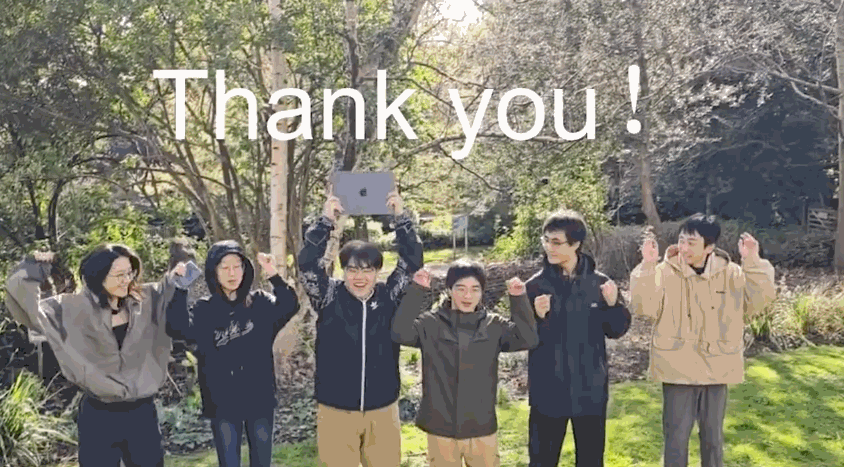

# 2025-group-27

2025 COMSM0166 group 27

# Game: Glitchwood

  
    
<em>Game Icon for Glitchwood.</em>

## Quick Start

- [**Play the Game Now!**](https://uob-comsm0166.github.io/2025-group-27/)  
  _Launch Glitchwood directly in your browser._

- [**Source Code Directory**](./docs)  
  _All development files and assets are located in the `/docs` folder._

- [**Watch the Demo Video**](https://youtu.be/V8NCOusjgn8)  
  _See Glitchwood in action with a narrated gameplay showcase._

  
    
<em>Thumbnail for the YouTube demo video (click to watch).</em>

# Our Group

  
  
<em>Group photo of Team 27 with member names marked.</em>

<table>
  <thead>
    <tr>
      <th>Name</th>
      <th>Email</th>
      <th>GitHub</th>
    </tr>
  </thead>
  <tbody>
    <tr>
      <td>Chengjun Yi</td>
      <td><a href="mailto:lw24658@bristol.ac.uk">lw24658@bristol.ac.uk</a></td>
      <td><a href="https://github.com/realYDIAN">realYDIAN</a></td>
    </tr>
    <tr>
      <td>Qiutong Zhao</td>
      <td><a href="mailto:fa24741@bristol.ac.uk">fa24741@bristol.ac.uk</a></td>
      <td><a href="https://github.com/AQIU20">AQIU20</a></td>
    </tr>
    <tr>
      <td>Heng Zhang</td>
      <td><a href="mailto:gg24694@bristol.ac.uk">gg24694@bristol.ac.uk</a></td>
      <td><a href="https://github.com/chrisheng456">chrisheng456</a></td>
    </tr>
    <tr>
      <td>Tong Yu</td>
      <td><a href="mailto:mp24824@bristol.ac.uk">mp24824@bristol.ac.uk</a></td>
      <td><a href="https://github.com/CelesteYt">CelesteYt</a></td>
    </tr>
    <tr>
      <td>Feihang Yan</td>
      <td><a href="mailto:vj24070@bristol.ac.uk">vj24070@bristol.ac.uk</a></td>
      <td><a href="https://github.com/Feihang027">Feihang027</a></td>
    </tr>
    <tr>
      <td>Xianhang Peng</td>
      <td><a href="mailto:ge24600@bristol.ac.uk">ge24600@bristol.ac.uk</a></td>
      <td><a href="https://github.com/capybara131">capybara131</a></td>
    </tr>
  </tbody>
</table>

# Project Report

## Table of Contents

- [1 Introduction](#1-introduction)
  - [1.1 Overview](#11-overview)
  - [1.2 Ideation and Design Origins](#12-ideation-and-design-origins)
  - [1.3 Inspiration](#13-inspiration)
  - [1.4 Innovation](#14-innovation)
  - [1.5 Vision](#15-vision)
  
- [2 Requirements](#2-requirements)
  - [2.1 Stakeholder Identification: The Onion Model](#21-stakeholder-identification-the-onion-model)
  - [2.2 Requirements Analysis: Epics, User Stories, and Acceptance Criteria](#22-requirements-analysis-epics-user-stories-and-acceptance-criteria)
  - [2.3 Applying Requirements to Our Game](#23-applying-requirements-to-our-game)
  - [2.4 Use-Case Diagram and Use-Case Specification](#24-use-case-diagram-and-use-case-specification)
  - [2.5 Reflection and Conclusion](#25-reflection-and-conclusion)

- [3 Design](#3-design)
  - [3.1 System Architecture Overview](#31-system-architecture-overview)
  - [3.2 Class Diagram](#32-class-diagram)
  - [3.3 Sequence Diagram](#33-sequence-diagram)
  - [3.4 Reflection and Conclusion](#34-reflection-and-conclusion)

- [4 Implementation](#4-implementation)
  - [4.1 Core Gameplay Implementation](#41-core-gameplay-implementation)
  - [4.2 Code Architecture Overview](#42-code-architecture-overview)
  - [4.3 Key Features and Highlights](#43-key-features-and-highlights)
  - [4.4 Technical Challenges and Solutions](#44-technical-challenges-and-solutions)
  - [4.5 Reflection and Conclusion](#45-reflection-and-conclusion)

- [5 Evaluation](#5-evaluation)
  - [5.1 Qualitative Evaluation](#51-qualitative-evaluation)
  - [5.2 Quantitative Evaluation](#52-quantitative-evaluation)
  - [5.3 Code Testing & Usability Interviews](#53-code-testing-usability-interviews)
  - [5.4 Reflection and Conclusion](#54-reflection-and-conclusion)

- [6 Process](#6-process)
  - [6.1 Team Roles and Collaboration](#61-team-roles-and-collaboration)
  - [6.2 Tools and Workflow](#62-tools-and-workflow)
  - [6.3 Agile Practices](#63-agile-practices)
  - [6.4 Continuous Improvement](#64-continuous-improvement)
  - [6.5 Reflection and Conclusion](#65-reflection-and-conclusion)

- [7 Sustainability, Ethics, and Accessibility](#7-sustainability-ethics-and-accessibility)
  - [7.1 Environmental Efficiency](#71-environmental-efficiency)
  - [7.2 Social and Narrative Themes](#72-social-and-narrative-themes)
  - [7.3 Technical Sustainability](#73-technical-sustainability)
  - [7.4 Accessibility & Inclusive Design](#74-accessibility-inclusive-design)
  - [7.5 Summary](#75-summary)

- [8 Conclusion](#8-conclusion)
  - [8.1 What We Learned](#81-what-we-learned)
  - [8.2 Challenges Overcome](#82-challenges-overcome)
  - [8.3 Collaboration Insights](#83-collaboration-insights)
  - [8.4 Future Directions](#84-future-directions)
  - [8.5 Final Thoughts](#85-final-thoughts)

- [9 Appendix](#9-appendix)
  - [9.1 Contributions of Team Members](#91-contributions-of-team-members)
  - [9.2 References](#92-references)
  - [9.3 Goodbye from the Team](#93-goodbye-from-the-team)

## 1 Introduction

### 1.1 Overview

**Glitchwood** is a browser-based **2D roguelike action RPG** developed using **P5.js**. Players take on the role of a developer navigating through their own chaotic creation—a metaphorical journey of code, bugs, and debugging.

Players choose from **three unique characters**, each with distinct combat styles and upgrade paths.

  
  
<em>Figure 1. Character selection screen.</em>

The game features **procedurally generated stages** filled with enemies, traps, and evolving hazards. Key gameplay elements include:
- A **dynamic weather system** changing gameplay every 30 seconds  
- A **pet system** offering support (healing, shielding, attacking)  
- Increasingly difficult **boss encounters**  
- An unlockable **Endless Mode** to test survival skills

  
  
<em>Figure 2. Weather effects in gameplay.</em>

  
  
<em>Figure 3. Pet selection screen.</em>

  
  
<em>Figure 4. Boss battle screen.</em>

Glitchwood is designed for both casual players and roguelike veterans, featuring:
- **Two difficulty levels**
- **A built-in tutorial**
- **Mouse-and-keyboard controls**

Most importantly, **Glitchwood** is a symbolic representation of software development, incorporating glitches, bugs, and system pressure into its mechanics.

### 1.2 Ideation and Design Origins

Before arriving at **Glitchwood**, our team explored multiple game ideas, which were tested through prototypes and discussions. Here we outline the path leading to the final design.

#### Game Idea 1: Survival Roguelike (Selected)

A wave-based roguelike where players control developer-themed characters in glitchy environments filled with enemies, hazards, and random upgrades. The gameplay focuses on fast-paced combat and metaphor-driven design.

  
  
<em>Figure 5. Mind map for Survival Roguelike concept.</em>

**Core Mechanics:**
- Distinct character classes (melee, ranged, projectile)  
- Random upgrades between waves  
- Companion pets with offensive, defensive, or healing roles  
- Weather system that changes every 30 seconds  
- Boss encounters and Endless Mode after wave 15  

  
  
<em>Figure 6. Character selection prototype.</em>

  
  
<em>Figure 7. Pet selection interface prototype.</em>

  
  
<em>Figure 8. Combat system demo prototype.</em>

  <video src="https://github.com/user-attachments/assets/141335507/439241019-1799972f-5791-44f3-937b-22e1397587ac.mp4" controls width="540">
    Your browser does not support the video tag.
  </video>
  
<em>Figure 9. Paper prototype demo for Survival Roguelike.</em>

**Design Strengths:**
- Modular systems for easy collaboration  
- High replayability due to random upgrades and dynamic weather  
- Easily testable mechanics with P5.js  
- Symbolic gameplay that mirrors software development challenges  

#### Game Idea 2: Horror Puzzle RPG (Not Selected)

An immersive puzzle RPG set in a frozen university lab, where the player must solve programming-themed puzzles to escape a time loop.

  
  
<em>Figure 10. Mind map for Horror Puzzle RPG concept.</em>

**Core Concepts:**
- Puzzle solving through logic gates and key-item use  
- Repeated loops unlocking new areas and dialogue  
- Supernatural horror elements with escalating difficulty  
- Multiple endings based on player decisions  

  <video src="https://github.com/user-attachments/assets/141335507/439230948-ebbef71e-5e4e-4bac-967e-0046e64da9a3.mp4" controls width="540">
    Your browser does not support the video tag.
  </video>
  
<em>Figure 11. Prototype video for Horror Puzzle RPG.</em>

**Design Limitations:**
- Complex branching logic difficult to manage in P5.js  
- Harder to modularize across developers  
- Story dependencies complicating iterative testing  

#### Why We Chose the Survival Roguelike

We selected **Game Idea 1** for **Glitchwood** because:
- **Modularity**: The pet, weather, and enemy systems could be developed independently.  
- **P5.js Compatibility**: More suited for browser deployment.  
- **Agile Iteration**: Easier to iterate and playtest.  
- **Clear Metaphor Integration**: The theme of debugging and developer pressure fit well.  
- **Collaborative Scalability**: Easier to divide the workload across different roles.

> Although the horror RPG had narrative potential, the survival roguelike provided a more solid base for both creativity and engineering.

### 1.3 Inspiration

To refine our design, we studied two modern roguelikes: **Vampire Survivors** and **20 Minutes Till Dawn**. These games provided valuable insights into gameplay mechanics, balance, and system complexity.

#### Vampire Survivors
- Auto-attack gameplay and wave-based enemy spawning  
- Highly addictive loop with evolving upgrades  
- Simple visuals and controls allow for fast iteration  
- Limitation: Lack of manual input can reduce player agency  
- Takeaway: We adopted **wave-based survival**, **upgrade choices**, and **enemy escalation**
  

  
  
<em>Figure 5. Screenshot from <i>Vampire Survivors</i>.</em>

#### 20 Minutes Till Dawn
- Twin-stick shooter with precise aiming and movement  
- Strong emphasis on build variety and moment-to-moment action  
- Effective minimalism in both UI and art direction  
- Limitation: Somewhat short progression loop, less narrative  
- Takeaway: We embraced **manual aiming**, **responsive controls**, and **fast-paced combat**

  
  
<em>Figure 6. Screenshot from <i>20 Minutes Till Dawn</i>.</em>

Unlike those titles, **Glitchwood** takes a more **symbolic approach**. Here, the player is a developer trapped in their own game, confronting metaphorical bugs, runtime failures, and digital entropy. Every mechanic—from **dynamic weather** to **pets as debugging tools**—echoes real-world challenges in software development.

Working within **P5.js**, we designed modular systems that allow:
- Rapid iteration and extensibility  
- Distinct character behaviors and upgrade paths  
- Thematic consistency between gameplay and metaphor  

[Back to Table of Contents](#table-of-contents)

## 2 Requirements

Throughout the development of *Glitchwood*, we applied structured requirement planning techniques to guide our design and implementation. Specifically, we used tools such as **Epics**, **User Stories**, and **Acceptance Criteria**, which are widely adopted in agile software development. These approaches helped us define goals more clearly, understand different stakeholder needs, and manage the complexity of the project in a collaborative and iterative way.

### 2.1 Stakeholder Identification: The Onion Model

To guide our requirements planning, we used the **Onion Model** to map out the different stakeholders involved in or affected by Glitchwood’s development. This model helped us visualize not only the users of the system, but also the broader technical, academic, and social context in which the game operates.

  
  
<em>Figure 12. Onion model diagram for stakeholder analysis.</em>

#### Core Layer: The System Itself

At the center of the model is the system—**Glitchwood**. All design decisions revolve around its mechanics, interface, and player experience.

#### Inner Layer: Immediate Users

This includes the **players**, who directly interact with the system, and the **testers**, who provided feedback during development. Their needs shaped key usability features, such as difficulty modes, intuitive controls, and tutorials.

#### Middle Layer: Institutional Context

This layer includes:

- **Instructors**, who evaluated the project based on software engineering principles
- **Inspirational sources**, such as Vampire Survivors and 20 Minutes Till Dawn, which influenced our mechanics and pacing

These stakeholders indirectly shaped how we interpreted project goals and technical structure.

#### Outer Layer: Extended Environment

The final layer captures external and social stakeholders:

- The **platform (GitHub Pages)**, used for hosting and live deployment
- **Classmates and potential influencers**, who could share or promote the game
- **Competitor projects** from other teams
- The **public**, representing players outside the course who may access the game post-release

By structuring our stakeholder landscape in this way, we ensured our requirements reflected not just user needs, but also technical constraints, academic expectations, and broader deployment conditions. This model also provided a foundation for aligning gameplay features with stakeholder values in subsequent planning phases.

### 2.2 Requirements Analysis: Epics, User Stories, and Acceptance Criteria

Once we mapped out our stakeholders, we translated their needs into formal software requirements using industry-standard tools: **Epics**, **User Stories**, and **Acceptance Criteria**.

#### From Stakeholders to Epics

We began by grouping stakeholder needs into five major **epics**, each representing a key area of concern:

- Gameplay progression and difficulty
- Upgrade system and combat balance
- UI clarity and accessibility
- Deployment and performance
- Educational and symbolic value

These epics helped us align high-level goals across design, development, and evaluation.

#### Writing User Stories

From each epic, we derived concrete **User Stories**, following the standard format:

> *As a [user], I want [feature], so that [value].*

For example:

> *As a casual player, I want a low-difficulty mode, so that I can enjoy the game without feeling overwhelmed.*

Each story was reviewed for clarity and feasibility during sprint planning.

#### Acceptance Criteria for Testability

To ensure our stories were actionable and verifiable, we defined **Acceptance Criteria** using the **Given–When–Then** structure. This allowed us to write test cases that could validate features throughout development.

Example:

> **User Story**: *As a player, I want weather to change periodically so that the gameplay feels dynamic.*  
> **Acceptance Criteria**:  
> - *Given* the player is in-game  
> - *When* 30 seconds have passed  
> - *Then* the weather system should trigger a change and apply corresponding effects

This method improved communication between designers, developers, and testers, ensuring everyone understood the purpose and expected behavior of each feature.

#### Stakeholder Requirements Mapping

The diagram below shows how we mapped user stories and acceptance criteria across stakeholder groups. Each epic is connected to specific personas, demonstrating our user-centered planning approach.

  
  
<em>Figure 13. Epics, user stories, and acceptance criteria mapped by stakeholder group.</em>

By grounding our development process in structured, testable requirements, we were able to plan features methodically, communicate goals clearly across the team, and iterate with confidence throughout each sprint.

### 2.3 Applying Requirements to Our Game

Once our epics and user stories were defined, we systematically translated them into concrete game features. This transformation—from stakeholder need to system behavior—formed the foundation of our design decisions.

#### Mapping Requirements to Game Systems

Each group of stakeholders contributed unique priorities, which we addressed through specific gameplay features, UI patterns, and code architecture.

**Players**  
Players prioritized clarity, responsiveness, and replayability. This led us to:

- Develop **two difficulty modes** to accommodate varying skill levels
- Implement a **tutorial overlay** for onboarding
- Design randomized upgrade options for varied playthroughs
- Create **intuitive keyboard and mouse controls**, tested across devices

**Developers** (Team)  
As the creators, we emphasized maintainability and scalability:

- Built a **modular upgrade system** to allow rapid addition of effects
- Designed **weather and pet systems** as independent classes
- Used GitHub workflows to support collaborative, branch-based development
- Applied class diagrams and OOP principles to isolate responsibilities

**Game Platform & Deployment Context**  
The requirement to host on **GitHub Pages** affected architectural choices:

- Used P5.js for browser compatibility
- Avoided external dependencies and large libraries
- Focused on **performance optimization** for smooth gameplay across devices

**Instructors & Academic Review**  
We aligned our game structure with course goals:

- Used **Use Case Models** to represent gameplay interactions
- Created **UML diagrams** to explain system dynamics
- Ensured traceability from requirements → design → implementation

**Marketing & Experience Design**  
To create a coherent and visually engaging product, we focused on:

- A **pixel-art UI** that aligns with the theme of “glitchy software”
- Clear **visual feedback** for attacks, pets, and boss skills
- Consistent **aesthetic tone** linking gameplay to the metaphor of development struggles

#### Closing the Loop: Requirements as Design Anchors

By consistently referring back to our original user stories and acceptance criteria, we ensured that every system feature served a specific purpose—either fulfilling a user need, enabling better testing, or reinforcing the game’s narrative metaphor. This alignment made our development more focused, justifiable, and user-centered throughout the entire process.

### 2.4 Use-Case Diagram and Use-Case Specification

To structure Glitchwood’s interactive features, we developed a detailed **Use Case Diagram** that models all system-level interactions between users and the game. The diagram visualizes the primary actions available to each user role—**Player** and **Developer**—as well as the conditions under which these actions occur.

  
  
<em>Figure 14. Use-case diagram and specification for Glitchwood.</em>

#### Actors and Use Case Overview

- **Player**: The end user who interacts with the game interface and mechanics.
- **Developer**: The system maintainer, responsible for updates and content expansion.

**Key player actions include:**

- Starting the game → Choosing difficulty and character
- Combat interaction → Fighting enemies, facing bosses
- Choosing upgrades
- Saving, pausing, resuming the game
- Entering infinite mode or returning to main menu

**Developer actions include:**

- Releasing new game versions via content patches or technical updates

#### Representative Use Case: Complete Game

**Use Case Name**: *Complete Game*

**Actor**: Player

**Preconditions**: Player has selected difficulty and character.

**Postconditions**: Player stats and score are saved; session ends or enters infinite mode.

**Basic Flow:**

1. Player selects difficulty
2. Player selects a character
3. Waves of enemies are fought
4. Player gains XP, selects upgrades
5. Boss appears at interval (e.g., wave 5, 10, 15)
6. Player either defeats boss and continues or is defeated
7. After wave 15, player may:
   - Finish the game
   - Enter infinite mode

**Alternate Flows:**

- *Game Over*: Player dies → score displayed → return to menu
- *Infinite Mode*: Player continues in looped progression until death

**Special Requirements:**

- Weather changes every 30 seconds
- Upgrade pool is randomized per run
- Enemy spawn rate increases over time
- Bosses are immune to obstacle collision
- Game difficulty increases exponentially

This model served as a foundation for designing UI screens, menu flow, and state transitions. It also provided a reference point when debugging scene logic or implementing persistent game states like pet selection and score tracking.

### 2.5 Reflection and Conclusion

Throughout the planning phase, using structured requirement techniques helped us move from creative ambition to implementable design. This section reflects on how these methods supported our workflow and strengthened our final product.

#### From Ambiguity to Clarity

By organizing our ideas into epics, user stories, and testable acceptance criteria, we were able to convert vague concepts into concrete development goals. This reduced the risk of feature drift and ensured that every major mechanic had a clear purpose aligned with stakeholder expectations.

#### Supporting Collaboration and Iteration

Having a shared language around user stories and use cases improved communication across the team. During each sprint, we used these structures to review progress, prioritize backlog items, and write test cases. This consistency made it easier to onboard team members and maintain system stability across branches.

#### Value Beyond the Project

Beyond this single game, we now see how requirement analysis provides a bridge between creative thinking and software engineering. Whether building games, apps, or other systems, these practices help teams align user value, system behavior, and development effort in a transparent and testable way.

Overall, this requirements-driven approach gave us a solid foundation—not just for building Glitchwood, but for becoming better developers and collaborators.

[Back to Table of Contents](#table-of-contents)

## 3 Design

The design phase of our project involved early-stage modeling of key systems to establish a clear architecture, identify core entities, and plan interactions. We focused on three aspects: **system architecture**, **class diagram** (static structure), and **sequence diagram** (behavioral interaction).

### 3.1 System Architecture Overview

Glitchwood was developed using a modular, object-oriented architecture, allowing each core game component to function independently while contributing to a cohesive gameplay loop. This design not only supported parallel development but also ensured system flexibility during iteration and testing.

#### Core Architectural Principles

We structured the game around three main principles:

- **Encapsulation**: Each system or entity manages its own state and behavior.
- **Separation of Concerns**: Logic for combat, environment, UI, and game state is divided cleanly across modules.
- **Extensibility**: New content—such as enemies, weapons, weather types, or upgrades—can be introduced with minimal refactoring.

#### Major Subsystems

The architecture is organized into the following high-level subsystems:

1. **Entity System**  
   - Includes `Player`, `Enemy`, `Boss`, and `Pet` classes.
   - Each entity contains its own stats, animation logic, and interaction methods.
   - Common interfaces (e.g., `move()`, `attack()`, `display()`) support polymorphism and code reuse.

2. **Combat and Upgrade Engine**  
   - Handles weapon logic (`Sword`, `Bow`, `Gun`) and projectile behavior (`Bullet`, `Arrow`).
   - Upgrade effects are managed separately and injected into player actions at runtime.
   - Pets apply passive or triggered effects through independent update loops.

3. **Environment System**  
   - Manages map generation, collision boundaries, and obstacle behavior.
   - The **weather engine** triggers effects every 30 seconds, modifying global attributes like speed or damage.
   - Weather logic is fully decoupled from player and enemy code, using global modifiers.

4. **State Management and UI Flow**  
   - Central controller manages transitions between screens: title, gameplay, boss phase, pet selection, and score screen.
   - Game states are synchronized through a global `gameState` variable and modular `scene()` handlers.
   - UI elements (e.g., health bar, upgrade choices, weather indicators) are layered cleanly over the game canvas.

This structure enabled our team to develop and test features in isolation, minimizing integration issues. For example, the weather system was developed independently, then connected to the core game loop through shared global variables and timing hooks. Similarly, pets were designed as self-contained agents with their own AI routines.

By prioritizing modularity and responsibility isolation, we created a flexible codebase capable of supporting further features such as cooperative multiplayer, branching narrative modes, or new progression systems.

### 3.2 Class Diagram

To define the static structure of our system, we created a UML **class diagram** that models the core components and their relationships. This diagram guided our implementation of object-oriented principles such as inheritance, composition, and polymorphism.

The diagram below outlines how we organized key gameplay systems around modular, extensible classes.

  
  
<em>Figure 15. UML class diagram of core gameplay systems.</em>

#### 1. Entity System: Player, Enemy, and Boss

- `Figures` is an abstract superclass for all visible, interactive units.
- `Player` extends `Figures`, adding attributes like `HP`, `speed`, `attackSpeed`, and methods such as `move()`, `upgrade()`, `display()`.
- `Enemy` is a parallel subclass with simplified behavior; `Boss` extends it with unique skills and health bars.

> **Design rationale**: Using shared base classes allows polymorphism in rendering, hit detection, and updates—reducing duplicated logic.

#### 2. Weapon and Projectile System

- `Sword`, `Gun`, and `Bow` represent distinct weapon behaviors and cooldown systems.
- All ranged weapons create `Bullet` or `Arrow` objects, which manage trajectory, collision, and on-hit effects.

> **Design rationale**: Weapon behavior is encapsulated per type, but all projectiles inherit from a shared template for consistency in timing and damage application.

#### 3. Environmental Effects: Weather System

- `Weather` is a base class with abstract methods like `appear()` and `disappear()`.
- Subclasses like `Snow`, `Thunder`, and `Sun` override these methods to implement unique effects:
  - `Snow`: Reduces movement speed
  - `Thunder`: Triggers random area damage
  - `Sun`: Increases attack speed

> **Design rationale**: The weather system uses polymorphic behavior to allow easy addition of new weather types without modifying core logic.

#### 4. Rewards and Support Systems

- `Potion` grants immediate attribute boosts.
- `Pet` is a superclass; subclasses like `Bird`, `Cat`, and `Elf` implement attack, shield, and healing behaviors respectively.

> **Design rationale**: By modeling pets as entities with their own logic cycles, we were able to treat them as semi-autonomous units, reducing code coupling with the player.

This object-oriented structure made our codebase both scalable and maintainable. It supported clean abstraction boundaries, easy debugging, and the addition of new content without major refactoring.

### 3.3 Sequence Diagram

To represent dynamic interactions during gameplay, we developed a **sequence diagram** outlining how key system components communicate during a typical session. This helped us identify dependencies, clarify input-response flows, and balance system update frequency.

  
  
<em>Figure 16. Sequence diagram illustrating core gameplay interactions.</em>

#### Overview of Flow

The diagram models a complete interaction loop—from character selection to combat and weather updates. It can be divided into four stages:

#### 1. Initialization and Character Selection

- Player interacts with the UI to invoke `chooseRole()`, setting internal player attributes.
- Selected character object is instantiated with role-specific stats and weapon behavior.

> This ensures all combat logic downstream is initialized based on selected parameters.

#### 2. Combat and Attack Handling

- The player invokes `attack()` using input events (`keyPressed`, `mouseClicked`).
- Depending on the weapon type:
  - `swordAttack()`, `shootBullet()`, or `shootArrow()` is called.
- Projectiles are instantiated and execute `move()` and `checkCollision()` every frame.

> This decouples player input from projectile logic, allowing each attack to behave autonomously.

#### 3. Enemy and Boss Logic

- Enemies and bosses poll `checkPlayerDistance()` each update cycle to determine action.
- If within range, `attack()` is triggered.
- Bosses may invoke advanced methods like `heavyAttack()` or `summon()`.

> This supports scalable enemy AI and varied challenge levels, with no logic duplication.

#### 4. Pets and Environmental Interaction

- Upon being unlocked, the pet object executes `follow()` each frame, using interpolation.
- Depending on pet type:
  - `healPlayer()`, `blockDamage()`, or `autoAttack()` is invoked periodically.
- Simultaneously, the global `WeatherSystem` monitors a 30-second timer and calls `triggerEffect()` when conditions change.

> These non-player systems enrich gameplay without disrupting the main loop.

This sequence model clarified the distinction between **frame-based passive updates** (e.g., movement, collision) and **event-driven interactions** (e.g., attacks, weather shifts). It also helped us schedule updates efficiently and avoid logic conflicts during overlapping events like weather change + boss skill.

### 3.4 Reflection and Conclusion

The design phase of Glitchwood was guided by core software engineering principles, with an emphasis on maintainability, modularity, and clarity. This section reflects on how object-oriented design (OOD) and UML modeling supported our development process.

#### Applying Object-Oriented Design in Practice

We made extensive use of OOD principles such as:

- **Encapsulation**: Each system (e.g., pets, projectiles, weather) managed its own state and update cycle, minimizing side effects.
- **Inheritance**: Shared behaviors—like `move()`, `display()`, `attack()`—were defined in abstract base classes (`Figures`, `Weather`) and reused across player, enemy, and pet systems.
- **Polymorphism**: Core methods like `attack()` or `triggerEffect()` had variant behaviors depending on object type, simplifying decision logic and enabling flexible expansion.
- **Composition**: Complex systems (like pets or projectile chains) were built by combining smaller, reusable components.

This allowed us to reduce coupling and support iterative changes without widespread code rewriting.

#### Role of UML Diagrams in Team Collaboration

The **class diagram** gave us a shared structural reference before implementation, clarifying object responsibilities and enabling consistent naming conventions across modules.

The **sequence diagram** helped us identify timing conflicts, passive vs. active logic, and the order in which game systems should be updated. This was especially useful when coordinating input, weather transitions, and boss mechanics.

Together, these diagrams functioned as communication tools—both within the dev team and when presenting system behavior to non-coders or during report writing.

#### Outcomes and Future Readiness

Thanks to our architectural planning, we were able to:

- Rapidly add new content (e.g., pets, weather types, bosses) with minimal refactoring
- Assign team members to distinct systems with limited overlap
- Implement smooth transitions between states (e.g., combat → pet selection → infinite mode)

This architecture lays a strong foundation for future extensions such as multiplayer support, branching narratives, or a level editor. The scalability we built in early has enabled Glitchwood to grow without compromising structural integrity.

> Ultimately, our design decisions ensured not only a functional game, but also a clean, extensible, and collaborative codebase—ready for the next stage of evolution.

[Back to Table of Contents](#table-of-contents)

## 4 Implementation

### 4.1 Basic Implementation

The core gameplay loop of Glitchwood revolves around real-time movement, combat, and adaptive environmental interaction. We implemented this loop by combining player input handling, procedural environment generation, adaptive enemy logic, and modular support systems such as pets and weather.

#### Player Controls and Input Handling

Players control their character using keyboard keys (WASD for movement) and mouse input (aiming and clicking to attack). Internally, we rely on p5.js event functions:

- `keyPressed()` and `keyReleased()` update movement states
- `mouseClicked()` triggers weapon attacks based on the character's class

> This separation of movement and attack input allows for simultaneous action, supporting both melee and ranged playstyles.

#### Procedural Map and Obstacle Generation

Each map consists of randomly generated obstacles that block movement and projectiles. When a new wave begins:

- All previous obstacles are cleared
- New obstacles are placed based on current wave level
- Obstacle layout uses a stack-based generation pattern to ensure collision-free placement

Certain bosses (e.g., `Slimeboss`) are designed to **ignore obstacles**, adding a layer of unpredictability to combat.

> Procedural regeneration increases replayability while forcing players to adapt their positioning strategies per wave.

#### Enemy Spawn and Pursuit Logic

Enemies spawn outside the visible map area and at a minimum distance from the player. Their movement relies on:

- Real-time vector calculation toward the player
- Angle-based movement adjustment for obstacle avoidance
- Progressive increase in spawn count per wave

Bosses appear on **waves 5, 10, and 15**, each bringing unique abilities and challenge curves.

> This algorithm balances fairness (avoid surprise spawns) and difficulty scaling as waves progress.

#### Weather and Pet Systems

After defeating the first boss, players select one of three pets, each providing continuous support:

- `Blaze`: Attacks nearby enemies
- `Aegis`: Generates a protective shield
- `Aurora`: Gradually heals the player over time

Separately, the **weather system** is triggered every 30 seconds, randomly selecting one of three global effects:

- `Snow`: Reduces movement speed for all characters and enemies
- `Thunder`: Deals periodic area damage
- `Sun`: Temporarily increases player attack speed

Both systems are implemented via independent classes and rely on the global time and frame counters provided by p5.js.

> Decoupling pets and weather from the main game loop allows for easy tuning, testing, and future expansion.

### 4.2 Code Architecture Overview

Glitchwood’s codebase follows a modular, event-driven structure grounded in object-oriented design. Each system—combat, weather, pets, upgrades—was encapsulated into standalone components to maximize scalability and reduce coupling.

#### Central Game Loop

At the core is the **main game loop**, which runs continuously using p5.js’s `draw()` function. This loop is responsible for:

- Updating player input states
- Moving all entities (player, enemies, pets, projectiles)
- Handling collisions and applying effects
- Rendering game objects and UI overlays
- Checking game state transitions (e.g., boss wave, pet selection, game over)

User input events (`keyPressed()`, `mouseClicked()`) trigger immediate actions (e.g., movement, attacks), while timed events (e.g., weather transitions, pet cooldowns) rely on frame-based counters.

> This architecture ensures clear separation between real-time updates and discrete triggers.

#### Modular Class System

Each gameplay element is encapsulated in its own class:

- **Player**  
  Stores attributes (`HP`, `speed`, `weaponType`) and handles input response, movement, and upgrade selection. Each player instance may include references to an equipped weapon and a companion pet.

- **Enemy & Boss**  
  Subclasses of a shared `Figure` superclass. Bosses override behavior methods to implement unique skills and animations.

- **Projectile System**  
  `Bullet`, `Arrow`, and enemy projectiles are autonomous instances updated every frame. Each includes collision logic and lifespan management.

- **Pet System**  
  Pets are subclassed into attacker, healer, or defender types. Each uses a combination of `follow()` and `trigger()` methods to manage position and behavior independently.

- **Weather System**  
  Implements a timed trigger using frame counters and random selection to apply a global environmental modifier every 30 seconds.

> By isolating behavior within self-contained classes, we ensured system robustness and reusability.

#### Special Interaction Handlers

To support complex game states and transitions, we implemented a lightweight **state manager**, built around a `gameState` global variable (e.g., `"start"`, `"wave"`, `"boss"`, `"selectPet"`, `"gameOver"`).

Each visual or logical phase is associated with a rendering function (`drawStartScreen()`, `drawWave()`, etc.), which is conditionally called inside `draw()`.

> This approach simplified phase transitions without relying on third-party state machines, keeping logic transparent and testable.

This architecture allowed us to independently develop features while maintaining a unified flow. Features such as new enemies, weapon types, or pets could be added without modifying core systems, enabling safe

### 4.3 Key Features and Highlights

Glitchwood's gameplay is defined by several key systems that work together to create an engaging, adaptive experience. Each of these systems was designed with modularity and replayability in mind.

#### 1. Procedural Map and Obstacle Generation

**Description**:  
Every wave spawns a new battle arena with a fresh layout of obstacles that block both movement and attacks.

**Implementation**:  
Obstacles are instantiated using a stack-based generator, which ensures:
- Random placement
- Non-overlapping with player spawn zone
- Obstacle shapes and density scale with wave number

**Design Value**:  
This system increases replayability and forces players to continually adapt tactics. It also introduces soft cover dynamics, rewarding positioning and spatial awareness.

#### 2. Fine-Grained Collision Detection

**Description**:  
Player, enemy, projectile, pet, and obstacle collisions are handled precisely to ensure a fair and responsive combat experience.

**Implementation**:  
- All game objects implement `checkCollision()` methods based on distance, angle, or bounding box
- Projectiles deactivate on contact
- "Air walls" are added at the edges of the canvas to prevent unintended exits

**Design Value**:  
By centralizing and unifying hit detection logic, we achieved consistent responses across different interaction types. This minimized bugs and made testing easier.

#### 3. Adaptive Pet System

**Description**:  
Pets accompany the player after boss battles, offering passive support in one of three modes: attack, heal, or defend.

**Implementation**:  
- Pets follow the player using `lerp()` smoothing
- Each pet class includes cooldown management (`attackCooldown`, `shieldDuration`, etc.)
- Pets detect enemies or player HP status and act accordingly

**Design Value**:  
The pet system adds strategic depth while maintaining mechanical clarity. It also gave us an opportunity to explore autonomous agent design within a real-time loop.

#### 4. Dynamic Weather Engine

**Description**:  
Every 30 seconds, the game environment shifts to a new weather state that applies global effects to all characters.

**Implementation**:  
- Weather types (`Snow`, `Thunder`, `Sun`) are subclasses of a `Weather` base class
- Effects are triggered based on `frameCount` and stored in a shared modifier object
- Weather updates are independent of player input or enemy state

**Design Value**:  
This mechanic keeps gameplay unpredictable and encourages real-time adaptation. Because it affects enemies and players equally, it introduces tactical windows and disruption events that shape each wave differently.

### 4.4 Three Key Technical Challenges in Glitchwood's Development

During implementation, we encountered several significant technical hurdles that tested our ability to design scalable, maintainable, and responsive game systems. Below we highlight the three most complex challenges and how we resolved them.

#### 1. Fine-Grained Collision and Boundary Control

**Challenge**:  
With multiple moving entities—players, enemies, projectiles, pets, and obstacles—we needed precise collision logic to ensure fair combat and predictable interactions.

**Technical Difficulty**:  
Naïve distance-based checks were insufficient for fast-moving projectiles and dense enemy groups. We also had to prevent players from leaving the intended play area without breaking immersion.

**Solution**:  
We implemented dynamic hitbox calculations using radial distance thresholds for general cases, and rectangular bounds for certain projectiles. Invisible "air walls" were defined at canvas edges, and every object adopted a `checkCollision()` method that unified collision detection logic.

> This approach allowed us to reuse the same logic for testing attacks, movement blocking, and shield effects across all entities.

#### 2. Pet System Integration with Regenerating Obstacles

**Challenge**:  
After each boss wave, the map resets with a new set of obstacles. Pets must continue to follow the player without becoming stuck or visually desynchronized.

**Technical Difficulty**:  
Pathfinding wasn’t feasible under time constraints. If we reused static following behavior, pets often got trapped behind newly generated obstacles or flickered during repositioning.

**Solution**:  
We introduced **dynamic path re-evaluation logic**, where each pet recalculates its relative offset from the player after obstacle regeneration. We used `lerp()` smoothing to ensure fluid motion and avoid visual stuttering. Additionally, key behaviors such as auto-attack and shielding were encapsulated in per-pet classes.

  
  
<em>Figure 17. Code snippet showing pet behavior: `follow()` and `autoAttack()` logic.</em>

> This modular approach kept the core game loop clean, allowing pets to operate autonomously while remaining visually synced with the player.

#### 3. Managing Cross-Dependent Upgrade Effects (Pierce + Split)

**Challenge**:  
For the archer character, certain upgrades like "Pierce" (arrows continue after hitting enemies) and "Split" (arrows spawn secondary projectiles) had to interact cleanly—even when applied together.

**Technical Difficulty**:  
Initially, upgrade effects were handled in the `Player` class. This created branching logic with nested conditions that became hard to debug, especially when multiple effects overlapped.

**Solution**:  
We refactored the upgrade system so that **each projectile handled its own behavior**. Logic for `onHit()` was moved into the `Arrow` class, which now independently determines whether to split, pierce, or both—based on its instantiation parameters.

  
  
<em>Figure 18. `Arrow` class handling multiple upgrade effects independently.</em>

> This object-oriented restructuring improved modularity, reduced bugs, and made adding future projectile effects significantly easier.

### 4.5 Reflection and Conclusion

The implementation phase of Glitchwood was where design ambitions met technical constraints. Through hands-on development, we not only built complex systems—weather effects, procedural enemies, dynamic upgrades—but also learned how to refine them through modularization, refactoring, and teamwork.

#### Lessons from the Development Process

Early in the project, some systems (notably upgrades and pet logic) were implemented with tightly coupled logic. This initially sped up prototyping but quickly led to debugging complexity and limited extensibility. Midway through development, we conducted several architectural refactors—moving behaviors into specialized classes and ensuring that each game object managed its own logic.

We also encountered performance limitations with increasing enemy counts, which highlighted the need to optimize rendering and collision logic proactively.

> These experiences taught us the importance of starting with clean interfaces and planning for extensibility—even under time pressure.

#### Architectural Takeaways

The success of our implementation largely came from embracing **object-oriented encapsulation** and **responsibility isolation**. Each system—weather, enemies, pets, upgrades—was eventually isolated into a reusable module, which made testing, debugging, and parallel development much easier.

This also enabled us to:

- Tune difficulty and performance independently per system
- Reuse logic between classes (e.g., all pets inherit from a shared AI loop)
- Quickly identify sources of bugs or performance spikes

> The resulting architecture not only met our current needs but lays a foundation for future features like multiplayer support or dynamic storyline branches.

#### Areas for Improvement and Future Potential

Although the game was fully functional, some aspects could benefit from further optimization or abstraction:

- **Performance under high entity counts**: Introducing spatial partitioning or sprite pooling could reduce frame drops in later waves.
- **Upgrade system extension**: A data-driven upgrade registry (rather than hardcoded logic) would allow easier balancing and customization.
- **Cross-system coordination**: While modularity helped, more formal event hooks (e.g., pub-sub pattern) could further reduce hidden dependencies.

> These improvements would not only polish gameplay but improve long-term maintainability and team scalability.

In conclusion, the implementation of Glitchwood was as much about building systems as it was about building habits. Through iteration, collaboration, and course-aligned design principles, we produced a game that is both technically sound and architecturally future-proof.

[Back to Table of Contents](#table-of-contents)

## 5 Evaluation

This section presents both qualitative and quantitative evaluations of our game, **Glitchwood**. We conducted structured user interviews and employed established metrics like **SUS** (System Usability Scale) and **NASA-TLX** (Task Load Index) to assess the game's usability, workload, and player experience across both difficulty modes.

### 5.1 Qualitative Evaluation

To gain deeper insight into how players experienced Glitchwood beyond metrics, we conducted two forms of qualitative testing: a **Think-Aloud Protocol** and **Post-Game Interviews**. These methods allowed us to identify usability issues, interaction friction, and emotional responses that would not surface through surveys alone.

#### Think-Aloud Testing

**Methodology**:  
We invited 6 participants (classmates and friends with varying game experience) to play for 15–20 minutes while **verbalizing their thoughts in real time**. Sessions were observed live or via screen share.

**Key Observations and Reactions**:

| Focus Area         | Issue Identified                                 | Example Comment                  |
|--------------------|--------------------------------------------------|----------------------------------|
| Pet Feedback       | Effect not visually noticeable                   | “Am I healing or not?”           |
| Weather Change     | Sudden slowdowns confused players                | “Why did I get so slow just now?”|
| Boss Attacks       | Lacked obvious tells                             | “That came out of nowhere.”      |
| Pause Function     | Some didn’t know the game could be paused        | “Wait, how do I pause?”          |

**Resulting Improvements**:

- Added **particle effects** and **icons** for pet activation
- Introduced **weather HUD indicators** and ambient sound
- Added **wind-up animations** and **warning flashes** for boss skills
- Displayed **pause key (P)** clearly in tutorial and menu

> These changes directly reduced confusion and increased perceived control in subsequent tests.

#### Post-Game Interviews

**Methodology**:  
Following gameplay, we conducted short semi-structured interviews (10–15 minutes) with 3 selected participants, covering topics such as difficulty, clarity, UI aesthetics, and narrative experience.

**Summary of Common Themes**:

| Theme            | Feedback Highlights                                                |
|------------------|---------------------------------------------------------------------|
| UI & Visuals     | “Clean and retro… easy to follow even with chaos on screen.”        |
| Difficulty Modes | “Easy mode is a great intro. Hard mode feels fair but stressful.”   |
| Narrative        | “I got the sense this is about a developer... cool metaphor.”       |
| Feedback Clarity | “Upgrades are obvious, but boss moves need clearer warnings.”       |

> We were especially encouraged by players picking up on the symbolic narrative without any explicit exposition—validating our design intent.

#### Reflection

These qualitative insights led to **immediate design actions** that improved clarity, onboarding, and moment-to-moment feedback. While quantitative tools helped validate learnability and workload, qualitative methods uncovered **intention gaps**—places where player expectations didn’t match game behavior.

> The combination of real-time reactions and reflective interviews proved essential in aligning game feedback with player mental models.

### 5.2 Quantitative Evaluation

To complement our qualitative insights, we applied two standardized tools to quantitatively assess Glitchwood’s usability and workload across both difficulty modes.

#### Methodology

- **NASA-TLX** (Task Load Index): Measures six dimensions of perceived workload—Mental Demand, Physical Demand, Temporal Demand, Performance, Effort, and Frustration.
- **SUS** (System Usability Scale): Measures perceived usability and learnability on a 100-point scale, with 68 as the industry benchmark for acceptable usability.

Participants played both **Easy (L1)** and **Hard (L2)** modes, completing both scales after each session.

#### NASA-TLX: Workload Comparison

##### Individual Scores by Mode

  
  
<em>Figure 19. NASA-TLX individual user scores for L1 (Easy Mode).</em>

  
  
<em>Figure 20. NASA-TLX individual user scores for L2 (Hard Mode).</em>

**Observation**:  
In Hard Mode, most players reported higher **mental demand**, **temporal stress**, and **effort**, particularly during boss encounters. Easy Mode generally resulted in lower overall workload and less perceived frustration.

##### Average Scores Comparison

  
  
<em>Figure 21. Average NASA-TLX scores by workload dimension in L1 and L2.</em>

This bar chart confirms that Hard Mode significantly increases mental strain and required effort. Performance self-evaluation also dipped slightly, indicating players felt less successful.

##### Radar Profile

  
  
<em>Figure 22. NASA-TLX radar comparison: Easy vs. Hard Mode workload profile.</em>

**Interpretation**:  
Hard Mode creates a more cognitively intense experience, which aligns with our design goal of providing challenge escalation. However, maintaining a balance between pressure and frustration remains critical.

#### SUS: System Usability Scores

##### L1 (Easy Mode)

  
  
<em>Figure 23. SUS question-level responses (Easy Mode).</em>

  
  
<em>Figure 24. Individual SUS scores with benchmark (Easy Mode).</em>

**Average SUS Score**: **69.0**  
This slightly exceeds the usability benchmark (68), indicating that the game is **easy to learn**, **intuitive to navigate**, and **perceived as usable** by most players in Easy Mode.

##### L2 (Hard Mode)

  
  
<em>Figure 25. SUS question-level responses (Hard Mode).</em>

  
  
<em>Figure 26. Individual SUS scores with benchmark (Hard Mode).</em>

**Average SUS Score**: **62.5**  
While slightly below benchmark, this result is expected due to increased complexity and workload in Hard Mode. The system was still rated as **comprehensible and learnable**, though perceived ease-of-use declined.

#### Conclusion

Together, the NASA-TLX and SUS results provide a balanced perspective:

- **Easy Mode** is well-calibrated for onboarding and general usability
- **Hard Mode** introduces cognitive tension without significantly compromising user comprehension
- The **perceived workload rises faster than usability drops**, validating our challenge curve

> Quantitative feedback confirmed our core design assumption: players feel both tested and in control, provided that feedback clarity and pacing are preserved.

### 5.3 Code Test & Usability Interviews

To validate the integration and polish of Glitchwood’s core systems, we deployed the game via **GitHub Pages** and conducted structured tests with three target user types:

- **CS students**: technically literate but casual players
- **Experienced gamers**: sensitive to combat flow and UI responsiveness
- **Developers with HCI knowledge**: focused on interaction logic and visual feedback

These participants were invited to test specific mechanics and transitions, followed by a usability interview.

#### Focus Areas and Improvements

| Focus Area         | Observation                                                             | Design Adjustment                                                      |
|--------------------|-------------------------------------------------------------------------|------------------------------------------------------------------------|
| **Boss Combat**     | Warning cues for major attacks were inconsistent or delayed             | Introduced pre-attack *audio cues* and *flash-based charge-up frames* |
| **Pet Feedback**    | Players were unsure when pets activated or applied effects              | Added glow icons, particle trails, and state-based animations          |
| **Weather Feedback**| Environmental changes went unnoticed by some players                   | Implemented top-corner HUD icons and ambient sound cues                |
| **Scene Transitions**| Shift from gameplay to boss or pet select felt abrupt and immersion-breaking | Added fade-in/out transitions with ambient bridge audio              |

These updates targeted **player clarity**, **rhythm preservation**, and **feedback timing**, all of which were frequently raised in interviews as elements that “make combat feel fair.”

#### Reflection

This stage of testing confirmed that while core mechanics were sound, the **presentation layer was key** to player satisfaction. Many design improvements stemmed from this final feedback loop—especially for high-pressure scenarios like boss phases.

> Direct player observation and live commentary surfaced friction points we couldn’t detect during internal play. It emphasized that polish is not just visual, but functional and emotional: clarity, pacing, and responsiveness matter just as much as balance.

### 5.4 Reflection & Conclusion

The evaluation phase of Glitchwood provided critical feedback loops that shaped the final user experience. Through a combination of structured testing and observational methods, we were able to identify friction points, validate interaction clarity, and refine game balance.

#### Balancing Challenge and Usability

Our **dual-difficulty design** (Easy and Hard modes) was validated through both qualitative and quantitative data. Easy mode consistently scored above usability benchmarks, confirming its accessibility to new players. Hard mode introduced a measurable increase in **mental and temporal demand**, yet remained within acceptable usability thresholds.

> This confirmed that Glitchwood’s challenge curve did not sacrifice clarity or control—key markers of fair game design.

#### Methodological Integration

The combination of:

- **NASA-TLX and SUS** (standardized surveys)
- **Think-Aloud Protocol** (live user reaction)
- **Post-test Interviews** (emotional and contextual feedback)
- **Code-level usability checks**

…enabled us to assess the system from both **external perception** and **internal interaction mechanics**.

Each method illuminated different aspects:  
NASA-TLX quantified stress; SUS revealed learnability gaps; live sessions surfaced unclear feedback timing.

#### Design Principles Learned

From this process, we extracted several enduring lessons:

- **Feedback must be immediate, visible, and symmetrical**: Both pet effects and weather transitions became more effective once their impact was visually and aurally reinforced.
- **Onboarding and pacing are inseparable**: Easy mode served as both a tutorial and a gameplay experience, reinforcing learning through action rather than instruction.
- **Polish = clarity under pressure**: High-stress scenarios (boss fights, split-second deaths) revealed how critical clear signaling and animation timing are to user satisfaction.

> In short, evaluation was not a final step—it was a co-driver of design. Iterative feedback cycles ensured our game was not only functional, but understandable, learnable, and fair.

[Back to Table of Contents](#table-of-contents)

## 6 Process

Our team collaborated closely throughout the project, ensuring clear communication, efficient workflows, and a structured development process. This section covers the team's roles, tools used, Agile methodology, and key lessons learned.

### 6.1 Team Roles and Division of Tasks

To ensure efficient parallel development and reduce integration overhead, we assigned each team member distinct roles. This approach mirrored real-world game development pipelines.

| Name             | Role                           | Responsibilities                                                                                           |
|------------------|--------------------------------|------------------------------------------------------------------------------------------------------------|
| **Chengjun Yi**  | Lead Developer & Debug Lead    | Managed codebase structure, module integration, and performance optimization. Led debugging efforts.       |
| **Qiutong Zhao** | Project Coordinator & Media Producer| Managed project scheduling, sprint tracking, and media production. Directed demo video and contributed to testing. |
| **Heng Zhang**   | Core Gameplay Engineer         | Developed enemy AI, boss behaviors, collision systems, and weather logic. Integrated game mechanics.       |
| **Feihang Yan**  | Pet System Engineer            | Designed and implemented autonomous pet logic and integration with combat and upgrades.                    |
| **Tong Yu**      | Art Director & UI Developer     | Created pixel art assets, animations, and UI design, built visual layout using p5.js.                      |
| **Xianhang Peng**| Front-End Developer             | Developed interactive front-end systems, menus, stats, and map UI.                                        |

> Clear role ownership led to rapid iteration and reduced integration bottlenecks.

### 6.2 Tools and Collaborative Platforms

We used a variety of tools to manage the complexity of the project, focusing on **version control**, **task management**, **communication**, **design**, and **media production**.

#### 1. Version Control and Code Review

- **GitHub**: Branch-based workflow with peer-reviewed pull requests for feature integration.  
- **JIRA**: Tasks linked to pull requests and tracked via a Kanban board for smooth task progression.

> These tools helped maintain code clarity and ensure smooth feature integration.

#### 2. Task Management and Kanban Workflow

To ensure efficient task management and collaboration, we used **JIRA** and its Kanban board system to break down tasks into manageable chunks. The workflow was organized into `To Do → In Progress → Code Review → Done`, allowing us to:

- **Track Task Progress**: The Kanban board allowed us to visualize the current status of each task and the overall project, ensuring no task was overlooked.
- **Maintain Clear Communication**: With each team member assigned clear tasks, the board helped keep everyone aligned on what needed to be done and what was in progress, improving overall coordination.
- **Improve Efficiency**: By maintaining a clear overview of all tasks, the team could easily identify bottlenecks and adjust priorities when necessary.

You can follow our team's development progress on the board here:  
- [**Kanban Board (Jira)**](https://1971026049.atlassian.net/jira/software/projects/KAN/boards/1)

  
  
<em>Figure 27. Project progress presentation on the Kanban board.</em>

  
  
<em>Figure 28. Completed tasks demonstration on the Kanban board.</em>

#### 3. Communication and Coordination

- **WeChat**: Daily asynchronous check-ins for task updates and bug discussions.  
- **Google Meet**: Used for live screen-sharing during feature integration and demos.

> These tools facilitated quick feedback and ensured UI and logic alignment across teams.

#### 4. Visual Design and Game Asset Creation

- **Aseprite**: Created pixel art, character sprites, and animations.  
- **Figma**: Designed UI wireframes and flowcharts for co-editing visual elements.

> These tools allowed parallel design and development without conflicts.

#### 5. Media and Presentation Tools

- **Adobe Premiere Pro + Photoshop**: Edited demo, trailer, and character intros.  
- **OBS Studio**: Used to record gameplay footage for bug reporting and showcases.

> These tools allowed professional-level presentations and iterative feedback.

#### Summary

Our toolset enabled modular development, efficient task tracking, and seamless collaboration, allowing us to deliver a polished game on time.

> These tools helped structure our workflow and ensured quality in every phase.

### 6.3 Agile Development Methodology

We used an Agile-inspired process to maintain regular feedback loops, incremental deliverables, and cross-functional collaboration across design, development, and evaluation.

  
  
<em>Figure 29. Sprint timeline with team role highlights and Kanban status flows.</em>

#### Weekly Work Rhythm

We structured our sprints as follows:

- **Monday**: Sprint planning and task allocation.  
- **Midweek**: Development and subgroup communication.  
- **Friday–Sunday**: Sprint reviews, bug triage, and integration testing.

> This cycle kept progress visible and allowed for early identification of issues.

#### Task Tracking with Kanban

We used **GitHub’s Kanban board** to track progress:

| Column          | Meaning                           |
|-----------------|----------------------------------|
| `Backlog`       | Non-prioritized tasks            |
| `To Do`         | Tasks for the current sprint     |
| `In Progress`   | Tasks being actively worked on   |
| `Code Review`   | Awaiting peer review             |
| `Done`          | Completed and tested tasks       |

> This system ensured transparency and kept everyone aligned.

#### Sprint Refinement and Planning

We adjusted sprints based on:

- **Integration challenges**: Early pair programming helped resolve feature clashes.  
- **Scope management**: We shifted to value-based prioritization, focusing on playable features.

> These adjustments kept the team on track and allowed for continuous improvement.

#### Reflection

Our Agile-inspired process allowed us to:

- Continuously improve through feedback loops.  
- Break down tasks into manageable increments.  
- Align design and code effectively, ensuring a high-quality final product.

> Agile wasn’t just our workflow—it was our mindset.

### 6.4 Team Reflection and Continuous Improvement

We faced several coordination challenges but adapted our workflow to maintain progress and morale.

#### Communication: From Ad-Hoc to Structured

**Initial Issue**: Over-reliance on asynchronous communication led to delays.  
**Adjustment**: We implemented regular check-ins and live discussions for complex decisions.

> **Lesson**: Real-time communication is essential for complex tasks.

#### Task Granularity: Managing Dependencies

**Initial Issue**: Large stories created confusion and integration issues.  
**Adjustment**: We broke tasks into smaller, clearer chunks, improving ownership and execution.

> **Lesson**: Granular tasks enhance clarity and parallel execution.

#### Integration Challenges: MVP Collision

**Problem**: Feature modules clashed during integration.  
**Solution**: We conducted full-day integration sessions to merge systems and resolve issues.

> **Lesson**: Co-location accelerates integration and enhances team awareness.

#### Planning Flexibility: Handling Delays

**Issue**: Delays disrupted some sprint plans.  
**Solution**: We shifted to a value-based approach, prioritizing key features for the MVP.

> **Lesson**: Flexibility in planning helps manage unforeseen setbacks.

[Back to Table of Contents](#table-of-contents)

### 7 Sustainability, Ethics, and Accessibility

Glitchwood was not only designed to entertain, but also to reflect a broader commitment to sustainability, ethical awareness, and accessibility. This chapter outlines how these values shaped our development decisions—from technical design to visual metaphors and deployment strategy.

#### 7.1 Environmental Impact

We designed Glitchwood to be **efficient by design**, both in computational demand and deployment method.

- **Frame logic and visual effects were deliberately minimized**, reducing unnecessary GPU load during idle frames and low-intensity gameplay.
- By choosing **p5.js**, we avoided large runtime engines or installations, significantly lowering the **energy cost of distribution**.
- All assets were optimized for browser delivery—pixel art sprites, static backgrounds, and capped animation loops.

> Through these measures, Glitchwood can run on older devices with limited hardware resources, expanding access and reducing lifecycle emissions.

**Reflection**:  
While our client-side game is energy-efficient, our current GitHub-hosted deployment offers limited control over backend sustainability. Future versions could adopt green hosting solutions or power-aware analytics.

#### 7.2 Social Impact

Glitchwood explores the **emotional experience of tech burnout** through symbolic gameplay: a developer trapped inside a buggy system, debugging both code and self. This narrative lens helped us address:

- **Workplace overexertion**: Gameplay reflects cognitive load, pressure, and repeated failure cycles.
- **Mental health**: The game avoids high-punishment loops and offers two difficulty levels to reduce frustration for casual players.
- **Role diversity**: Characters metaphorically represent different developer personas, affirming that diverse work styles are valid.

We also actively considered inclusivity:

- High-contrast color schemes aid visibility
- Pet feedback was reinforced with icons and animations
- Control inputs were kept simple and tutorialized in early waves

> These choices support a wider range of players while embedding real-world themes into the experience.

#### 7.3 Technical Sustainability

We prioritized **long-term maintainability** and **modular extensibility**:

- All core systems (weather, upgrades, pets) were developed as independent modules, reducing system coupling
- Code reuse was maximized via inheritance and abstract classes (e.g., all enemies share movement logic)
- Game runs on open standards (HTML5 + JS), avoiding locked platforms or proprietary libraries

> This structure enables future teams—or even external contributors—to extend the system with new content (e.g., characters, weather types) without rewriting foundational logic.

We also intentionally targeted **low-spec hardware**, ensuring our game is playable on entry-level laptops or tablets without additional setup.

#### 7.4 Sustainability-Oriented Requirements

Drawing from the **SusAF (Sustainability Awareness Framework)**, we embedded sustainability goals directly into our requirements gathering process. Below are selected examples from each domain:

| Type            | Stakeholder        | Requirement                                                                                   |
|-----------------|--------------------|-----------------------------------------------------------------------------------------------|
| Environmental   | Developer           | Avoid frame-locked loops and GPU-intensive effects to reduce device energy consumption        |
| Technical       | Maintainer          | Modularize all features to prevent duplication and ease feature expansion                     |
| Social          | Casual player       | Provide a low-frustration “Easy Mode” with full gameplay content                              |
| Accessibility   | Visually sensitive user | Use strong visual contrast and pet effect feedback mechanisms                              |
| Deployment      | Tester              | Host via web platform for zero-install testing across different systems and browsers          |

> These requirements ensured that sustainability was not an afterthought, but a constraint baked into system scope, feature prioritization, and user expectations.

### Summary

Rather than treat sustainability and ethics as compliance topics, we saw them as **creative constraints**—challenges that made Glitchwood more focused, inclusive, and robust. From architecture to artwork, these principles helped us build not just a game, but a thoughtful, accessible system.

> Our goal wasn’t just to simulate software failure—but to demonstrate how intentional design can lead to software resilience.

[Back to Table of Contents](#table-of-contents)

### 8 Conclusion

Glitchwood has been more than a course project—it has been a compact simulation of real-world software design, collaborative game development, and iterative user-centered refinement. This final chapter synthesizes the technical, creative, and collaborative insights we gained.

#### 8.1 What We Learned

**Architectural Planning Matters**  
Starting with clear UML diagrams, modular code boundaries, and shared naming conventions helped us avoid later-stage refactoring and ensured everyone could work independently yet compatibly.

**Agile in Practice**  
We learned that short sprints, live reviews, and early testing loops outperform long isolated development. Features like the weather system or pet AI evolved rapidly due to this incremental process.

**Design–Code–Player Feedback Loop**  
Many design decisions—like pet visuals, boss warnings, or UI timing—were directly informed by user feedback. We experienced how usability is not “icing,” but core to retention and perceived quality.

> These lessons extended beyond code: they improved our ability to scope, prioritize, communicate, and iterate as a team.

#### 8.2 Technical Challenges Overcome

We confronted and resolved three major categories of challenges:

- **System Complexity**: Combining random upgrades, pet AI, and procedural waves strained early logic structures. We refactored these into separate classes with clear interface contracts.
- **Performance Bottlenecks**: Late-stage issues with entity collision and animation lag were mitigated through batching, frame logic capping, and spatial spawning buffers.
- **Upgrade Interactions**: Effects like “Split + Pierce” required a shift from player-driven upgrades to projectile-bound logic, teaching us how **ownership logic** affects scalability.

These challenges forced us to think like engine designers, not just feature coders.

#### 8.3 Collaboration and Testing Insights

What began as task assignment evolved into true **collaborative ownership**. We:

- Rewrote UI based on HCI tester feedback
- Tuned gameplay balance based on NASA-TLX workload patterns
- Adapted code structure based on integration friction

The mix of **quantitative analysis (SUS, NASA)** and **qualitative UX review** helped us triangulate improvements that made the game both fair and fun.

> We didn’t just test our game—we tested our own assumptions.

#### 8.4 Looking Ahead

If further developed, Glitchwood offers two promising directions:

**Technical Growth**:
- Multiplayer co-op support via socket-based state sync
- Data-driven upgrade scripting (JSON/DB instead of hardcoded logic)
- Scene streaming and animation queueing for performance tuning

**Educational & Experimental Potential**:
- Used as an **educational sandbox**: “debug the metaphor”
- Support for **player-made upgrade mods**
- Expanding metaphor: more "bugs", crash events, or recovery arcs

> The game is architected for growth—not just in size, but in meaning.

#### 8.5 Final Thoughts

Glitchwood began as a roguelike. It became a metaphor. It ended as a living software system—balanced between story, system, and scale.

Through this project, we became better programmers, better designers, and most importantly, better collaborators. We learned how to take feedback without ego, build systems with intention, and ship a product that others could truly engage with.

> In the end, the most meaningful escape wasn’t from the game world—but into the creative process itself.

[Back to Table of Contents](#table-of-contents)

## 9 Appendix

### 9.1 Contributions of Team Members

To ensure fairness and transparency, we documented the contribution of each team member based on their primary responsibilities, key technical ownership, and collaborative impact. All members contributed equally to the final deliverable, with different areas of focus that complemented one another.

| Name              | Contribution Summary                                                                                                                                                                                             | Weight |
|-------------------|------------------------------------------------------------------------------------------------------------------------------------------------------------------------------------------------------------------|--------|
| **Chengjun Yi**   | Led core system integration and performance optimization. Defined overall architecture, managed module compatibility, and led debugging efforts during late-stage iterations.                                    | 1      |
| **Qiutong Zhao**  | Coordinated team progress, sprint planning, and task assignments. Directed and edited the demo video. Contributed to bug tracking and narrative-metaphor alignment in early system design.                      | 1      |
| **Heng Zhang**    | Implemented major gameplay features including weather effects, boss behaviors, and enemy spawning logic. Contributed heavily to system-level debugging and visual feedback integration.                          | 1      |
| **Tong Yu**       | Designed all character and environmental art. Implemented front-end UI components, transitions, and interaction prompts. Worked closely with logic developers to align visual assets with gameplay timing.       | 1      |
| **Feihang Yan**   | Designed and developed the pet system: AI behaviors, interaction logic, and effect management. Integrated pet features across maps and contributed to debugging and visual/audio feedback loops.                | 1      |
| **Xianhang Peng** | Developed the in-game UI layers (menus, stats, prompts) and score logic. Worked on map obstacle generation and gameplay-state transitions. Participated in testing and design feedback cycles.                  | 1      |

All members collaborated during testing, debugging, report writing, and integration sessions. Major integration phases were co-developed through real-time sync meetings or offline jam-style sessions to ensure compatibility across modules.

> We practiced full-stack ownership within domains, but worked as a fully integrated team.

### 9.2 References

Becker, C., Betz, S., Chitchyan, R., et al. (2015). Requirements: The key to sustainability. *IEEE Software*, 33(1), 56–65. https://doi.org/10.1109/MS.2015.158

Duboc, L., Betz, S., Penzenstadler, B., et al. (2019). Do we really know what we are building? Raising awareness of potential sustainability effects. *IEEE Int’l Requirements Engineering Conf.*, 6–16. https://doi.org/10.1109/RE.2019.00013

Fritsche, U., & Barth, A. (2016). Effective multithreading patterns for game engines. *Proceedings of ACM TVX*, 113–122. https://doi.org/10.1145/2925976.2925989

Hendrikx, M., Meijer, S., Van Der Velden, J., & Iosup, A. (2013). Procedural content generation for games: A survey. *ACM TOMM*, 9(1), 1–22. https://doi.org/10.1145/2422956.2422957

Hilty, L. M., & Aebischer, B. (2015). ICT for sustainability: An emerging research field. In *ICT Innovations for Sustainability* (pp. 3–36). Springer. https://doi.org/10.1007/978-3-319-09228-7_1

Leimus, J., & Steele, J. (2014). Behavioral modeling of mobile game interactions using UML state machines. *IEEE VS-GAMES*, 45–52.

Maratou, V., Chatzidaki, E., & Xenos, M. (2014). Enhance learning on software project management through role-play in virtual worlds. *Interactive Learning Environments*, 24(4), 897–915. https://doi.org/10.1080/10494820.2014.937345

Piraveenan, M. (2019). Applications of game theory in project management: A structured review. *Mathematics*, 7(9), 858. https://doi.org/10.3390/math7090858

Smith, A., & Johnson, B. (2020). Architectural patterns for scalable multiplayer games. *IEEE Transactions on Games*, 12(3), 225–237. https://doi.org/10.1109/TG.2020.2987654

Vodák, J. (2024). *2D rogue-like game with procedural elements* (Master’s thesis). Retrieved from https://theses.cz/id/s86g0y/

Wu, B., & Wang, A. I. (2012). A guideline for game development-based learning: A literature review. *International Journal of Learning*, 2012(1), Article 103710. https://onlinelibrary.wiley.com/doi/full/10.1155/2012/103710

> These references informed our approach to game architecture, sustainability modeling, evaluation methodology, and educational game design principles.

### 9.3 Goodbye from the Team

Thank you for reviewing our journey. Glitchwood was not just a game—it was a shared learning experience in design, coding, collaboration, and reflection.

  
  
<em>Figure 30. The team waves goodbye—our closing gesture from the world of Glitchwood.</em>

[Back to Table of Contents](#table-of-contents)