# 2025-group-27

2025 COMSM0166 group 27

# 🌟 Game: Glitchwood

  

## 🚀 Quick Start

- [**Play the Game Now!**](https://uob-comsm0166.github.io/2025-group-27/)  
  _Launch Glitchwood directly in your browser._

- [**Source Code Directory**](./docs)  
  _All development files and assets are located in the `/docs` folder._

- **Demo Video**: *Coming soon!*  
  _A brief gameplay showcase will be added here when finalized._

# 👥 Our Group

  

<table>
  <thead>
    <tr>
      <th>Name</th>
      <th>Email</th>
      <th>GitHub</th>
    </tr>
  </thead>
  <tbody>
    <tr>
      <td>Chengjun Yi</td>
      <td><a href="mailto:lw24658@bristol.ac.uk">lw24658@bristol.ac.uk</a></td>
      <td><a href="https://github.com/realYDIAN">realYDIAN</a></td>
    </tr>
    <tr>
      <td>Qiutong Zhao</td>
      <td><a href="mailto:fa24741@bristol.ac.uk">fa24741@bristol.ac.uk</a></td>
      <td><a href="https://github.com/AQIU20">AQIU20</a></td>
    </tr>
    <tr>
      <td>Heng Zhang</td>
      <td><a href="mailto:gg24694@bristol.ac.uk">gg24694@bristol.ac.uk</a></td>
      <td><a href="https://github.com/chrisheng456">chrisheng456</a></td>
    </tr>
    <tr>
      <td>Tong Yu</td>
      <td><a href="mailto:mp24824@bristol.ac.uk">mp24824@bristol.ac.uk</a></td>
      <td><a href="https://github.com/CelesteYt">CelesteYt</a></td>
    </tr>
    <tr>
      <td>Feihang Yan</td>
      <td><a href="mailto:vj24070@bristol.ac.uk">vj24070@bristol.ac.uk</a></td>
      <td><a href="https://github.com/Feihang027">Feihang027</a></td>
    </tr>
    <tr>
      <td>Xianhang Peng</td>
      <td><a href="mailto:ge24600@bristol.ac.uk">ge24600@bristol.ac.uk</a></td>
      <td><a href="https://github.com/capybara131">capybara131</a></td>
    </tr>
  </tbody>
</table>

# 🗂️ Kanban Board

- 📋 [**Kanban Board (Jira)**](https://1971026049.atlassian.net/jira/software/projects/KAN/boards/1)  
  _Follow our team’s agile workflow and development progress._

  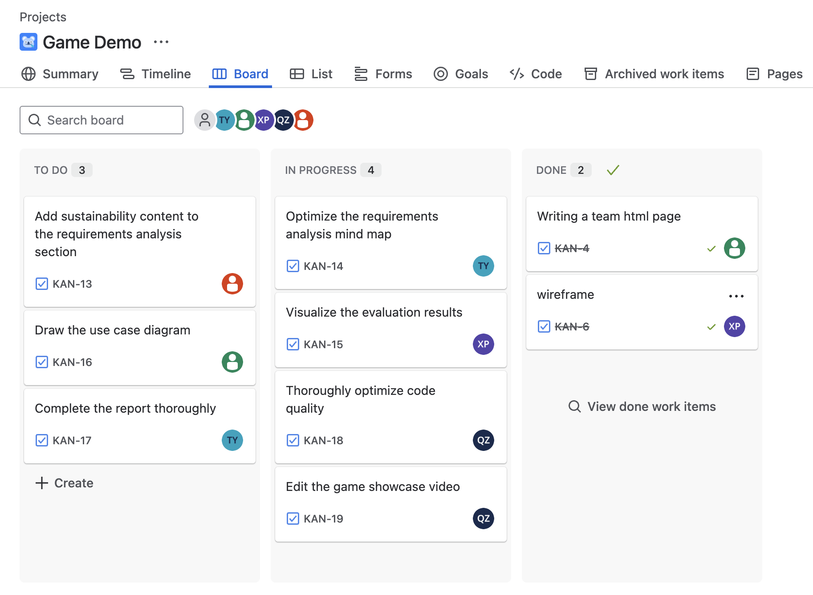
  
<em>Project progress presentation</em>

  

  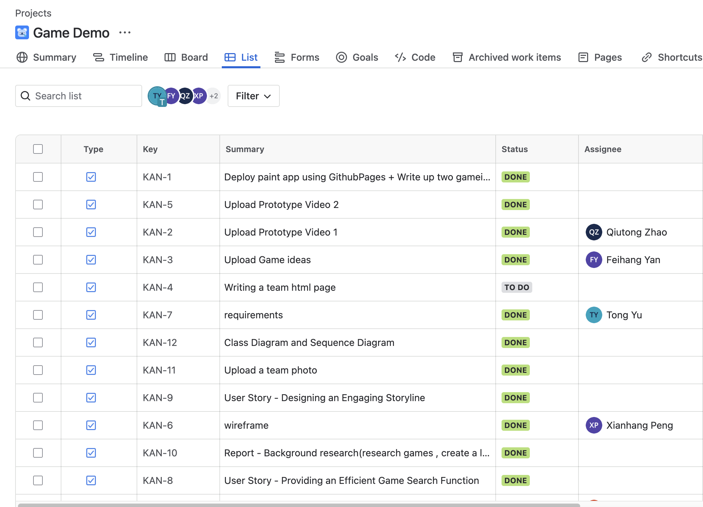
  
<em>Completed tasks demonstration</em>

# 📝 Project Report

## Table of Contents
- [📝 Project Report](#-project-report)
  - [Table of Contents](#table-of-contents)
  - [1 Introduction](#1-introduction)
    - [1.1 Overview](#11-overview)
    - [1.2 Inspiration](#12-inspiration)
    - [1.3 Innovation](#13-innovation)
    - [1.4 Vision](#14-vision)
  - [2 Ideation](#2-ideation)
    - [2.1 Game Idea 1: Survival Roguelike](#21-game-idea-1-survival-roguelike)
    - [2.2 Game Idea 2: Horror Puzzle RPG](#22-game-idea-2-horror-puzzle-rpg)
    - [2.3 Why We Chose Game Idea 1](#23-why-we-chose-game-idea-1)
  - [3 Requirements](#3-requirements)
    - [3.1 Stakeholder Identification: The Onion Model](#31-stakeholder-identification-the-onion-model)
    - [3.2 Requirements Analysis: Epics, User Stories, and Acceptance Criteria](#32-requirements-analysis-epics-user-stories-and-acceptance-criteria)
    - [3.3 Applying Requirements to Our Game](#33-applying-requirements-to-our-game)
    - [3.4 Use-Case Diagram and Use-Case Specification](#34-use-case-diagram-and-use-case-specification)
    - [3.5 Reflection and Conclusion](#35-reflection-and-conclusion)
  - [4 Design](#4-design)
    - [4.1 System Architecture Overview](#41-system-architecture-overview)
    - [4.2 Class Diagram](#42-class-diagram)
    - [4.3 Sequence Diagram](#43-sequence-diagram)
    - [4.4 Reflection and Conclusion](#44-reflection-and-conclusion)

  - [5 Implementation](#5-implementation)
    - [5.1 Basic Implementation](#51-basic-implementation)
    - [5.2 Code Architecture Overview](#52-code-architecture-overview)
    - [5.3 Key Features and Highlights](#53-key-features-and-highlights)
    - [5.4 Three Key Technical Challenges in Glitchwood's Development](#54-three-key-technical-challenges-in-glitchwoods-development)
    - [5.5 Reflection and Conclusion](#55-reflection-and-conclusion)
  - [6 Evaluation](#6-evaluation)
    - [6.1 Qualitative Evaluation](#61-qualitative-evaluation)
    - [6.2 Quantitative Evaluation](#62-quantitative-evaluation)
    - [6.3 Code Test \& Usability Interviews](#63-code-test--usability-interviews)
    - [6.4 Reflection and Conclusion](#64-reflection-and-conclusion)
  - [7 Process](#7-process)
    - [7.1 Team Roles and Division of Tasks](#71-team-roles-and-division-of-tasks)
    - [7.2 Tools and Collaborative Platforms](#72-tools-and-collaborative-platforms)
    - [7.3 Agile Development Methodology and Iteration Process](#73-agile-development-methodology-and-iteration-process)
    - [7.4 Team Reflection and Continuous Improvement](#74-team-reflection-and-continuous-improvement)
    - [7.5 Reflection and Conclusion](#75-reflection-and-conclusion)
  - [8 Sustainability, Ethics, and Accessibility](#8-sustainability-ethics-and-accessibility)
    - [8.1 Environmental Impact](#81-environmental-impact)
    - [8.2 Social Impact](#82-social-impact)
    - [8.3 Technical Impact](#83-technical-impact)
    - [8.4 Sustainability-Oriented Requirements](#84-sustainability-oriented-requirements)
  
  - [9 Conclusion](#9-conclusion)
    - [9.1 Lessons Learned from the Project](#91-lessons-learned-from-the-project)
    - [9.2 Overcoming Key Development Challenges](#92-overcoming-key-development-challenges)
    - [9.3 Insights from Collaboration and Testing](#93-insights-from-collaboration-and-testing)
    - [9.4 Future Directions for Glitchwood](#94-future-directions-for-glitchwood)
    - [9.5 Conclusion](#95-conclusion)
  - [10 Appendix](#10-appendix)
    - [10.1 Contributions of Team Members](#101-contributions-of-team-members)
    - [10.2 References](#102-references)

## 1 Introduction

### 1.1 Overview

**Glitchwood** is a **2D roguelike action RPG** developed using P5.js. Players choose from **three uniquely designed characters**—each with distinct combat styles and upgrade preferences—to battle through procedurally generated stages filled with enemies, traps, and unpredictable challenges.

  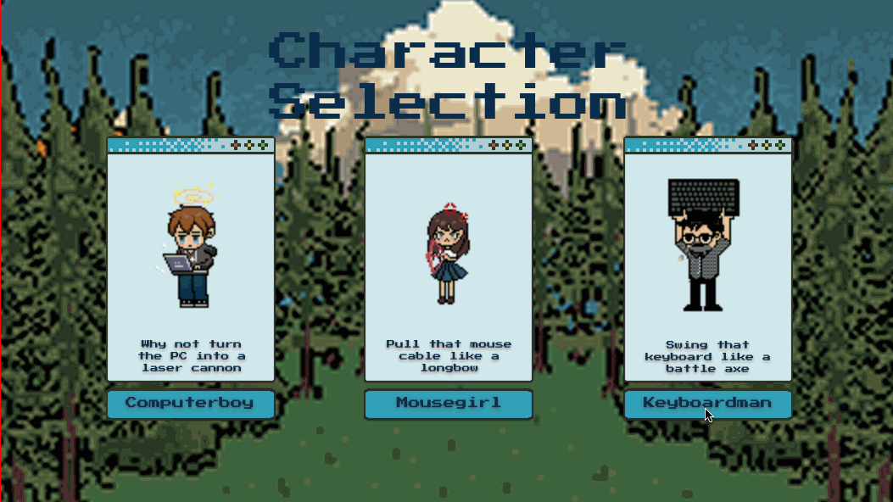
  
<em>Figure 1. Character selection screen.</em>

  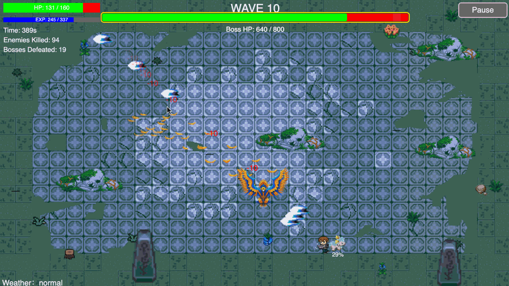
  
<em>Figure 2. Boss battle screen.</em>

The game emphasizes **randomness and replayability**, introducing features like dynamic **weather effects**, **support pets**, **enemy variants**, and **environmental obstacles**. As players progress through increasingly difficult waves, they earn upgrades and eventually unlock an **Endless Mode** to test their endurance.

  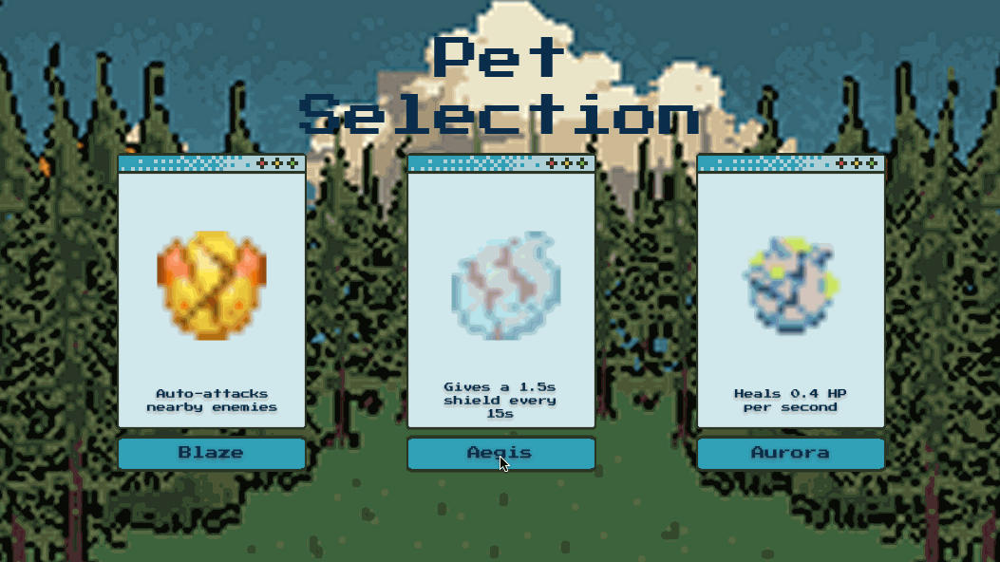
  
<em>Figure 3. Pet selection screen.</em>

  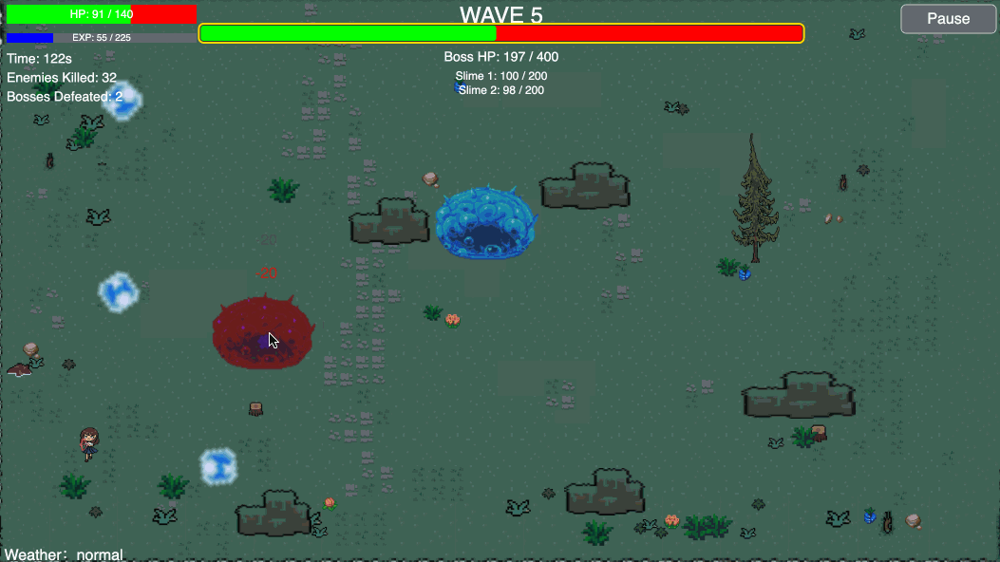
  
<em>Figure 4. Weather effects screen.</em>

Designed for both **newcomers and roguelike veterans**, Glitchwood includes a built-in tutorial, intuitive controls, and two difficulty levels. Its gameplay is tied to a deeper theme—**a developer lost inside their own creation**, fighting to escape.

---

### 1.2 Inspiration

Our game design was inspired by two modern roguelike hits:

#### Vampire Survivors
- Auto-attack gameplay and wave-based enemy spawning  
- Highly addictive loop with evolving upgrades  
- Simple visuals and controls allow for fast iteration  
- Limitation: Lack of manual input can reduce player agency  
- Takeaway: We adopted **wave-based survival**, **upgrade choices**, and **enemy escalation**
  

  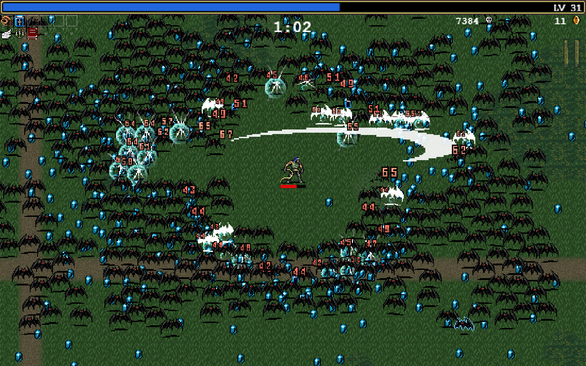
  
<em>Figure 5. Screenshot from <i>Vampire Survivors</i>.</em>

#### 20 Minutes Till Dawn
- Twin-stick shooter with precise aiming and movement  
- Strong emphasis on build variety and moment-to-moment action  
- Effective minimalism in both UI and art direction  
- Limitation: Somewhat short progression loop, less narrative  
- Takeaway: We embraced **manual aiming**, **responsive controls**, and **fast-paced combat**

  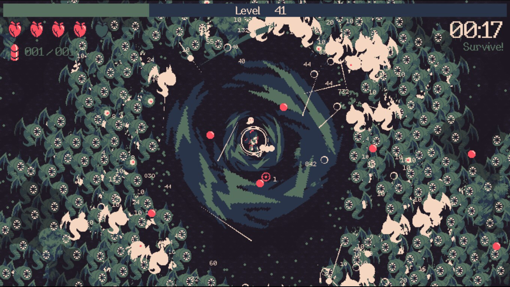
  
<em>Figure 6. Screenshot from <i>20 Minutes Till Dawn</i>.</em>

Unlike those titles, **Glitchwood** takes a more **symbolic approach**. Here, the player is a developer trapped in their own game, confronting metaphorical bugs, runtime failures, and digital entropy. Every mechanic—from **dynamic weather** to **pets as debugging tools**—echoes real-world challenges in software development.

Working within **P5.js**, we designed modular systems that allow:
- Rapid iteration and extensibility  
- Distinct character behaviors and upgrade paths  
- Thematic consistency between gameplay and metaphor  

---

### 1.3 Innovation

**Glitchwood** brings several innovations to the roguelike format, blending symbolic design with engaging mechanics, narrative, and visual cohesion.

#### Mechanical Innovations

The game introduces multiple gameplay systems that enrich replayability and strategic depth:

- **Three distinct characters**, each with unique combat roles and upgrade styles (rather than a shared progression tree).
- A **pet system**: after defeating a boss, players select one of three pets—**attack**, **shield**, or **heal**—which significantly influence combat tactics.
- A **dynamic weather system** that alters gameplay every 30 seconds:
  - **Snow** slows movement
  - **Lightning** causes random damage
  - **Sunlight** gradually drains health  
  All weather effects apply symmetrically to both players and enemies.

##### ▶ Characters

|                                             Image                                             |      Name       | Description                                                                                                   |
| :-------------------------------------------------------------------------------------------: | :-------------: | :------------------------------------------------------------------------------------------------------------ |
|    |  **Mousegirl**  | Charge-based ranged attacker. Fully charged, deals highest damage. Upgrades focus on bow mechanics.           |
|  | **Computerboy** | Easy-to-use character with strong bullet-based attacks. Upgrades boost attributes and firepower.              |
|  | **Keyboardman** | Melee fighter with high AoE damage. Needs to stay close. Upgrades emphasize survivability and special traits. |

##### ▶ Bosses

|                                    Image                                     |     Name      | Description                                                                                 |
| :--------------------------------------------------------------------------: | :-----------: | :------------------------------------------------------------------------------------------ |
|  | **Slimeboss** | Classic RPG enemy reimagined as a boss. Four colored forms with different attack patterns.  |
|   | **Birdboss**  | Shrine-dwelling boss with dash and restriction skills. Stay outside its range to stay safe. |
|    |  **Bugboss**  | Disrupts vision and summons ghost flames. Sudden high-damage attacks — stay alert!          |

##### ▶ Weather Effects

|                           Image                            |     Name      | Description                                                        |
| :--------------------------------------------------------: | :-----------: | :----------------------------------------------------------------- |
|      |   **Snow**    | Slows the movement speed of both characters and enemies.           |
|  | **Lightning** | Deals damage to characters and enemies within its range.           |
|        |    **Sun**    | Causes gradual health loss over time for both players and enemies. |

##### ▶ Pet System

|                         Image                          |    Name    | Description                                                                    |
| :----------------------------------------------------: | :--------: | :----------------------------------------------------------------------------- |
|    | **Blaze**  | Attacks enemies, dealing damage to them.                                       |
|    | **Aegis**  | Protects the player, preventing damage from enemies and environmental hazards. |
|  | **Aurora** | Heals the player by restoring health over time.                                |

#### Narrative Innovation

The story metaphorically reflects a **programmer's emotional journey** through:

- **Burnout**
- **Debugging and bugs**
- **Problem-solving under stress**

Rather than using explicit dialogue, these themes are **embedded in mechanics and visuals**, creating a symbolic rather than literal narrative.

#### Visual & Thematic Innovation

- Pixel art characters represent **programmer archetypes**.
- UI elements resemble **code editors and console logs**.
- **Glitch effects and corrupted sprites** evoke software instability.
- Sound design is minimal and ambient, reinforcing immersion.

---

### 1.4 Vision

**Glitchwood** was built with two core objectives:

1. Deliver a polished, replayable roguelike experience.
2. Explore how technical and creative systems can metaphorically reflect real-world software development.

#### Gameplay Vision

We aimed to create **modular, extensible systems**—such as:

- The **weather engine**
- The **pet integration system**
- **Enemy generation logic**

These were intentionally designed for scalability, supporting future additions like new abilities, difficulty adjustments, or even **multiplayer co-op**. Our architecture prioritized **clean, maintainable code** that facilitates rapid iteration and long-term evolution.

#### Technical Vision

Using **P5.js** as our engine of choice, we set out to **push its real-time performance limits** while maintaining smooth responsiveness. This involved tackling challenges like:

- **Collision detection** under load
- **Animation state management**
- **Fluid input handling**

Through this, we deepened our understanding of performance optimization within browser-based interactive environments.

#### Forward-Looking Possibilities

*Glitchwood* is more than a game—it’s a **framework for experimentation**. Potential future directions include:

- Deeper **roguelike branching paths** and player-driven storylines
- **Community-generated upgrades** or modding support
- Educational use as a **code-as-metaphor learning platform**
- Expansion into **cooperative multiplayer**
- Continued **performance and accessibility tuning**

Our long-term vision is to grow *Glitchwood* into a **living sandbox**—one that bridges gameplay, storytelling, and system design while staying grounded in both technical and emotional authenticity.

[Back to Table of Contents](#table-of-contents)

## 2 Ideation

Before selecting and developing Glitchwood, our team explored two original game concepts. Each was supported by early design prototypes and system planning. This allowed us to evaluate their creative potential, feasibility within our toolset (P5.js), and suitability for an agile development workflow.

### 2.1 Game Idea 1: Survival Roguelike

  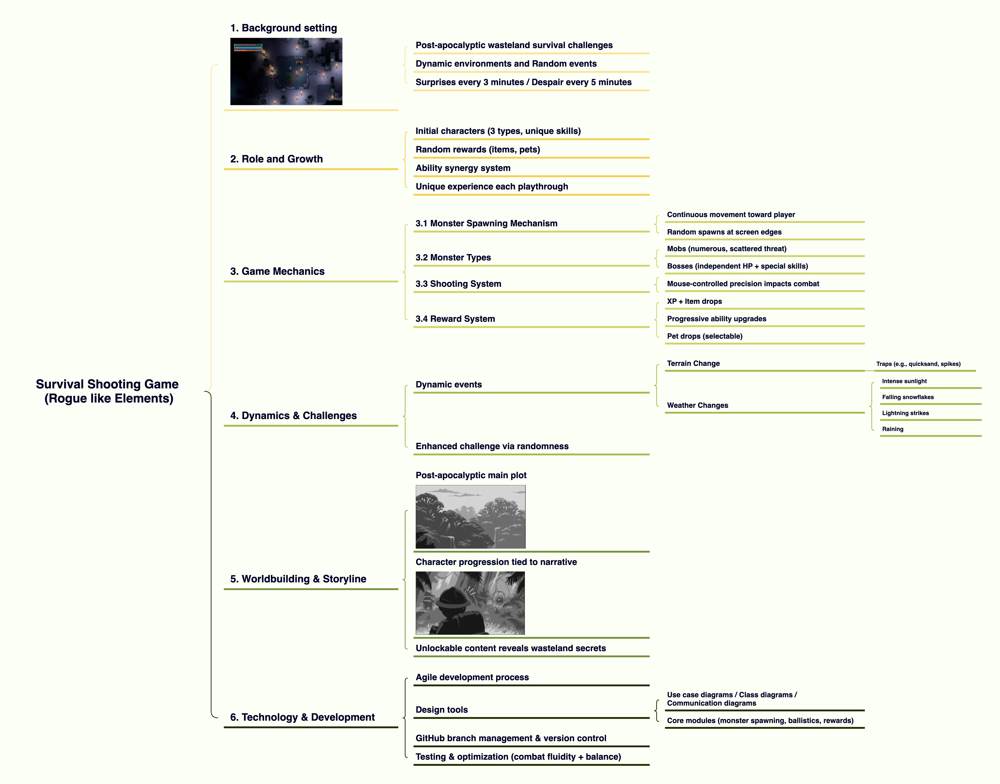
  
<em>Figure 7. Mind map for Survival Roguelike idea.</em>

#### Core Concept
A wave-based roguelike where players control one of several programmer-themed characters navigating glitchy environments filled with enemies, hazards, and random upgrades. Players adapt to ever-changing weather, pet abilities, and environmental effects while progressing toward high scores or survival.

#### Key Mechanics
- **Distinct characters** with different combat styles and upgrade preferences
- **Dynamic weather system** (e.g., lightning, snow, sunlight) affecting all characters and enemies
- **Wave-based enemy spawning**, with bosses and random rewards scaling over time
- **Pets with combat effects** (attack, heal, shield), acquired after boss battles
- **Endless mode** and increasing difficulty to encourage replayability
  

  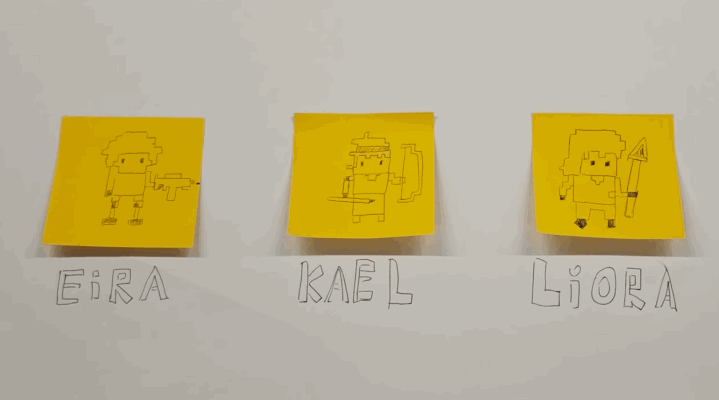
  
<em>Figure 8. Character selection screen from prototype.</em>

  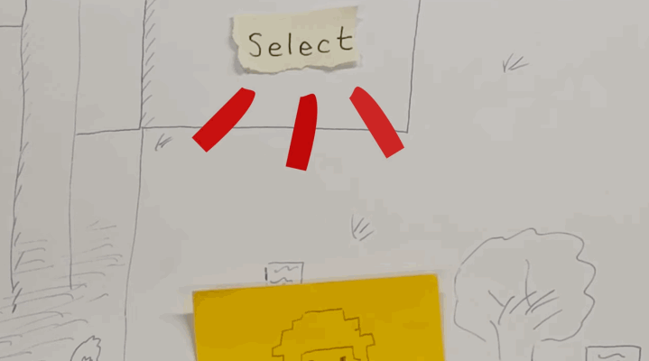
  
<em>Figure 9. Pet selection screen from prototype.</em>

  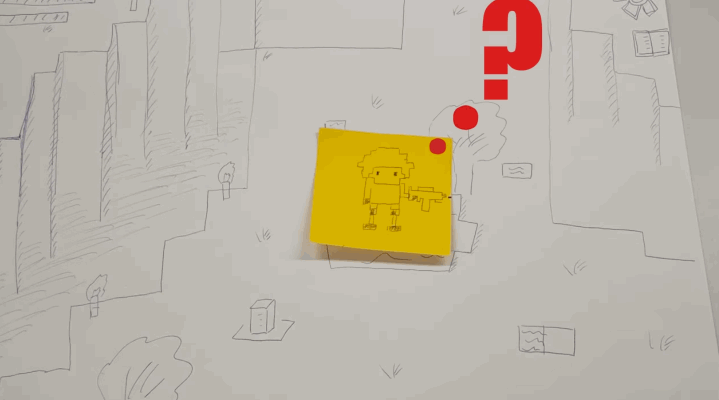
  
<em>Figure 10. Combat demo from prototype.</em>

#### Design Strengths
- Straightforward system to prototype with paper diagrams and early demos
- Modular enough to design separate upgrade logic, pet effects, and environmental systems
- Compatible with course tools: P5.js, class/use case diagrams, agile iterations

#### Paper Prototype Demo

  <video src="https://github.com/user-attachments/assets/141335507/439241019-1799972f-5791-44f3-937b-22e1397587ac.mp4" controls width="540">
    Your browser does not support the video tag.
  </video>
  
<em>Figure 11. Paper prototype video for Game Idea 1.</em>

  ---
  
### 2.2 Game Idea 2: Horror Puzzle RPG

  
  
<em>Figure 12. Mind map for Horror Puzzle RPG idea.</em>

#### Core Concept
A time-loop puzzle RPG set in a frozen university lab. Players explore, solve programming-themed puzzles, and uncover hidden experiments to escape a mysterious temporal trap.

#### Key Mechanics
- Environmental puzzles (logic, object-based, memory)
- Repeated time loops revealing more story and areas
- Supernatural horror events and evolving world state
- Multiple endings based on player decisions

  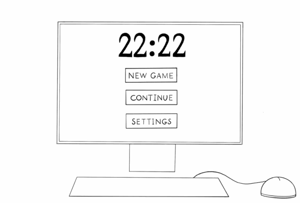
  
<em>Figure 13. Story introduction screen from prototype.</em>

  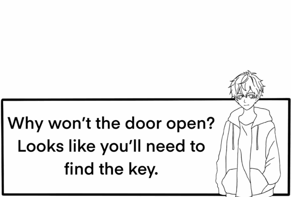
  
<em>Figure 14. Puzzle-solving screen from prototype.</em>

  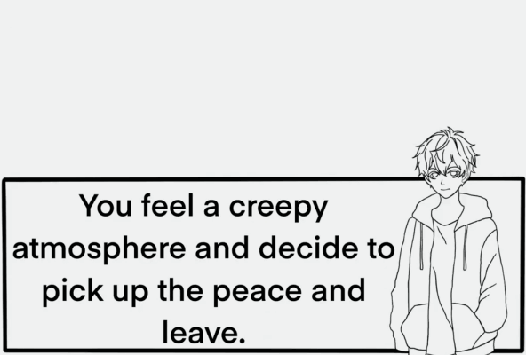
  
<em>Figure 15. Monster-chase scene from prototype.</em>

#### Design Limitations
- Requires extensive narrative scripting and state control
- Harder to modularize for team collaboration
- Fewer opportunities for randomness or iterative balance tuning
- Less suited for fast prototyping and testing in P5.js

#### Paper Prototype Demo

  <video src="https://github.com/user-attachments/assets/141335507/439230948-ebbef71e-5e4e-4bac-967e-0046e64da9a3.mp4" controls width="540">
    Your browser does not support the video tag.
  </video>
  
<em>Figure 11. Paper prototype video for Game Idea 2.</em>

  ---
  
### 2.3 Why We Chose Game Idea 1

After structured comparison, we selected **Game Idea 1** as the foundation for Glitchwood. This decision was based on the following:

- **Better modularity and scalability**: Wave-based combat, pet effects, weather changes, and upgrade logic could be developed in parallel by different team members.
- **Stronger compatibility with course tools**: We could apply use case diagrams, class diagrams, and early paper prototypes effectively.
- **Supports agile iteration**: Core mechanics (spawning, combat, upgrades) could be tested and refined incrementally in sprints.
- **Higher alignment with learning goals**: The idea allowed us to explore randomness, system balance, and symbolic design while reinforcing CS themes (e.g., bugs, debugging, resilience).
- **Better fit for team collaboration**: Each subsystem (combat, environment, pet system) could be assigned clearly, allowing us to coordinate through GitHub and version control.

[Back to Table of Contents](#table-of-contents)

## 3 Requirements

Throughout the development of *Glitchwood*, we applied structured requirement planning techniques to guide our design and implementation. Specifically, we used tools such as **Epics**, **User Stories**, and **Acceptance Criteria**, which are widely adopted in agile software development. These approaches helped us define goals more clearly, understand different stakeholder needs, and manage the complexity of the project in a collaborative and iterative way.

### 3.1 Stakeholder Identification: The Onion Model

Our first step was to identify all relevant stakeholders involved in or affected by the development of *Glitchwood*. To visualize the relationships and influence between them, we adopted the **Onion Model** of stakeholders, which classifies them into concentric layers from core systems to external environments.

  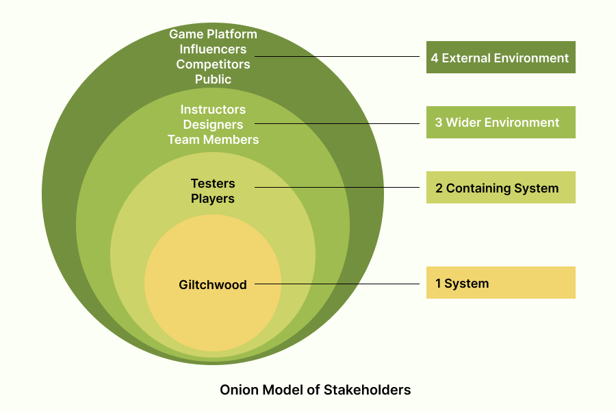
  
<em>Figure 17. Onion model diagram for stakeholder analysis.</em>

- **Level 1: System** – *Glitchwood* itself, the game we built.
- **Level 2: Containing System** –  
  - **Testers** who provided feedback and helped us find bugs.  
  - **Players** who care about fun, challenge, and gameplay experience.
- **Level 3: Wider Environment** –  
  - **Instructors** who assessed our work and expected us to apply course knowledge.  
  - **Design inspirations**, including mechanics and themes from other games that influenced our direction.
- **Level 4: External Environment** –  
  - **Game Platform** (GitHub), used for hosting and sharing the game.  
  - **Influencers**, like bloggers or classmates, who may share or comment on the game.  
  - **Competitors**, both student projects and similar games in the market.  
  - **Public**, meaning anyone who might play or hear about the game.

This layered structure helped us consider technical goals, user needs, and broader context throughout development.

---

### 3.2 Requirements Analysis: Epics, User Stories, and Acceptance Criteria

Once stakeholders were defined, we translated their needs into high-level **Epics**, which represent core goals or features. These were then broken down into more detailed **User Stories**, written in the standard format:

> *As a [user], I want [goal], so that [reason].*

To validate each user story, we defined **Acceptance Criteria** using the "Given-When-Then" format, which ensures each requirement is testable and concrete. This helped align our expectations across design and development phases.

The following diagram summarizes the epics, stories, and acceptance criteria across five key stakeholder groups:

  
  
<em>Figure 18. Stakeholder requirements mapped via epics and user stories.</em>

This visual representation allowed us to keep the entire team focused on stakeholder-driven value, while ensuring coverage of both functional and experiential aspects of the game.

---

### 3.3 Applying Requirements to Our Game

This structured planning method guided how we designed *Glitchwood* from the start. Instead of diving directly into coding, we first assessed the goals and concerns of different groups:

- **Players** needed fun and progression, through intuitive controls and immersive combat.
- **Developers** focused on modularity and long-term maintainability.
- **The Game Platform** emphasized user engagement, rating systems, and retention.
- **Publishers** required monetizable gameplay loops with high replayability.
- **The Marketing Team** requested visuals and UI elements that aligned with market trends.

By mapping these needs to specific game features (e.g., combat mechanics, weather system, pet interactions, scalable upgrades), we could ensure each implemented feature directly served user or business value.

---

### 3.4 Use-Case Diagram and Use-Case Specification

The picture below shows the use-case diagram and use-case specification of our game.

  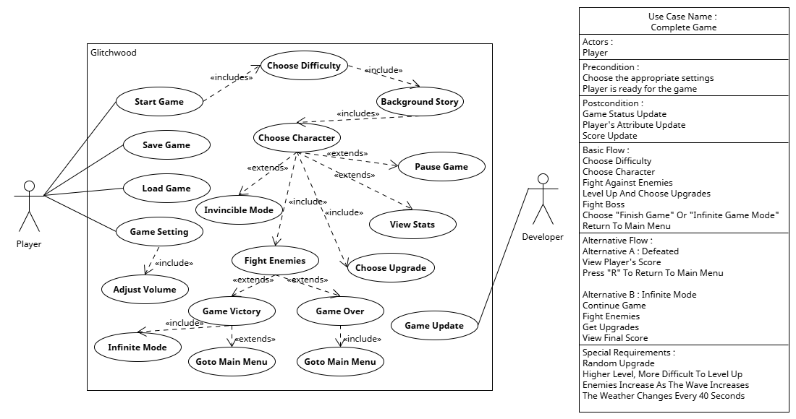
  
<em>Figure 19. Use-case diagram and specification for Glitchwood.</em>

**Actors:**

Player: Interacts with the game by starting, saving, loading, and customizing gameplay(eg. setting background music volume of game).

Developer: Responsible for updating the game (Game Update).

**Main Use Cases:**

The player:
Start Game → includes: Choose Difficulty, Background Story, Choose Character;
Fight Enemies → extends: Game Victory, Game Over, Invincible Mode;
Choose Upgrade;
Save Game, Load Game;
Game Setting → includes: Adjust Volume;
Infinite Mode → extends: Goto Main Menu;
Pause Game, View Stats;
Goto Main Menu

The developer:
Release New Version Of Game

**Use Case Description:**

Use Case Name: Complete Game

Precondition: Player chooses appropriate settings and is ready to play game.

Postcondition: Game status, player attributes, and scores are updated.

Basic Flow:
Choose Difficulty → Choose Character → Fight Enemies → Level Up and Choose Upgrades → Fight Boss → Choose to “Finish Game” or “Enter Infinite Mode” → Return to Main Menu

Alternative Flows:
A: Defeated → View Score → Press "R" to return to main menu
B: Infinite Mode → Continue Game → Get Upgrades → View Final Score

Special Requirements:
Random Upgrades
Harder to level up as level increases
More enemies as waves progress
Weather changes every 40 seconds

---

### 3.5 Reflection and Conclusion

Using Epics, User Stories, and Acceptance Criteria helped us move from vague design ideas to a concrete, testable structure. It reduced miscommunication, supported iterative planning, and clarified the purpose of every system we implemented.

Most importantly, this process improved our **collaboration**, **task management**, and **feature validation**, all of which were crucial for maintaining project velocity. Moving forward, this approach will remain a valuable framework for future projects and professional practice in both game development and software engineering.

[Back to Table of Contents](#table-of-contents)

## 4 Design

The design phase of our project involved early-stage modeling of key systems to establish a clear architecture, identify core entities, and plan interactions. We focused on three aspects: **system architecture**, **class diagram** (static structure), and **sequence diagram** (behavioral interaction).

### 4.1 System Architecture Overview

We adopted an object-oriented architecture tailored for our game's modular systems. All game elements—player characters, enemies, pets, weather, rewards—are designed as independent yet interactable components. This allowed us to:

- **Scale efficiently**, e.g., adding new weather effects, characters, or reward types  
- **Separate responsibilities**, making code easier to maintain and extend  
- **Support collaborative agile workflows**, with clear subsystem ownership for different team members

---

### 4.2 Class Diagram

The following UML class diagram captures the **static structure** of Glitchwood’s core gameplay systems.

  
  
<em>Figure 20. UML class diagram of core gameplay systems.</em>

#### Key Components

- **Field & Figures**  
  - `Field`: Represents the game space and its properties.  
  - `Figures`: Abstract superclass for interactive game objects.

- **Player & Enemy**  
  - `Player`: Holds player stats like `speed`, `HP`, `attackSpeed`, and methods like `move()`, `upgrade()`, `display()`.  
  - `Enemy`: Generic hostile entity with `attack()` and movement logic.  
  - `Boss`: Special subclass with `displayHealthBar()` and higher difficulty.

- **Weapons & Projectiles**  
  - `Sword`, `Gun`, `Bow`: Each weapon type encapsulates specific mechanics (e.g., cooldown, damage type).  
  - `Bullet`: Used for ranged attacks, supports interactions like `touchEnemy()`.

- **Weather Effects**  
  - `Weather`: Base class with `appear()` and `disappear()` methods.  
  - Derived types:
    - `Snow`: Slows all movement.
    - `Thunder`: Causes random area damage.
    - `Sun`: Causes gradual health loss.

- **Reward System**  
  - `Potion`: Restores health or boosts attributes.  
  - `Pet`: Subclasses include:
    - `Bird`: Deals ranged damage.
    - `Cat`: Uses touch-based attacks.
    - `Elf`: Provides healing/shield effects.

---

### 4.3 Sequence Diagram

The following diagram illustrates **dynamic interaction flow** between systems in typical gameplay.

  
  
<em>Figure 21. Sequence diagram illustrating gameplay interactions.</em>

#### Key Scenarios

- **Character Selection & Attacks**
  - Player selects a role via `chooseRole()`.
  - Depending on weapon type, performs `attack()`, `shootBullet()`, or `shootArrow()`.

- **Potion Use**
  - The player requests a health potion via `getPotion()` after checking HP.

- **Pet System**
  - Player selects a pet (`choosePet()`), which then follows and supports combat through healing or attack.

- **Boss & Enemy Battles**
  - All enemy types check player HP, perform `attack()`, and apply effects like `heavyAttack()`.

- **Weather Effects**
  - Weather system invokes `affect()` periodically, influencing both players and enemies in real time.

---

### 4.4 Reflection and Conclusion

#### Key OOD Principles in Practice
- **Encapsulation**: Each entity (e.g., `Player`, `Enemy`, `Pet`, `Weather`) contains its own data and logic, reducing side effects and improving reusability.
- **Abstraction**: Shared behaviors like `move()` or `attack()` are defined in parent classes such as `Figures`, enabling simple and clear extension.
- **Inheritance**: Relationships like `Enemy → Boss` and `Pet → Cat/Bird/Elf` reduce redundancy and make new entity creation easier.
- **Polymorphism**: Methods like `attack()` and `affectWeather()` behave differently depending on the object type, supporting flexible interactions.
- **Composition**: Complex entities, such as a player with a pet, are constructed by combining simpler components.

#### Role of UML Diagrams
- The **Class Diagram** helped us define the system structure before implementation.
- The **Sequence Diagram** illustrated dynamic gameplay interactions (e.g., combat, potion use), improving team understanding and task assignment.

#### Benefits to Our Development Process
- **Clarity**: Reduced ambiguity when assigning or reviewing code responsibilities.
- **Scalability**: Easily added new content (e.g., pets, weather, bosses) without major changes.
- **Efficiency**: Fewer bugs and faster iteration thanks to clean system boundaries.
- **Agility**: Design models supported sprint planning, code reviews, and refactoring.

This strong architectural foundation allowed us to develop features in parallel, avoid large-scale rewrites, and remain confident in the system’s extensibility—laying the groundwork for future updates like multiplayer or branching narratives.

[Back to Table of Contents](#table-of-contents)

## 5 Implementation

### 5.1 Basic Implementation

The implementation of **Glitchwood** revolves around battling enemies, leveling up, and progressing through stages while striving for higher kill counts in endless mode. Players can easily control one of three selectable characters using a combination of keyboard and mouse: the keyboard handles movement, while the mouse controls attacks and attack direction. **The implementation relies primarily on event-related methods such as keyPressed and mouseClicked.**

Characters can engage in both melee and ranged combat, with damage types classified as either single-target or AoE.

The game features four distinct maps, each with procedurally generated obstacles of different styles. These obstacles block both movement and attacks (for both players and enemies). However, certain bosses possess the ability to phase through obstacles. **When a new map is generated, existing obstacles are cleared, and new obstacles are created based on the current wave.**

As for the game logic, enemies spawn outside obstacle zones and at a certain distance from the player’s location. As waves increase, the number of spawning enemies increases. Bosses appear at waves 5, 10, and 15, each bringing unique challenges. **To ensure enemies pursue the player effectively, we calculate the direct line between them and determine the optimal angle for movement along the shortest path.**

Regarding the pet and weather systems, after defeating the first boss, players can choose one of three pets, each granting a unique blessing—such as generating a shield, restoring health, or automatically attacking enemies. Additionally, the game introduces a dynamic weather system that changes every 30 seconds. **This is implemented using time-related functions provided by p5.js, along with random number generation to determine the type of weather effect.**

---

### 5.2 Code Architecture Overview

The code architecture of **Glitchwood** is modular and follows object-oriented principles. Key components like **Player**, **Enemies**, **Bullets**, **Pets**, and **Weather Effects** are encapsulated in separate classes. This modular design allows us to scale the game and add new features easily without disrupting existing functionalities.

- **Main Game Loop**:
   - The core game logic is driven by a main loop where the game state is constantly updated, including player movements, collisions, enemy spawning, and state transitions (e.g., between gameplay, pet selection, and boss fights).
   - The loop also handles **event-driven interactions**, using methods like `keyPressed()` for player movement and `mouseClicked()` for attacks.
   
- **Modular Classes**:
   - **Player Class**: Handles the player character’s attributes, movement, upgrades, and  attack mechanisms. It includes both melee and ranged combat modes, as seen in the characters like `Mousegirl` and `Keyboardman`.
   - **Enemy Class**: A superclass for all enemy types, defining basic behaviors like movement, attack patterns, and interactions with obstacles. More complex enemies (e.g., **Bosses**) are subclasses with specialized behaviors.
  - **Bullet Class**: Manages the projectile logic, including hit detection and boundary handling. Specific projectiles like **EnemyBullets** and **WebProjectiles** are subclasses with additional features.
  - **Pet System**: After defeating a boss, players can choose a pet (e.g., shield, attack, healing), and the selected pet follows the player during gameplay, impacting the strategy with unique abilities.
  - **Weather Effects**: The dynamic weather system that alters gameplay every 30 seconds, affecting player and enemy movements (e.g., slowing down in snow or damaging in thunderstorms).

---

### 5.3 Key Features and Highlights

- **Dynamic Map and Obstacle Generation**:
The game generates unique maps with randomized obstacles that block movement and attacks. The **stack-based approach** allows obstacles to be dynamically added and removed as new waves of enemies are generated.

- **Complex Collision Detection**:
Collision detection in the game is handled meticulously to ensure a fair and responsive combat experience. **Attack hitboxes** and **enemy collisions** are calculated with precision. The inclusion of **"air walls"** prevents players from exiting the intended play area, using boundary logic.

- **Pet System**:
The pet system introduces an additional layer of complexity, allowing players to choose pets with distinct abilities. Each pet follows the player, interacts with the game environment, and impacts gameplay mechanics (e.g., shields, attack boosts, or healing). Ensuring that the pets don't disrupt gameplay balance while adding depth was a key challenge.

- **Weather System**:
The weather system influences gameplay significantly, providing varied environmental conditions that players must adapt to. Snow slows movement, lightning damages enemies and players, and sunlight can be both a benefit and a detriment. This system is implemented using **time-based functions** to control the intervals and transitions between different weather conditions.

---

### 5.4 Three Key Technical Challenges in Glitchwood's Development

#### 1. Fine-Grained Collision Detection and Boundary Enforcement

Precise collision handling was essential for maintaining a fair and fluid combat experience in *Glitchwood*. We had to manage collisions among **players**, **enemies**, **projectiles**, and **obstacles**, while enforcing invisible **"air walls"** to restrict player movement within the intended play area.

To ensure both responsiveness and accuracy, we implemented collision detection based on **dynamic hitbox calculations**, **attack angles**, and **distance thresholds**. Balancing collision precision with real-time performance — especially when dealing with **high enemy counts** and **fast-moving projectiles** — was a consistent technical challenge throughout development.

---

#### 2. Pet System Integration

Every five waves, a **new map is procedurally generated** with updated obstacles. While this enriched gameplay variety, it presented a unique challenge for the **pet system**. Pets are designed to follow the player and provide combat support, but they risked becoming stuck or desynced due to the newly placed obstacles.

To address this, we introduced **pet movement re-evaluation logic** triggered after obstacle regeneration. This allowed pets to **dynamically reposition** and maintain **consistent pathing**, preserving their reliability across shifting environments without disrupting game flow.

 In detailed, For coders, one of the toughest parts of the project was integrating a dynamic obstacle wave system with autonomous pets without breaking game balance. In the snippet above (in picture), you can see how we implemented **two core pet behaviors: orbital following and auto-attack** in the **`AttackPet`** class.  Orbital following uses a circular offset and `lerp()` for smooth movement around the player.  Auto-attack detects and damages the nearest enemy on cooldown (**simply decrementing `attackCooldown` and checking distance**).  The real challenge emerged when we tried syncing pet timers, animations, and obstacle spawns in a central update routine—it quickly became unmanageable as more pets and effects were added.  We solved this by moving both state transitions and rendering into each pet’s own methods: **`follow()`**, **`attack()`**, **`activateShield()`** / **`deactivateShield()`**, etc. This isolated complexity, kept the core loop clean, and finally achieved a flexible, balanced pet system that scales with wave progression.

  
  
<em>Figure 22. Code snippet showing pet behavior implementation.</em>

---

#### 3. Managing Upgrade Interactions: Piercing and Splitting Effects

The **archer character (Mousegirl)** features two notable upgrades:
- **Pierce**: Arrows remain active after hitting an enemy.
- **Split**: Arrows spawn two new arrows in different directions upon impact.

These upgrades were easy to manage individually, but combining them led to **conflicts and nested logic** when upgrades were implemented inside the `Player` class. Eventually, we migrated upgrade logic into the `Arrow` class, allowing each instance to **independently handle its effects**. This **object-oriented redesign** improved clarity, maintainability, and future scalability.

  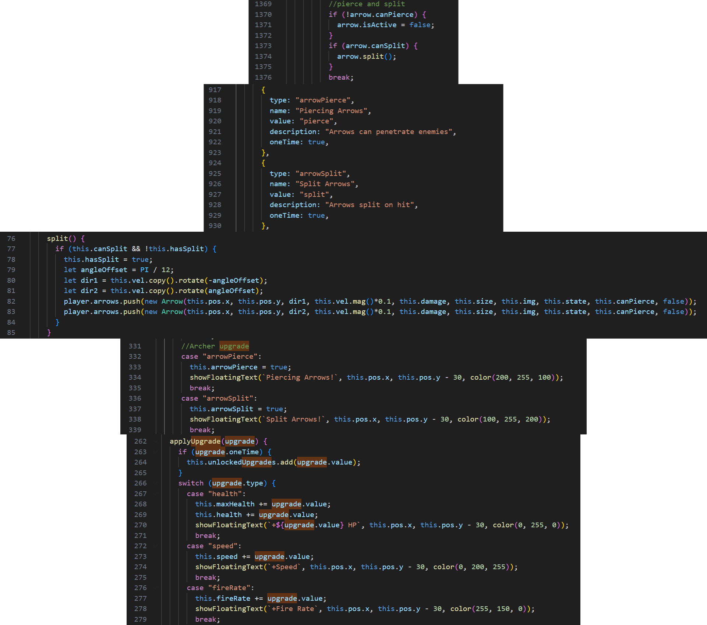
  
<em>Figure 23. Code snippet handling Pierce and Split upgrades in the Arrow class.</em>

---

#### Additional Challenge: Seamless Integration of Narrative and Gameplay

While the above challenges focused on code, a **core design goal** of *Glitchwood* was to reflect the **emotional experience of a developer** trapped in their own creation.

We avoided long dialogues or cutscenes, instead weaving narrative through:
- **Visual Design**: Glitch effects, corrupted assets, and bug-themed bosses.
- **Gameplay Mechanics**: Themes of **debugging**, **instability**, and **progression** embedded in systems like weather effects, upgrades, and character roles.
- **Metaphorical Elements**: Pets as “tools,” weather as “system failures,” enemies as “bugs.”

This required ongoing alignment between **art**, **narrative**, and **gameplay** teams, ensuring metaphor and mechanics were **symbolically and mechanically cohesive**.

---

#### Summary Table of Challenges

| Challenge | Summary |
|:----------|:--------|
| **Collision System** | Real-time hitbox detection and air wall boundary handling |
| **Pet + Obstacle Integration** | Pets dynamically reposition after map obstacle regeneration |
| **Upgrade System** | Refactored upgrade logic into `Arrow` class for combined effects |
| **Narrative Design** | Embedded symbolic narrative through gameplay and visuals |

---

### 5.5 Reflection and Conclusion
Developing *Glitchwood* taught us to manage the tension between creative design and technical execution. From optimizing real-time performance to modularizing combat, pets, and weather systems, we faced significant architectural and gameplay challenges. 

A key takeaway was the importance of **object-oriented clarity**: early reliance on centralized logic (e.g., upgrades inside the `Player` class) made combined effects difficult to manage, which we resolved through refactoring and encapsulation. We also learned that gameplay systems like **pets or dynamic obstacles** require not only functional code, but also cross-system awareness (e.g., pathfinding re-evaluation after map regeneration).

While some optimizations (such as performance tuning in high-enemy scenarios) remain areas for improvement, our modular approach enabled consistent iteration, debugging, and feature addition. These lessons shaped our final product and will inform future development work.

[Back to Table of Contents](#table-of-contents)

## 6 Evaluation

This section presents both qualitative and quantitative evaluations of our game, **Glitchwood**. We conducted structured user interviews and employed established metrics like **SUS** (System Usability Scale) and **NASA-TLX** (Task Load Index) to assess the game's usability, workload, and player experience across both difficulty modes.

### 6.1 Qualitative Evaluation

To better understand how players experienced **Glitchwood**, we applied two qualitative methods: a lightweight **Think Aloud protocol** and **follow-up interviews**. This combination helped us capture both real-time reactions and reflective feedback.

---

#### Think Aloud Testing

Testers (mainly classmates and friends) played the game while **describing their thoughts aloud**. Each session lasted 15–20 minutes and was conducted in person or via screen sharing. This method surfaced interaction issues that weren’t obvious during internal testing.

> Real-time comments like _“What just hit me?”_ or _“Is my pet even working?”_ revealed usability gaps and unclear mechanics.

##### Key Observations & Iterative Improvements

| Area                 | What Happened                                             | Player Reactions               | Action Taken                                                   |
|----------------------|-----------------------------------------------------------|-------------------------------|----------------------------------------------------------------|
| **Pet Feedback**     | Unclear if healing/shielding was active                   | “Am I healing or not?”        | Added glow effects and pet-specific icons                      |
| **Boss Warnings**    | Attacks lacked obvious cues                               | “I didn’t see that coming!”   | Introduced charge-up visuals and warning sounds                |
| **Weather Effects**  | Slowness caught players off guard                         | “Why am I slow all of a sudden?” | Added HUD icons and ambient sound for weather change          |
| **Pause Function**   | Some players didn’t know how to pause                     | “Wait, how do I pause?”       | Added tutorial hint for ‘P’ key                                |

---

#### Post-Game Interviews

After testing, we conducted brief **semi-structured interviews** with three participants, covering topics like UI, difficulty, feedback, and narrative. This validated our Think Aloud observations and offered broader context.

  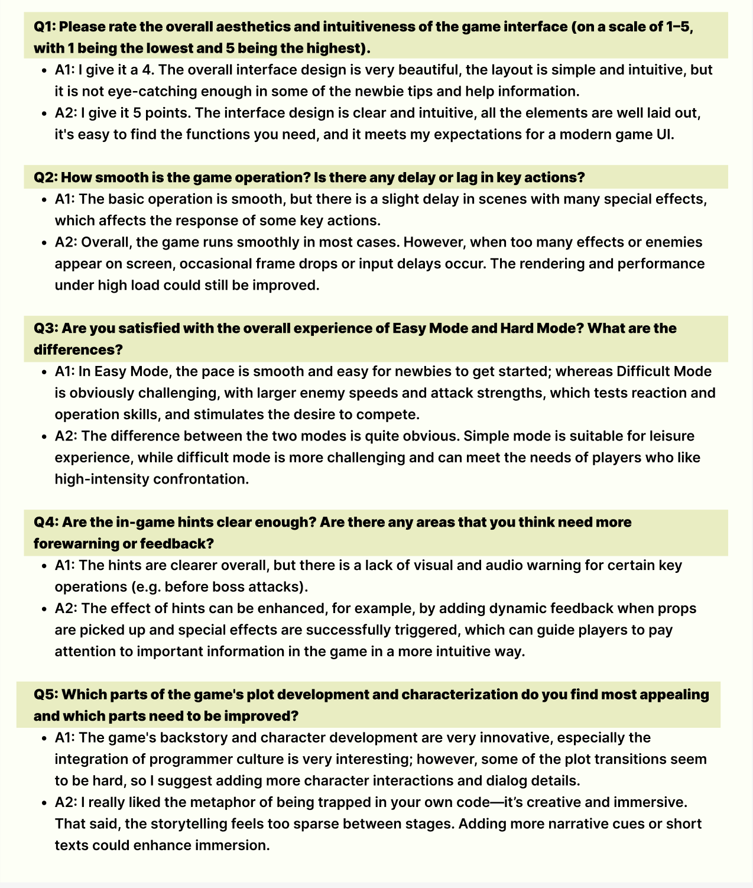
  
<em>Figure 24. Summary of focus group responses and improvement actions.</em>

##### Summary of Key Takeaways

| Theme                | Feedback Highlights                                                                 |
|----------------------|--------------------------------------------------------------------------------------|
| **UI & Aesthetics**  | Interface was praised as clean and intuitive (avg. rating: 4–5/5)                    |
| **Difficulty Modes** | Clear contrast between Easy and Hard modes; the latter felt more engaging           |
| **Boss Feedback**    | Players wanted clearer skill warnings                                               |
| **Tutorial Info**    | Pause function and key controls now clarified in the guide                          |

---

#### Conclusion

The **Think Aloud method** revealed **micro-interaction issues**, while **interviews** helped us understand players’ general expectations. Together, they helped us prioritize feasible, high-impact fixes—like improving feedback clarity and tutorial usability.

---

### 6.2 Quantitative Evaluation

To evaluate user experience in **L1 (Easy Mode)** and **L2 (Hard Mode)**, we collected quantitative feedback using two standardized instruments:

- **System Usability Scale (SUS)**: Assesses perceived usability and user satisfaction.
- **NASA-TLX**: Measures perceived workload across six dimensions—Mental, Physical, and Temporal Demand, Effort, Frustration, and Performance.

---

#### NASA-TLX Results

We first examined average workload scores across all dimensions.

  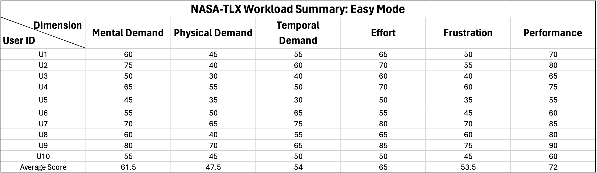
  
<em>Figure 25. NASA-TLX individual user scores for L1 (Easy Mode) across all workload dimensions.</em>

  
  
<em>Figure 26. NASA-TLX individual user scores for L2 (Hard Mode) across all workload dimensions.</em>

  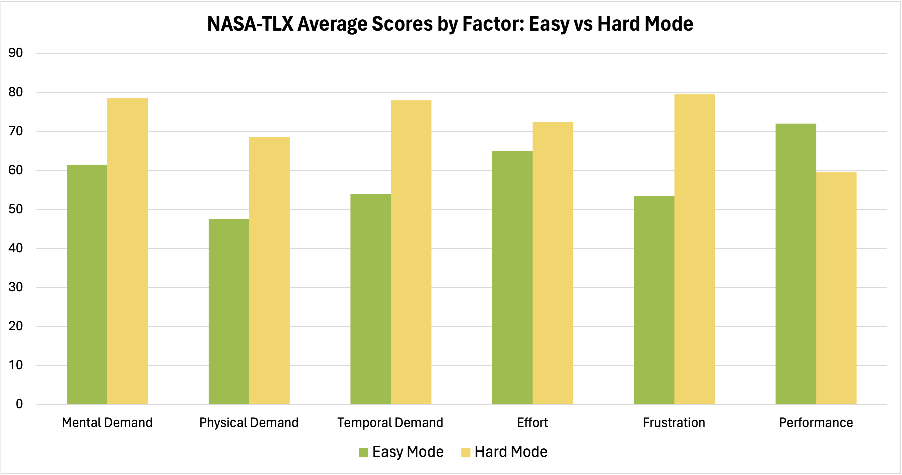
  
<em>Figure 27. Comparison of average NASA-TLX workload scores between L1 and L2 across six factors.</em>

The bar chart highlights a marked increase in perceived workload across most dimensions for Hard Mode, particularly Mental Demand, Frustration, and Temporal Pressure.

To visualize this shift more holistically, we used a radar plot:

  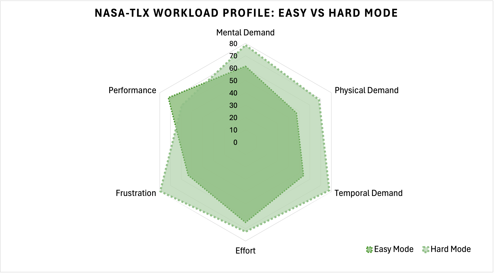
  
<em>Figure 28. Radar chart showing NASA-TLX workload profile differences between L1 and L2.</em>

Players in **L1** experienced the game as manageable, with minimal stress and reasonable pacing. In **L2**, users reported significantly higher strain, suggesting that the difficulty level increased both cognitive and emotional workload.

---

#### SUS Analysis

While workload increased, usability ratings via the **SUS** provided a complementary perspective. We compared each participant’s SUS score to the benchmark of **68**, visualizing user-perceived usability under both difficulty levels.

##### L1: Easy Mode

  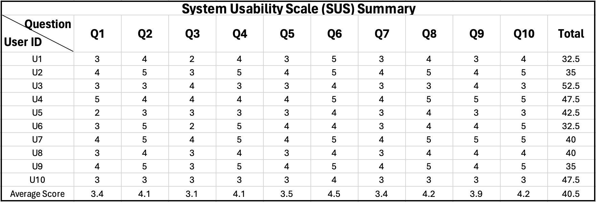
  
<em>Figure 29. Individual SUS question responses in Easy Mode.</em>

In **Easy Mode**, the average SUS score was **69**, slightly above the benchmark. Most players found the interface intuitive, especially participants U2, U4, and U9 who scored near or at 100.

  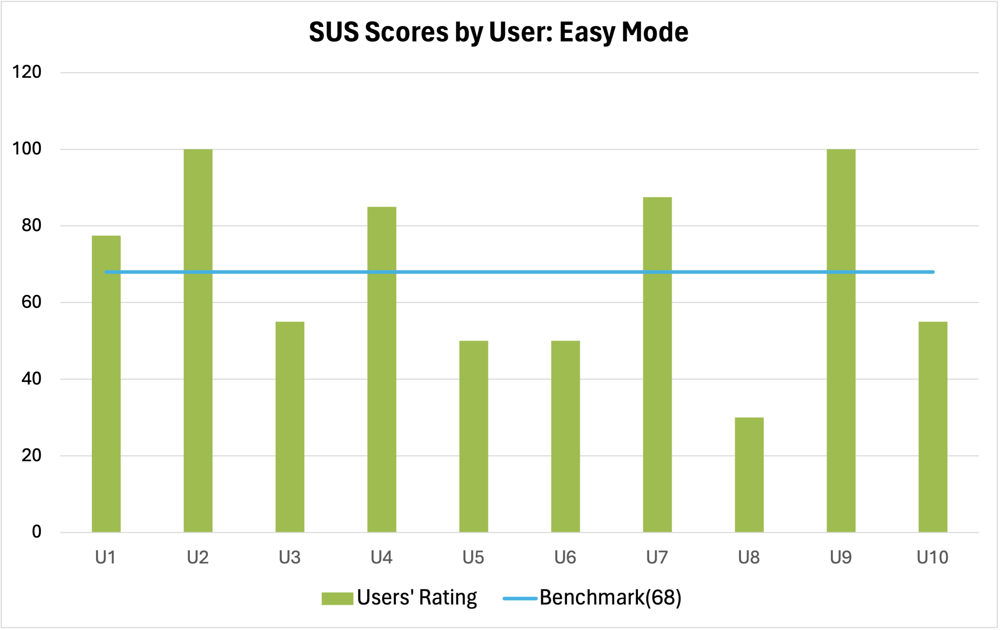
  
<em>Figure 30. SUS scores per participant in Easy Mode, with benchmark line at 68.</em>

##### L2: Hard Mode

  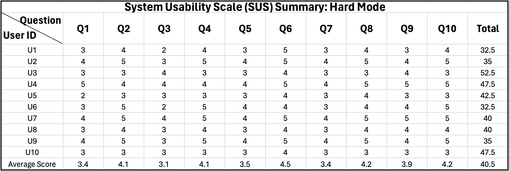
  
<em>Figure 31. Individual SUS question responses in Hard Mode.</em>

  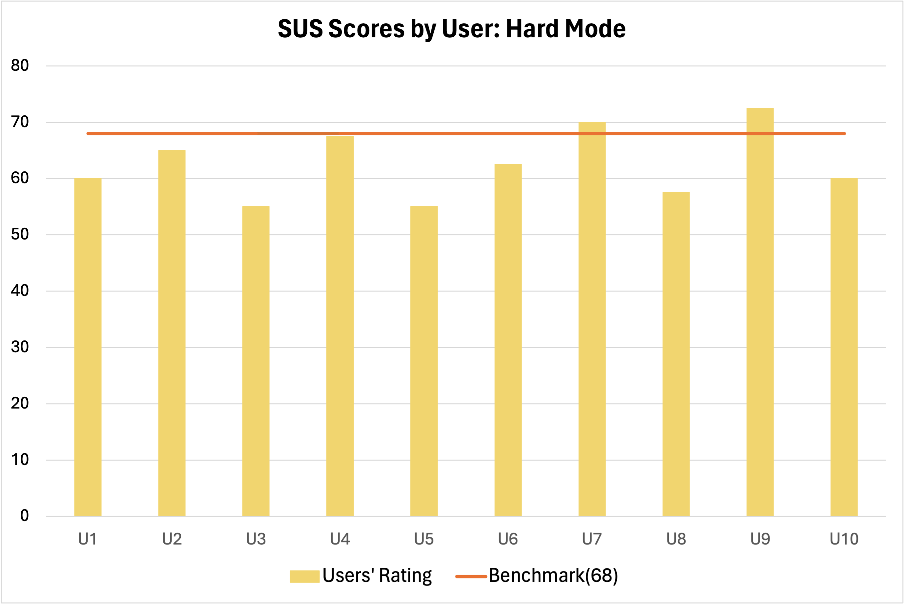
  
<em>Figure 32. SUS scores per participant in Hard Mode, with benchmark line at 68.</em>

In **Hard Mode**, the average SUS score was **62.5**, slightly below the benchmark but higher than our original estimate. This suggests that while the interface remained usable, the increased difficulty taxed player perception and confidence in system learnability.

**Revised conclusion**: L2’s usability was not fundamentally broken, but rather approached the limits of user tolerance. As a result, we made post-test adjustments to simplify redundant inputs and enhance feedback cues during intense gameplay sequences.

---

### 6.3 Code Testing & Usability Interviews

To complement our quantitative analysis, we deployed a live testing environment via **GitHub Pages**, optimized for both desktop and mobile. We invited participants from three user profiles:

- **CS students**
- **Experienced gamers**
- **Developers with HCI knowledge**

Each participant was asked to interact with key game mechanics and UI flows, followed by a short interview focusing on usability impressions, expectations, and friction points.

#### Summary of Observations and Iterative Changes

| Focus Area           | Key Observations                                         | Design Adjustments                                                     |
|----------------------|----------------------------------------------------------|------------------------------------------------------------------------|
| **Boss Combat**       | Visual and audio alerts were inconsistent or delayed     | Integrated pre-attack *audio cues* and *flashing visual warnings*      |
| **Pet System**        | Effects felt passive or unclear in impact                | Introduced *trailing effects*, *glow icons*, and *activation feedback* |
| **Weather Events**    | Environmental hazards often went unnoticed               | Added *HUD icons* (top corner) and *ambient sound cues*                |
| **Scene Transitions** | Boss entrances felt abrupt and immersion-breaking        | Added *fade transitions* and *thematic ambient bridge audio*           |

These interviews provided concrete feedback on experiential gaps, helping us prioritize subtle but impactful changes.

---

### 6.4 Reflection & Conclusion

The multi-layered evaluation approach helped us refine both the **usability** and **player experience** of our game. Key reflections include:

- **L1 (Easy Mode)** served well as a smooth onboarding pathway, while **L2 (Hard Mode)** successfully introduced tension and reflex-based challenges.
- Participants praised the game’s **visual identity** and **aesthetic cohesion**, particularly the glitch-themed design.
- Feedback highlighted **response clarity**, **pet visibility**, and **system feedback** as critical for refinement.
- The combination of **SUS** and **NASA-TLX** yielded complementary insights—balancing **usability perception** with **workload stress**.

Overall, this user-centered and data-driven evaluation loop mirrors real-world **UX design cycles**, echoing key course themes like *evaluation methodology*, *usability engineering*, and *iterative improvement*.

[Back to Table of Contents](#table-of-contents)

## 7 Process

Our team worked closely together throughout the project, ensuring clear communication, efficient collaboration, and a structured development process. This section outlines the team's roles and responsibilities, the tools we used, our Agile development methodology, and the lessons learned from our collaborative experience.

### 7.1 Team Roles and Division of Tasks

To ensure smooth collaboration and development, we clearly defined the roles and responsibilities of each team member. Below is the breakdown of tasks assigned to each member of the team:
| Name              | Role                                              | Responsibilities                                                                                                                                                                                  |
| ----------------- | ------------------------------------------------- | ------------------------------------------------------------------------------------------------------------------------------------------------------------------------------------------------- |
| **Chengjun Yi**   | Lead Developer and Debug Team Leader              | Responsible for overall code architecture, system performance tuning, and ensuring all modules are integrated smoothly. Managed debugging and system-level optimization.                          |
| **Qiutong Zhao**  | Video Director, Editor, and Coordination Engineer | Directed and edited the presentation video. Coordinated progress within the team and handled task allocation. Contributed to auxiliary logic code, such as bug tracking and fixing.               |
| **Heng Zhang**    | Core Development Engineer and Debug Team Member   | Implemented core game logic, including enemy generation, boss skills, collision detection, special effects, and dynamic weather systems. Worked on debugging and feature integration.             |
| **Tong Yu**       | Art Design and Front-end UI Development Engineer  | Designed the game's art and visual resources, and developed the front-end UI. Worked on animation effects and integrated visual design with gameplay. Conducted a comprehensive review.           |
| **Feihang Yan**   | Pet Systems Engineer and Debug Team Member        | Developed the pet system, including pet behavior modeling, interaction logic, state management, and optimization. Ensured seamless integration of the pet system with the overall game mechanics. |
| **Xianhang Peng** | Front-end Development Engineer                    | Focused on the development of the game’s front-end components, such as the main menu, operation prompts, and score display. Optimized interaction logic and user experience.                      |

---

### 7.2 Tools and Collaborative Platforms

To ensure smooth collaboration and efficient development, we utilized the following tools:

#### Version Control and Collaborative Development:
- **GitHub**: Used for version control, ensuring that all code was hosted in a central repository. Each team member worked on their own branch, and code changes were reviewed through **pull requests** before being merged into the main branch. This process helped maintain code quality and minimize conflicts.

#### Task and Project Management:
- **JIRA**: Used for task management. We divided the project into smaller, manageable tasks, assigned deadlines, and tracked progress in real-time. This helped ensure that the team remained on track and that all tasks were completed on time.

#### Communication Tools:
- **WeChat**: Employed for real-time communication, especially when team members could not meet in person. The app facilitated quick communication, shared files, and updates on tasks.
- **Google Meet**: For team meetings and quick virtual check-ins.

#### Design and Visualization Tools:
- **Aseprite**: Used for pixel art creation, including character designs, environmental elements, and animations. This was crucial for maintaining a consistent and retro aesthetic in the game.
- **Figma**: Used to design visual assets like UI components and game environments. Figma allowed for collaborative design, enabling team members to suggest and implement design changes in real-time.
- **UMLEtino**: Used for generating class diagrams and sequence diagrams. This tool allowed us to quickly visualize system architecture and interactions, helping to communicate design decisions across the team.

#### Media and Presentation Tools:
- **Adobe Premiere Pro**: Used for video editing to create the game’s promotional video and demo footage.
- **Adobe Photoshop**: Used for image editing and refining game assets, such as character portraits and item icons.
- **OBS Studio**: Used for screen recording during testing phases to capture gameplay footage for feedback and improvement.

---

### 7.3 Agile Development Methodology and Iteration Process

  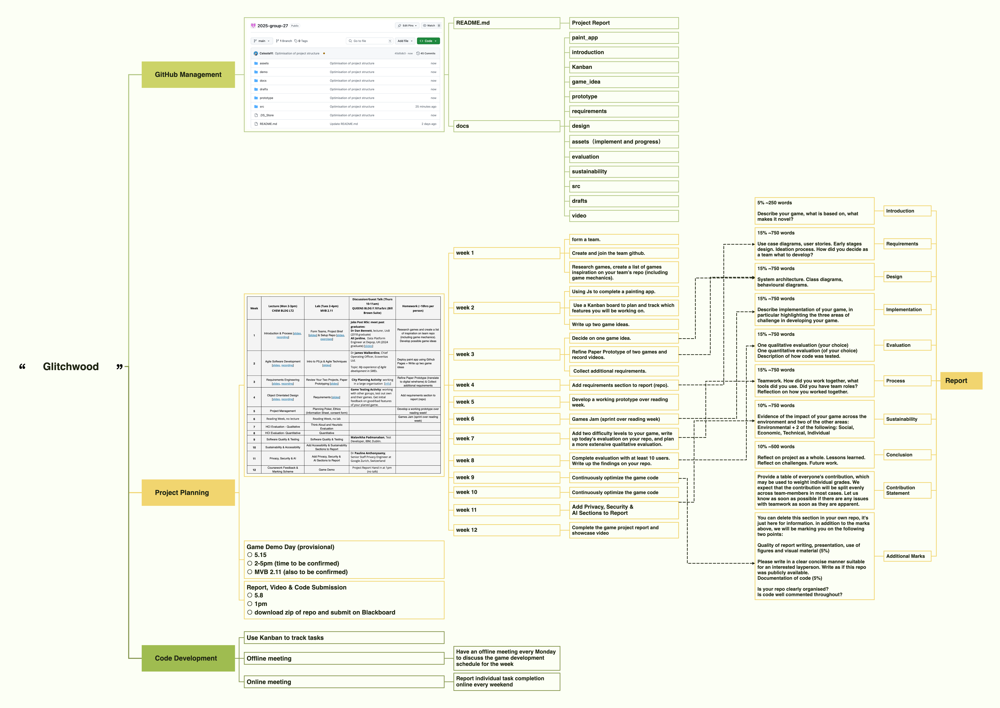
  
<em>Figure 27. Glitchwood's sprint timeline and team workflow overview.</em>

#### Weekly Planning & Review

- Every **Monday**, we held an **offline in-person meeting** to:
  - Review previous progress
  - Plan the weekly development focus
  - Assign tasks based on availability and skill
  - Update our shared Kanban board on GitHub

- Every **weekend**, we held **online meetings** (via Discord/Zoom) where each member:
  - Reported on their individual task completion
  - Flagged blockers or difficulties
  - Synchronized with others on integration points

#### Sprint-Based Iteration

- We divided our semester into **bi-weekly Sprints**.
- Each Sprint included:
  - A development focus (e.g., core combat, weather, pets, evaluation integration)
  - A testing goal (e.g., L1 user test, L2 feedback)
  - Mid-sprint check-ins and end-of-sprint reviews

#### Task Management

- Tasks were tracked using a **GitHub Kanban board**, where columns represented different stages of development: `Backlog`, `In Progress`, `Review`, and `Completed`.
- Each team member was responsible for updating their task status and assigning issues via pull requests.

#### Retrospectives & Adaptation

- After each sprint, we reflected on what went well, what needed improvement, and how to better support each other.
- This helped us continuously adjust our process—for example:
  - Shifting from daily stand-ups to weekly async updates
  - Clarifying coding conventions and review standards
  - Rebalancing workload based on exam schedules

By combining clear weekly structure with flexible sprint goals, we stayed coordinated while allowing room for creativity and iteration. This lightweight but disciplined process helped our team deliver a polished and thematically rich final product.

---

### 7.4 Team Reflection and Continuous Improvement

During the project, we learned several important lessons about collaboration and teamwork. Below are some of the key takeaways:

#### 7.4.1 Reflection on Team Communication
We realized that **active and open communication** is essential for successful teamwork. While **WeChat** and **GitHub** were vital for day-to-day coordination and version control, **face-to-face meetings** proved invaluable for solving complex technical issues. In particular, our “**Game Jam**” meetings helped resolve integration problems and allowed us to brainstorm and find solutions quickly.

#### 7.4.2 Task Management and Workflow Optimization
Through the use of **JIRA** and **Kanban**, we were able to break down tasks into smaller, more manageable components and assign clear responsibilities. This structure allowed for better tracking of progress and ensured that tasks did not fall through the cracks.

#### 7.4.3 Challenges and Adjustments
One of the biggest challenges we faced was the integration of different game modules during the **MVP (Minimum Viable Product)** stage. The parallel development of features led to issues with connecting game states. We solved this problem by holding impromptu meetings to discuss solutions, which ultimately resulted in smoother integration and a better player experience.

We also learned the importance of **flexible planning**. Sometimes tasks took longer than expected, and some features had to be reworked. This required us to continuously re-evaluate our priorities and adjust timelines accordingly.

---

### 7.5 Reflection and Conclusion

Our collaboration during the development of **Glitchwood** has been highly successful due to clear role definitions, effective use of collaboration tools, and an iterative Agile process. We’ve learned valuable lessons in communication, problem-solving, and teamwork that will be useful for future projects. The experience not only helped us improve the game but also allowed us to develop a deeper understanding of Agile development and its application in real-world projects.

[Back to Table of Contents](#table-of-contents)

## 8 Sustainability, Ethics, and Accessibility

### 8.1 Environmental Impact
In terms of environmental sustainability, the design of **Glitchwood** incorporates natural elements both in the game’s narrative and technical aspects. The dynamic weather system, which changes every 30 seconds, is inspired by nature and introduces various environmental challenges, such as rain, snow, and lightning, that the player must adapt to. This system not only enhances immersion but also subtly educates players about the unpredictability of environmental changes, helping them to reflect on resource management and the balance within ecosystems.

We have also optimized the game to ensure energy efficiency. This includes minimizing computational resources used for rendering visual effects and animations, which helps reduce the overall carbon footprint of the game. By using energy-efficient coding practices and optimizing graphical assets, the game reduces its environmental impact without sacrificing player experience. However, reflecting on the development process, we acknowledge that further steps could be taken to minimize the carbon impact of the servers used for hosting the game. In the future, we plan to explore more energy-efficient server solutions to further reduce our environmental footprint. **Reflection**: While we have taken steps to optimize energy use within the game, we have not yet fully addressed the impact of hosting and running the game on servers. In future projects, we should prioritize environmentally sustainable hosting options.

---

### 8.2 Social Impact
Social sustainability in **Glitchwood** is represented through the narrative and game design, which encourages reflection on issues like overwork and burnout that are prevalent in the tech industry. The game's central theme is a developer trapped within their own creation, metaphorically addressing the struggles that software developers and tech workers face, such as stress, long working hours, and the toll of constant problem-solving. By integrating these themes into the gameplay, players are invited to engage in a deeper dialogue about the challenges faced by those in the tech industry.

The game’s design also promotes social inclusivity and accessibility. We made sure that different difficulty levels (L1 and L2) are available, so players of all skill levels can enjoy the game. Additionally, by using a color palette that enhances readability and providing adjustable settings, we’ve worked to make **Glitchwood** accessible to people with various disabilities. Feedback from the community is actively integrated, ensuring that the game is continuously evolving to be more inclusive. **Reflection**: We recognize that while we have made efforts to improve accessibility, there is always room for growth. More accessibility features, such as audio cues for visually impaired players or further customizable color schemes, would greatly benefit a wider audience. This is an area where we can continue to refine the design.

---

### 8.3 Technical Impact
Technically, the game employs modular and efficient code, which not only ensures that the system remains maintainable but also promotes long-term sustainability. By structuring the code in a way that allows easy updates and additions, such as incorporating new weather effects or additional character abilities, we ensure that future content can be added without causing significant technical debt.

The decision to use P5.js, a lightweight JavaScript library, was made with performance optimization in mind, ensuring the game runs efficiently across a variety of devices. This choice also supports accessibility, as it makes the game playable on lower-spec hardware, reducing the need for players to have high-performance systems to enjoy the game. **Reflection**: While P5.js was a suitable choice for the scope and goals of the project, its limitations became apparent as we encountered performance bottlenecks in handling more complex game mechanics. In future projects, we might explore more robust frameworks or game engines to provide better performance for more intricate game designs. This would also allow us to implement additional technical features that could enhance gameplay and user experience, without compromising performance.

---

### 8.4 Sustainability-Oriented Requirements

Informed by the **Sustainability Awareness Framework (SusAF)** and software engineering principles, we identified a set of user requirements in **Glitchwood** that align with environmental, social, and technical sustainability goals. These sustainability-driven requirements were considered during the early design and implementation phases.

#### Environmental Requirements
- As a **developer**, I want to minimize frame-based animations and visual effects so that the game reduces GPU usage and energy consumption.
- As a **project maintainer**, I want to reuse code modules (e.g., for spawning and UI handling) to avoid redundancy and reduce maintenance overhead.

#### Social Requirements
- As a **casual player**, I want an accessible “Easy Mode” so that I can enjoy the game without frustration or performance stress.
- As a **player with color sensitivity**, I want clear visual contrast and optional HUD scaling to improve readability.

#### Technical Requirements
- As a **developer**, I want to build modular features (e.g., weather and pets) so that the game can evolve without major code rewrites.
- As a **tester**, I want a browser-based deployment so that testing and feedback can happen cross-platform without additional installations.

[Back to Table of Contents](#table-of-contents)

## 9 Conclusion

The development of *Glitchwood* has been a complex and rewarding journey that challenged our skills in game design, implementation, testing, and ethical responsibility. This section reflects on the full project lifecycle, key technical challenges, our team’s learning outcomes, and how we see the game evolving in the future.

### 9.1 Lessons Learned from the Project

As computer science students, this project allowed us to explore the intersection of creative design and technical development. We followed an **agile development methodology**, organizing work into sprints and refining features through stakeholder feedback and structured evaluations.

A key lesson was the importance of **early architectural planning**—our use of class diagrams and modular structure helped avoid large-scale refactoring later. Additionally, using tools like GitHub, JIRA, and collaborative testing methods helped the team stay aligned throughout the process. Integrating gameplay, narrative, and accessibility pushed us to consider broader user needs while staying technically grounded.

---

### 9.2 Overcoming Key Development Challenges

**Integrating narrative with gameplay** was a major challenge. We iterated extensively to ensure that story elements complemented mechanics rather than disrupting flow. Performance issues with dynamic animations were resolved by simplifying visual logic and testing framerate impact.

Implementing **modular yet interconnected game systems**—such as collision detection, pet abilities, and weather effects—required careful system design. The pet system, in particular, had to feel impactful without overpowering the gameplay. We used encapsulated modules and events to keep these features manageable and testable.

We also prioritized **sustainable performance**, reducing graphical overhead and ensuring the game ran well even on lower-spec devices. These choices reflect our growing awareness of environmentally responsible software design.

---

### 9.3 Insights from Collaboration and Testing

Team collaboration proved to be both a challenge and a breakthrough point. Initially, coordination issues and asynchronous work led to delays. Over time, regular check-ins and a shared understanding of user stories helped unify our approach.

Through **heuristic evaluations** and both **qualitative and quantitative testing**, we identified usability issues we hadn’t anticipated—such as vague tutorials or weak feedback for in-game events. These insights led to concrete improvements, from clearer visual cues to simplified onboarding sequences.

We also came to value the balance between **technical feasibility and user experience**, and how small details—like animation timing or interface clarity—can significantly impact gameplay satisfaction.

---

### 9.4 Future Directions for Glitchwood

Looking forward, we see several directions for future development:

- Introduce **dynamic storylines** influenced by player choices
- Enhance **AI behavior** and real-time environmental responsiveness
- Conduct **broader usability testing** for diverse user profiles
- Continue **performance optimization** and expand hardware compatibility
- Minimize runtime and hosting resource usage for **sustainable deployment**

With these improvements, *Glitchwood* can grow into an even richer, more inclusive game—both technically polished and ethically aligned.

---

### 9.5 Conclusion

In summary, *Glitchwood* has been more than just a game project—it has been an opportunity to apply software engineering principles in a real-world, creative context. We leave this experience with stronger technical skills, deeper design awareness, and a clearer sense of how to build thoughtful, impactful digital experiences.

[Back to Table of Contents](#table-of-contents)

## 10 Appendix

### 10.1 Contributions of Team Members

| Name              | Contribution                                                                                                                                                                                                                                         | Weight |
| ----------------- | ---------------------------------------------------------------------------------------------------------------------------------------------------------------------------------------------------------------------------------------------------- | ------ |
| **Chengjun Yi**   | Led overall code integration and debugging, ensuring smooth interaction between all modules. Coordinated team activities and handled project management tasks. Contributed to video creation and participated in creative brainstorming sessions.    | 1      |
| **Qiutong Zhao**  | Directed and edited the game’s presentation video. Led the narrative design and contributed to creative discussions. Managed team coordination and task allocation, while also assisting with bug tracking and fixing.                               | 1      |
| **Heng Zhang**    | Implemented core game mechanics such as enemy generation, boss skills, and dynamic weather systems. Took charge of boss skill design and debugging, and actively participated in creative discussions and video creation.                            | 1      |
| **Tong Yu**       | Designed the game’s visual art and front-end UI, ensuring that animation and design were well integrated with gameplay. Contributed to the storyline development and played a key role in optimizing the project report.                             | 1      |
| **Feihang Yan**   | Developed the pet system, including its behavior modeling, interaction logic, and state management. Contributed creatively to pet design and participated in video creation. Also assisted with debugging and optimization.                          | 1      |
| **Xianhang Peng** | Focused on front-end development, including UI elements like the main menu and score display. Played a key role in map design and optimizing the game’s interaction logic. Contributed to video creation and participated in creative brainstorming. | 1      |

---

### 10.2 References

Vodák, J. (2024). *2D rogue-like game with procedural elements* (pp. 30–34). Retrieved from https://theses.cz/id/s86g0y/

Wu, B., & Wang, A. I. (2012). A guideline for game development-based learning: A literature review. *International Journal of Learning*, 2012(1), Article 103710. https://onlinelibrary.wiley.com/doi/full/10.1155/2012/103710

Smith, A., & Johnson, B. (2020). Architectural patterns for scalable multiplayer games. *IEEE Transactions on Games*, 12(3), 225–237. https://doi.org/10.1109/TG.2020.2987654

Leimus, J., & Steele, J. (2014). Behavioural modelling of interaction flows in mobile games using UML state machines. In *Proceedings of the 5th International Conference on Games and Virtual Worlds for Serious Applications* (pp. 45–52). IEEE.

Hendrikx, M., Meijer, S., Van Der Velden, J., & Iosup, A. (2013). Procedural content generation for games: A survey. *ACM Transactions on Multimedia Computing, Communications, and Applications*, 9(1), 1–22. https://doi.org/10.1145/2422956.2422957

Fritsche, U., & Barth, A. (2016). Effective multithreading patterns for game engines. In *Proceedings of the ACM International Conference on Interactive Experiences for TV and Online Video* (pp. 113–122). ACM. https://doi.org/10.1145/2925976.2925989

Piraveenan, M. (2019). Applications of game theory in project management: A structured review and analysis. *Mathematics*, 7(9), 858. https://doi.org/10.3390/math7090858

Maratou, V., Chatzidaki, E., & Xenos, M. (2014). Enhance learning on software project management through a role-play game in a virtual world. *Interactive Learning Environments*, 24(4), 897–915. https://doi.org/10.1080/10494820.2014.937345

Becker, C., Betz, S., Chitchyan, R., Duboc, L., Easterbrook, S. M., Penzenstadler, B., et al. (2015). Requirements: The key to sustainability. *IEEE Software*, 33(1), 56–65.

Duboc, L., et al. (2019). Do we really know what we are building? In *Proceedings of the International Conference on Requirements Engineering*.

Hilty, L., & Aebischer, B. (2015). ICT for sustainability: An emerging research field. In L. Hilty & B. Aebischer (Eds.), *ICT innovations for sustainability* (pp. 3–36). Springer.
